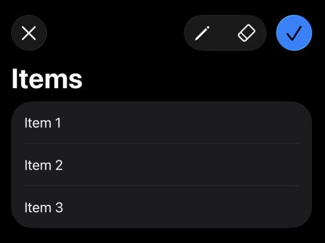

# DeepSeek 似乎不会写 Liquid Glass UI

尝试了一下用DeepSeek v4 Pro+Claude Code来vibe一个简单的CRUD客户端项目，发现它可以说对iOS 26的液态玻璃风格和组件是一窍不通。
- 做出来的Toolbar一点也不像iOS 26里的设计，但它却在iOS 26上运行，所以最后看上去很怪。
- Modal Form的左上角和右上角依然是过去的“取消”和“完成”，而不是iOS 26里面常见的勾和叉。
- 页面中主要组件没有一点iOS 26的味道，并且有很多莫名其妙的分割线缩进或者重合。

我反复强调要使用Liquid Glass中的common pratice，换来的是更加奇怪的实现，越来越差，这更说明DeepSeek是没有iOS 26 Swift UI的相关编程储备的。心疼我的Token`(╯‵□′)╯︵┻━┻`

没办法，毕竟Swift面对的是一个封闭（却丰富）的生态。

## 尝试添加 Skills/插件

我尝试添加了下面的两个附加：
- https://github.com/AvdLee/SwiftUI-Agent-Skill
- https://github.com/haider-nawaz/liquid-glass-skill

然而没有什么用。但我仔细看了一下Skill本身，写的并没有什么问题。所以怀疑是DeepSeek与Claude Code里的Claude生态不是很兼容导致的，没办法。

## 尝试自己拯救 Toolbar 的设计

虽然我不会Swift，但我实在是不想再继续浪费Token，于是就想要去问别的AI，结果发现当DeepSeek成为我的首选和主力后，它无法解决的事情我确实不知道问谁了（国内模型）...我也不想去用免费版里降智的ChatGPT或者Claude。思来想去试了一下Kimi，然而它的思考模式直接卡住，问了豆包，实现出来的也是错的（of course!）

所以我准备用古法，去搜这样一个Toolbar该如何设计。很幸运的是一搜就搜到了，感谢[这篇博客](https://swiftwithmajid.com/2025/07/01/glassifying-toolbars-in-swiftui/)言简意赅地演示了如何实现一个这样的Liquid Glass中经典的Toolbar布局，其核心是下面的代码。

```swift
struct ToolsToolbar: ToolbarContent {
    var body: some ToolbarContent {
        ToolbarItem(placement: .cancellationAction) {
            Button("Cancel", systemImage: "xmark") {}
        }
        
        ToolbarItemGroup(placement: .primaryAction) {
            Button("Draw", systemImage: "pencil") {}
            Button("Erase", systemImage: "eraser") {}
        }
        
        ToolbarSpacer(.flexible)
        
        ToolbarItem(placement: .confirmationAction) {
            Button("Save", systemImage: "checkmark") {}
        }
    }
}
```


*上面代码的效果，来自同一个博客。这也是我见到的“经典”Toolbar布局*

而这段代码的核心是
- placement `.cancellationAction`、`.primaryAction`和`.confirmationAction`三个枚举值
  - 第一个是位于左上角表达取消的按钮位置
  - 第二个是位于右上角附近的操作按钮组
  - 第三个是位于右上角表达确认的按钮位置，我习惯将其理解为Primary Action（之前做Shopify Polaris了解的概念）
- `ToolbarSpacer(.flexible)` 为`.primaryAction` placement和`.confirmationAction` placement的位置之间添加了关键的间隔

于是我直接上手修改，一发入魂。我个人认为这部分代码还是很好理解的，哪怕你完全没有接触过Swift也可以上手改。

## 教育 DeepSeek

有了范例之后就可以让DeepSeek模仿了，事实证明模仿的挺好。我让DeepSeek将这三个placement好好记住，写进CLAUDE.md。这些写入的内容在后面让它重构所有Modal Form的左上角和右上角（将“取消”和“确定”修改为图标，并在右上角使用`.confirmationAction`）的过程中起到了关键的作用。

它写入的内容主要是下面的这个表：
| Placement | Usage | Example |
|---|---|---|
| `.primaryAction` | Group of toolbar actions (filters, search, sort, more menu) | `ToolbarItemGroup(placement: .primaryAction)` |
| `.confirmationAction` | The single most important action on the page (create, save, register) | `ToolbarItem(placement: .confirmationAction)` |
| `.cancellationAction` | Cancel/dismiss in modal forms | `ToolbarItem(placement: .cancellationAction)` |
| `.destructiveAction` | Destructive operations (delete) | `ToolbarItem(placement: .destructiveAction)` |

以及pattern：
```swift
.toolbar {
    ToolbarItemGroup(placement: .primaryAction) {
        // filter buttons, sort menus, etc.
    }
    ToolbarSpacer(.flexible)
    ToolbarItem(placement: .confirmationAction) {
        Button("创建", systemImage: "plus") { showCreate = true }
    }
}
```

:::details 生成的完整与Liquid Glass相关CLAUDE.md内容
```markdown
### Liquid Glass Toolbar Design

All toolbars follow iOS 26+ Liquid Glass placement semantics. Never hand-style toolbar buttons — let the system render them based on semantic placement.

**Placement rules:**

| Placement | Usage | Example |
|---|---|---|
| `.primaryAction` | Group of toolbar actions (filters, search, sort, more menu) | `ToolbarItemGroup(placement: .primaryAction)` |
| `.confirmationAction` | The single most important action on the page (create, save, register) | `ToolbarItem(placement: .confirmationAction)` |
| `.cancellationAction` | Cancel/dismiss in modal forms | `ToolbarItem(placement: .cancellationAction)` |
| `.destructiveAction` | Destructive operations (delete) | `ToolbarItem(placement: .destructiveAction)` |

**Layout pattern for list/detail views with both action group and a primary button:**

```swift
.toolbar {
    ToolbarItemGroup(placement: .primaryAction) {
        // filter buttons, sort menus, etc.
    }
    ToolbarSpacer(.flexible)
    ToolbarItem(placement: .confirmationAction) {
        Button("创建", systemImage: "plus") { showCreate = true }
    }
}
```

**Layout pattern for modal forms:**

```swift
.toolbar {
    ToolbarItem(placement: .cancellationAction) {
        Button("取消") { dismiss() }
    }
    ToolbarItem(placement: .confirmationAction) {
        Button("保存") { ... }
    }
}
```

**Key rules:**
- Never use `.topBarLeading` / `.topBarTrailing` — these are legacy. Use semantic placements above.
- Never apply `.background(.blue)`, `.clipShape(Capsule())`, or manual padding to toolbar buttons. The system styles `.confirmationAction` buttons with Liquid Glass automatically.
- Use `Button("label", systemImage: "icon")` for labeled buttons, `Image(systemName:)` with `.font(.subheadline.weight(.medium))` for icon-only buttons inside `.primaryAction` groups.
```
:::
