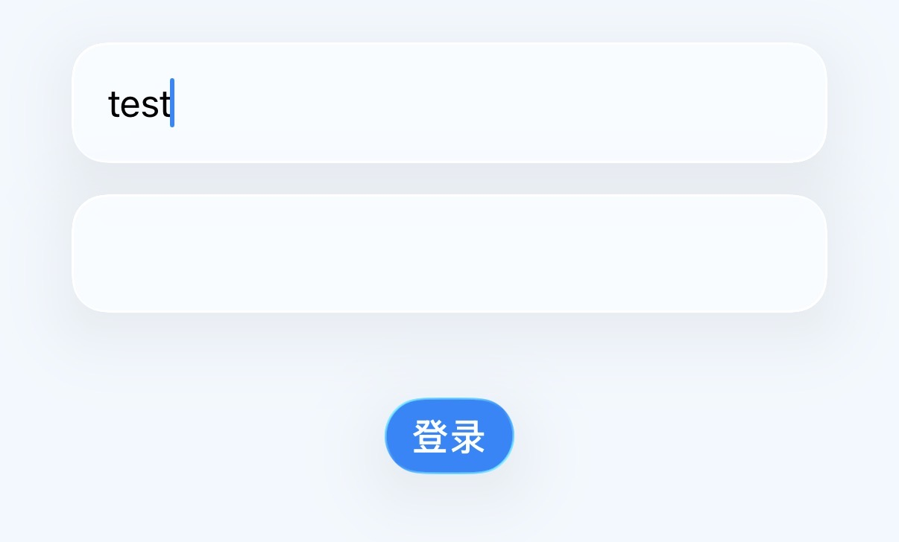
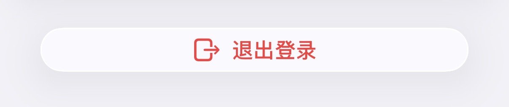
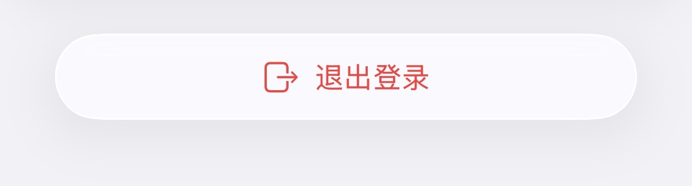

# DS 不会写液态玻璃 UI

尝试了一下用DeepSeek v4 Pro+Claude Code来vibe一个简单的CRUD客户端项目，发现它可以说对iOS 26的液态玻璃风格和组件是一窍不通。
- 做出来的Toolbar一点也不像iOS 26里的设计，但它却在iOS 26上运行，所以最后看上去很怪。
- Modal Form的左上角和右上角依然是过去的“取消”和“完成”，而不是iOS 26里面常见的勾和叉。
- 页面中主要组件没有一点iOS 26的味道，并且有很多莫名其妙的分割线缩进或者重合，显然是拼凑导致的。
- Glass按钮的设计不正常，而且也不知道怎么去修改，东拼西凑。

我反复强调要使用Liquid Glass中的common pratice，换来的是更加奇怪的实现，越来越差，这更说明DeepSeek是没有iOS 26 Swift UI的相关编程储备的。心疼我的Token`(╯‵□′)╯︵┻━┻`

没办法，毕竟Swift面对的是一个封闭（却丰富）的生态。

## 尝试添加 Skills/插件

我尝试添加了下面的两个附加：
- https://github.com/AvdLee/SwiftUI-Agent-Skill
- https://github.com/haider-nawaz/liquid-glass-skill

然而没有什么用，它根本不会调用Skill，即使我明确指出想让它实现Liquid Glass UI。我仔细看了一下Skill本身，写的没有问题而且都是有用的内容。我怀疑是DeepSeek与Claude Code里的Claude生态不是很兼容导致的。

补充一句：后来我在提示词里面让DeepSeek注意使用Skill，他才知道调用...效果也就那样，一些细枝末节仍然无法正确实现，且仍然摆脱不了知识盲区带来的拼凑问题。

## 尝试自己拯救 Toolbar 的设计

虽然我不会Swift，但我实在是不想再继续浪费Token，于是就想要去问别的AI，结果发现当DeepSeek成为我的首选和主力后，它无法解决的事情我确实不知道问谁了（国内模型）...我也不想去用免费版里降智的ChatGPT或者Claude。思来想去试了一下Kimi，然而它的思考模式直接卡住，问了豆包，实现出来的也是错的（of course!）

所以我准备用古法，去搜这样一个Toolbar该如何设计。很幸运的是一搜就搜到了，感谢[这篇博客](https://swiftwithmajid.com/2025/07/01/glassifying-toolbars-in-swiftui/)言简意赅地演示了如何实现一个这样的Liquid Glass中经典的Toolbar布局，其核心是下面的代码。

```swift
struct ToolsToolbar: ToolbarContent {
    var body: some ToolbarContent {
        ToolbarItem(placement: .cancellationAction) {
            Button("Cancel", systemImage: "xmark") {}
        }
        
        ToolbarItemGroup(placement: .primaryAction) {
            Button("Draw", systemImage: "pencil") {}
            Button("Erase", systemImage: "eraser") {}
        }
        
        ToolbarSpacer(.flexible)
        
        ToolbarItem(placement: .confirmationAction) {
            Button("Save", systemImage: "checkmark") {}
        }
    }
}
```


*上面代码的效果，来自同一个博客。这也是我见到的“经典”Toolbar布局*

而这段代码的核心是
- placement `.cancellationAction`、`.primaryAction`和`.confirmationAction`三个枚举值
  - 第一个是位于左上角表达取消的按钮位置
  - 第二个是位于右上角附近的操作按钮组
  - 第三个是位于右上角表达确认的按钮位置，我习惯将其理解为Primary Action（之前做Shopify Polaris了解的概念）
- `ToolbarSpacer(.flexible)` 为`.primaryAction` placement和`.confirmationAction` placement的位置之间添加了关键的间隔

于是我直接上手修改，一发入魂。我个人认为这部分代码还是很好理解的，哪怕你完全没有接触过Swift也可以上手改。

## 教 DeepSeek 写 Toolbar

有了范例之后就可以让DeepSeek模仿了。于是我让DeepSeek将这三个placement的用法写进CLAUDE.md，主要是下面的这个表：
| Placement | Usage | Example |
|---|---|---|
| `.primaryAction` | Group of toolbar actions (filters, search, sort, more menu) | `ToolbarItemGroup(placement: .primaryAction)` |
| `.confirmationAction` | The single most important action on the page (create, save, register) | `ToolbarItem(placement: .confirmationAction)` |
| `.cancellationAction` | Cancel/dismiss in modal forms | `ToolbarItem(placement: .cancellationAction)` |
| `.destructiveAction` | Destructive operations (delete) | `ToolbarItem(placement: .destructiveAction)` |

以及下面的代码pattern：
```swift
.toolbar {
    ToolbarItemGroup(placement: .primaryAction) {
        // filter buttons, sort menus, etc.
    }
    ToolbarSpacer(.flexible)
    ToolbarItem(placement: .confirmationAction) {
        Button("创建", systemImage: "plus") { showCreate = true }
    }
}
```

这些写入的内容在后面让它重构所有Modal Form的左上角和右上角（将“取消”和“确定”修改为图标，并在右上角使用`.confirmationAction`）的过程中起到了关键的作用。

## 它也不会写按钮

通过在提示词里面加入“记得使用Skill”的提示，DeepSeek确实可以实现出Liquid Glass按钮了，但完全称不上是一步到位。

```swift
content
    .font(.headline)
    .frame(maxWidth: .infinity)
    .buttonStyle(.glassProminent)
    .padding(.vertical, 14)
```

 *玻璃是有了，但是...*

由于我对这块也不熟悉，所以只能从现象出发给它修改建议。

```markdown
当前修改的liquid glass样式是正确的，但是这些按钮太小且没有跟先前那样占满整行。请全部修改，让按钮占满整行。
```

它得出的结论是，`.frame(maxWidth: .infinity)`的效果可能被`.buttonStyle(.glassProminent)`覆盖了，所以要将frame放在buttonStyle的后面...然而实际上这并没有什么作用。

> 问题很清楚：iOS 26+ 路径中 `.frame(maxWidth: .infinity)` 在 `.buttonStyle()` 之前，只扩展了 label 而不是整个按钮。Liquid Glass 按钮样式会使用自身的内容尺寸，不会继承 label 的 frame。需要将 frame 移到 buttonStyle 之后。

所以我再一次需要自己解决这个问题。搜到了Reddit上的[这个帖子](https://www.reddit.com/r/SwiftUI/comments/1pejnuo/ios_26_how_can_you_make_the_bottom_bar_button_go/)，提到了iOS 26的新API`.buttonSizing(.flexible)`，替换之后宽度就正常了。

 *宽度正常，但是上下边距太小*

但仍然有种别扭的感觉，因为按钮的上下边距太小了。显然DeepSeek是有考虑到上下边距的：`.padding(.vertical, 14)`，但没有实质作用。让DeepSeek来思考怎么改，它又一次得出了链顺序不对的结论...然后我就受不了，去问ChatGPT了。ChatGPT也好不到哪里去。它让我把padding放在buttonStyle的前面，结论与DeepSeek完全相反。

> 如果你想增大按钮内部上下间距，需要：[...] 也就是说：
> - padding 放在 buttonStyle 前面
> - 让 padding 成为 button label 的一部分
> 
> 这是 SwiftUI modifier 顺序问题。

但是下面ChatGPT“顺带提一嘴”环节中提到`.controlSize(.large)`的名称中的“control size”引起了我的兴趣。我试了试，发现就是正确答案。ChatGPT这属于歪打正着。

 *Exactly what I want!*

按钮这一块，整体上来看，DeepSeek很喜欢对代码进行缝缝补补，这证明它对于正确的practice并没有多少认知。感觉还是因为Swift语言太冷门以及Apple的AI生态孱弱/不重视导致的，至今没有看到什么权威性的与实现或设计相关的Skill、MCP。谁说AI不能替代人类？只要信息足够缺乏，AI也拿你没办法！

附一个DestructiveButtonModifier的最初代码与修改后的代码。虽然前后连行数都没变，但效果是天差地别，而DeepSeek就是不知道这些API。我感觉DeepSeek正在渐渐引起我走上iOS开发的兴趣！

- 最初的代码
    ```swift
    content
        .font(.headline)
        .buttonStyle(.glass)
        .tint(.red)
        .frame(maxWidth: .infinity)
        .padding(.vertical, 14)
    ```
- 修改后的代码
    ```swift
    content
        .font(.headline)
        .buttonStyle(.glass)
        .tint(.red)
        .buttonSizing(.flexible)
        .controlSize(.large)
    ```