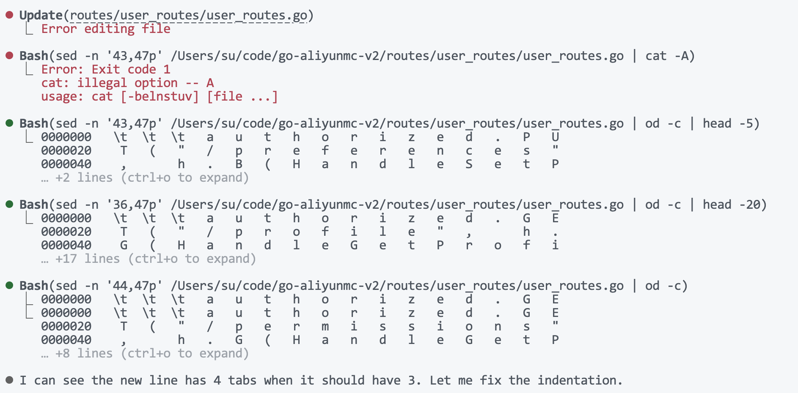
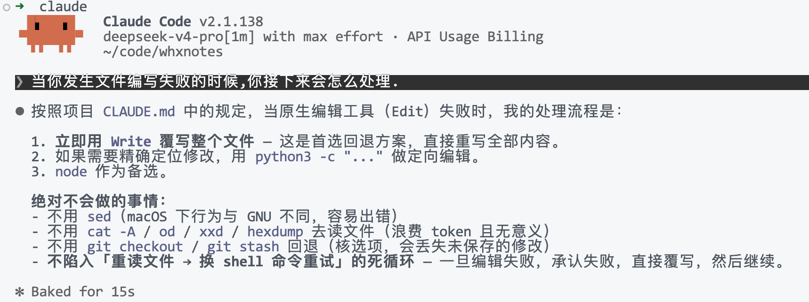
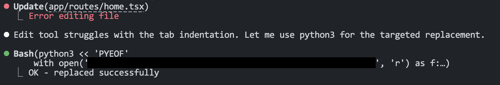

# 关于 Claude Code 里 DeepSeek 的一些不甚满意的表现

## 文件编辑经常失败

从刚开始用Claude Code接DeepSeek，我就已经察觉了这一点，其表现是无缘无故地发生编辑错误，然后开始尝试另辟蹊径来解决。我猜这是因为DeepSeek生成的参数与Agent框架期望的不对应导致的。每一次编辑失败之后，DeepSeek都会尝试使用`sed`、`cat`等来弥补完成文件的编辑，但在这个过程中总是出奇一致地出现一个试错的环节：它会使用管道符号加上一个`cat -A`来进行一个读取的操作，然后被报错`cat: illegal option -- A`。

几乎每一次遇到编辑失败，都会进入如下图所示的这样一个流程中：

 *近乎公式化的试错流程，在几十次的使用中见过不下几十次*

- 尝试用`sed`接`cat -A`，报错
- 尝试用`sed`接`od`，以原始字节的形式窥探文件内容
- 有的时候还会把`od`换成`xxd`
- 后续编辑也是用的`sed`+`cat`组合

这个流程所带来的问题是token和时间的浪费，主要体现在下面几点。
- **一个非常标志性的、莫名其妙的、多余的指令尝试习惯**：只要你不让他记住`cat -A`是错误的用法，那么它每一次遇到编辑失败都会先尝试一遍这个错误的指令。
- **使用指令的同时无法确保准确性，且主动纠结缩进问题**：指令形式注定了其语句的生成稳定性和准确性都比正常的tool call要低，也正因此经常会引入一些格式问题，例如缩进。当真的遇到缩进问题的时候（比如`\t`的数量不对），它还会陷入到对缩进的纠结上，即使语言并不是Python。如果真遇上Python，我觉得运气不好的话要调很久，浪费更多token。等它纠结完缩进觉得缩进OK了之后，我打开文件看，缩进仍然是乱的，所以在这个地方它还会给自己编一个谎。
- **倾向于使用`od`和`xxd`来看原始数据，而不是正常的文本数据**：`od`和`xxd`返回的原始数据相比于直接读文本要多很多冗余信息。
- **编辑失败—重读文件循环**：它倾向于在每一次编辑失败以后，重新读一遍文件。我觉得这可能是Agent框架所设定的规则，目的是让模型能够给出正确的行号和编辑范围，但在当前这种情况下无疑是进一步加剧了token的浪费。

好的一点是，无论怎么折腾，到目前为止我还没有遇到彻底无法写入的场景，跌跌撞撞最后都能写入，也是正确的代码。

唯一让我失望的一次，是它在纠结缩进的过程中似乎犯了一些很严重的编辑错误导致文件的内容乱掉了，所以它就告诉自己“文件彻底乱掉了”，然后给我端上来了一个`git checkout`指令...我以为这是它的什么小trick。确认执行的一秒之后我反应过来这可是在动文件历史...于是就这样丢失了一个文件的编辑内容。它花费了好几分钟的时间将上下文中的残留给拿了回来，写入了，所以结果没有丢失，但浪费了更多token。这个故事告诉我们无脑一路Yes是行不通的，你永远不知道模型会给你生成什么指令出来。

从那之后，为了避免它再用`sed`来编辑文件，我在CLAUDE.md主动提出可以直接用Python或者Node的REPL来执行。想到能用REPL来执行也是因为我看它编辑失败后有的时候也用这种方法，而这种方法给我的好感比`sed`之类要多得多。我给的提示词如下
> You may be encounting editing failure regularly. Please DO NOT use any of these approaches to read or write, as they're hard to harness and easy to cause troubles, wasting valuable time:
> - `git` based commands, especially ones revert file changes
> - `sed`, not reliable for large pieces of code
> - `cat`, not reliable for large pieces of code
> 
> You can consider the following options if the native operation cannot be done:
> - overwrite the whole file (for editing/updating)
> - python3 (for any purpose)
> - node (for any purpose)

可惜的是遵循的效果不怎么样，依然会在编辑失败之后第一时间采用旧的循环，所以我让Hermes Agent为我优化了一下提示词。它告诉我原本的提示词的问题是语气太软。但我觉得和模型说强制的要求反而遵循效果不好——更重要的是给出目的和理由来。总之，Hermes根据我上面所写的那些，写出了目的更加明确的提示词，放到了全局CLAUDE.md里。我新开了一个session验证了一下：

 *真的听话了吗？*

后面又用了几次，遇到同样的问题的时候，DeepSeek果然就能知道这是在“struggle”。这个时候它就没有尝试使用`sed`之类，而是直接上python。看来这个提示词确实起作用了。能起作用的提示词就是好提示词。

 *也许真的听话了*

这个问题我在小红书上面问了一圈，有两个不同的人告诉我这是Claude Code版本导致的，说Claude Code正在重构，升级到某个版本就可以了。然而并没有。升级到他们说的版本问题依旧。总之，Claude Code不是为DeepSeek设计的，反过来也成立，所以也没啥好抱怨的，能用就行...