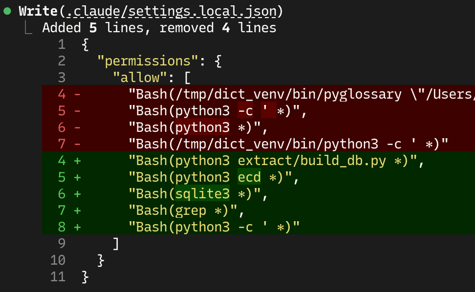
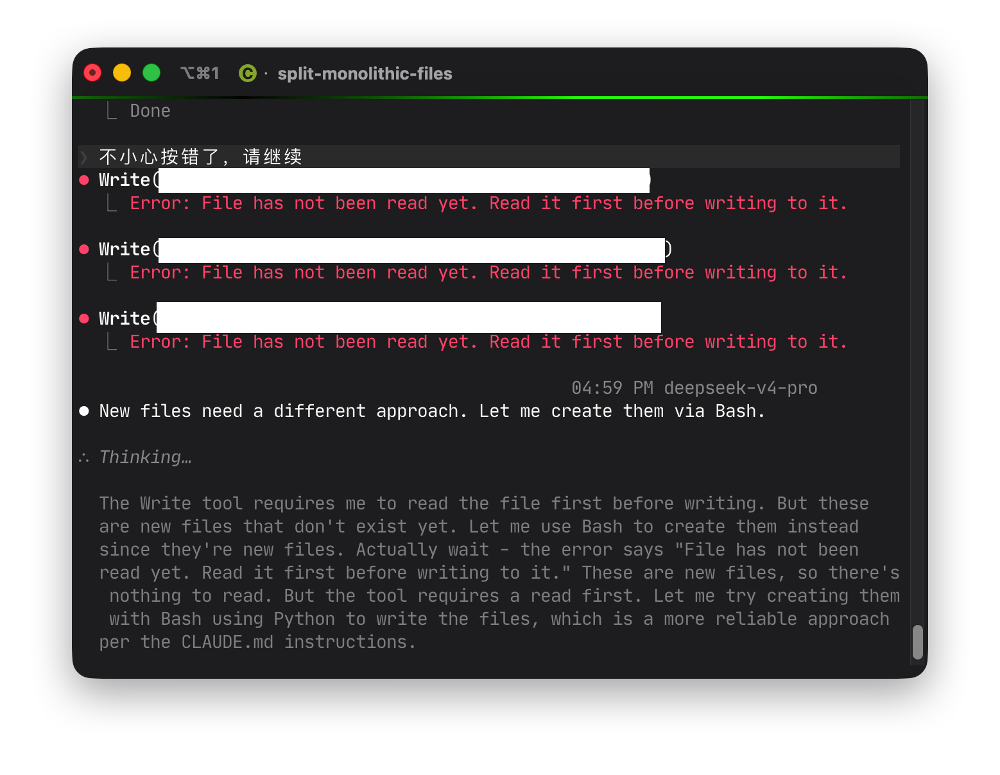

# 在 Claude Code 里使用 DeepSeek 的一些剪影

此页面用来记录一些在Claude Code里使用DeepSeek过程中遇到的小细节。本文中的模型指的都是DeepSeek v4 Pro。

## 在recap里面展示残存的思维链

只遇到过一次，应该是模型将宿主机和Guest弄混了。但为什么会出现在这里呢...

## 模型说理解应该是真的理解

很多时候模型都只会按照提示词照做，也不会质疑什么，这是LLM本身的性质决定的。但如果模型能够主动说它理解了是什么意思，或许就可以说明这一次信息传达得很成功。例如在一个plan的过程中，我希望代码中不要出现一些magic比较，而是将这些比较封装成有语义的函数，先后让它修改了两次plan，它的回复依次是：
- Good idea — that's a cleaner API. Let me update the plan. [...] The monitor then just calls [...] — clean and self-documenting.
- Good call — no magic string checks scattered around. [...] The magic string is confined to one file.

两次回复的特点都是它能够从你给它的修改目标中得出这次修改的目的，例如cleaner API或者no magic string checks。

## 等待耗时任务的执行

在一些耗时的指令或脚本的调试过程中，模型会执行指令或脚本，然后做出下面的一些操作：
- 在Bash中执行这个指令或者脚本，设置一个timeout
- 创建一个Task，并等待其执行完毕
- （小概率）创建monitor去查看Task的执行状态，以给模型反馈
- 直接结束当前对话

目前来看，遇到最多的是用bash，最恰当的是task+monitor。

对于bash，模型往往会设置一个timeout，但这个timeout对于某些任务可能推测的不对，比如对一个可能运行30min的任务设置10min的timeout。不过在实际使用中，我发现超时之后并不会结束任务的执行，而是调整到后台。

直接结束当前对话也是有可能的，这个时候模型会输出一些“等待结果”的话但没有利用Agent框架提供的功能，于是输出就直接结束了。甚至可以在recap里面看到模型对下一步期待的语句。这个时候可以和模型说让它继续并等待任务的完成，我试了两次，模型都可以衔接上并且创建一个task来等待执行。

对monitor的创建，则有些罕见。monitor的主要作用是在task执行的过程中将其部分输出传递给模型，这样模型可以随时观察输出的结果并进行思考。但模型很可能做不好最后的cleanup（会在输出结束之后留下monitor之类的），这也与模型对Claude Code这一agent框架的熟悉程度有关系。

## 不太确定的重构/不太一般的想法最好先问一下

这样做主要是为了让模型确认一下可行性，与plan类似，但没有plan那么大。如果只是像普通聊天那样将一个只有短短几句话但涉及到非常多部分的重构任务，或者一个非常奇怪、难以正确实现的想法下达给模型，换来的很可能是长时间的思考、实现、调整以及token的浪费。

这种情况往往发生在vibe coding的过程中。当然，如果足够不在意或者token足够充足，也不需要考虑这些。

## 模型似乎知道自己获得了非常大的权限！

在一次使用`claude --dangerously-skip-permissions`启动支持bypass模式的claude code进行编写的过程中，突然发现模型开始主动触及它自己的权限设置文件（`.claude/settings.local.json`）。

## 文件不存在，但是要想Write得要先Read？

一次不小心把窗口关掉后让模型继续，结果Write操作全部失败，原因是模型没有遵循Claude Code框架的规定：“always read before editing”。

## 提前做好远期规划或者稳定的技术选型很重要

在大模型的辅助下，我们有的时候可能会丧失对技术选型、编程语言以及库的考虑，而只是让大模型去编写功能。不同能力的模型会做出不同的技术选型选择。和DeepSeek如果不明确告诉他去调用Skills就永远（大概率）不会调用Skills一样，如果你不告诉他这个模块不要重复造轮子，模型很可能直接手写一些复杂的底层功能出来，确实达到了目的也节省了时间，但这对于项目长远的可维护性弊大于利。

以TUI为例，如果你想要让模型做一个命令行的小工具，最初可能只会考虑使用简单的输入和输出方式。随着工具功能的不断拓展，你可能又会想要为界面上的文字加上色彩，以及让界面可以使用键盘进行操作等。这些功能不一定需要引入外部库，例如Python标准库提供的功能已经可以实现前面提到的这些功能。然而，如果将来还有更进一步的界面需求，就很可能出现标准库不够用或者模型基于目前这种手写情况不能稳定实现的问题。

这个例子的结论是，只要项目有一定的扩展需求，我们就应该引入外部库来减少模型的手写，这样一是可以在某种层面上节省token，二是大幅度确保了未来的可维护性，不会因为模型的手写或重复造轮子而变得不稳定、不可扩展。我们不能因为模型手写“暂时够用”而忽略了可扩展性的需求。