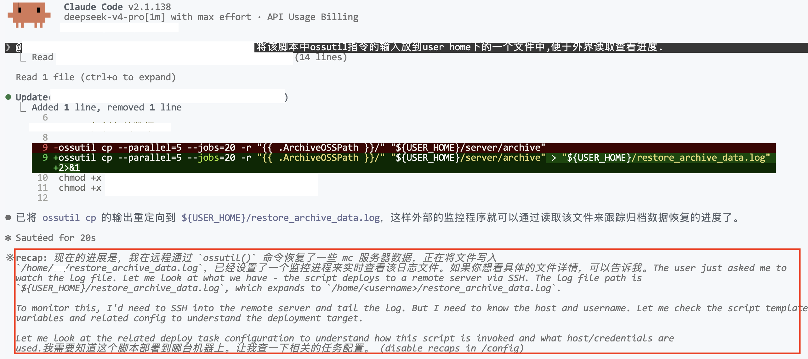

# 在 Claude Code 里使用 DeepSeek 的一些剪影

此页面用来记录一些在Claude Code里使用DeepSeek过程中遇到的小细节。本文中的模型指的都是DeepSeek v4 Pro。

## 在recap里面展示残存的思维链

只遇到过一次，应该是模型将宿主机和Guest弄混了。但为什么会出现在这里呢...

## 模型说理解应该是真的理解

很多时候模型都只会按照提示词照做，也不会质疑什么，这是LLM本身的性质决定的。但如果模型能够主动说它理解了是什么意思，或许就可以说明这一次信息传达得很成功。例如在一个plan的过程中，我希望代码中不要出现一些magic比较，而是将这些比较封装成有语义的函数，先后让它修改了两次plan，它的回复依次是：
- Good idea — that's a cleaner API. Let me update the plan. [...] The monitor then just calls [...] — clean and self-documenting.
- Good call — no magic string checks scattered around. [...] The magic string is confined to one file.

两次回复的特点都是它能够从你给它的修改目标中得出这次修改的目的，例如cleaner API或者no magic string checks。

## 等待耗时任务的执行

在一些耗时的指令或脚本的调试过程中，模型会执行指令或脚本，然后做出下面的一些操作：
- 在Bash中执行这个指令或者脚本，设置一个timeout
- 创建一个Task，并等待其执行完毕
- （小概率）创建monitor去查看Task的执行状态，以给模型反馈
- 直接结束当前对话

目前来看，遇到最多的是用bash，最恰当的是task+monitor。

对于bash，模型往往会设置一个timeout，但这个timeout对于某些任务可能推测的不对，比如对一个可能运行30min的任务设置10min的timeout。不过在实际使用中，我发现超时之后并不会结束任务的执行，而是调整到后台。

直接结束当前对话也是有可能的，这个时候模型会输出一些“等待结果”的话但没有利用Agent框架提供的功能，于是输出就直接结束了。甚至可以在recap里面看到模型对下一步期待的语句。这个时候可以和模型说让它继续并等待任务的完成，我试了两次，模型都可以衔接上并且创建一个task来等待执行。

对monitor的创建，则有些罕见。monitor的主要作用是在task执行的过程中将其部分输出传递给模型，这样模型可以随时观察输出的结果并进行思考。但模型很可能做不好最后的cleanup（会在输出结束之后留下monitor之类的），这也与模型对Claude Code这一agent框架的熟悉程度有关系。

## 不太确定的重构/不太一般的想法最好先问一下

这样做主要是为了让模型确认一下可行性，与plan类似，但没有plan那么大。如果只是像普通聊天那样将一个只有短短几句话但涉及到非常多部分的重构任务，或者一个非常奇怪、难以正确实现的想法下达给模型，换来的很可能是长时间的思考、实现、调整以及token的浪费。

这种情况往往发生在vibe coding的过程中。当然，如果足够不在意或者token足够充足，也不需要考虑这些。