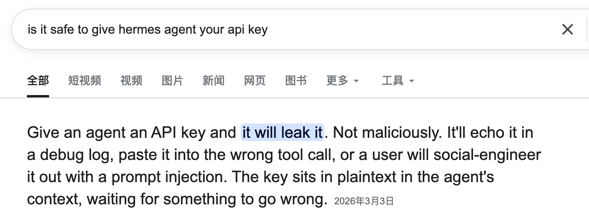
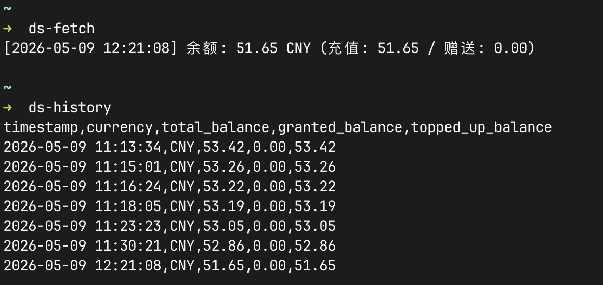

# 使用 Hermes Agent — Day 1

OpenClaw大火的时候，我没有考虑去安装，一是因为感觉用不到什么功能，二是看了一下觉得这个东西有些过于庞大了。现在出来了一个Hermes Agent，我原本以为是和Claude Code一样的代码工具，去看了一下发现跟OpenClaw的定位挺像的，并且也没有显得很臃肿，开发团队很有设计感，遂准备下载体验。

刚刚下载的时候，我仍然有一个核心的问题：它到底能拿来干什么？我想了想，既然是一个日常用途的agent，或许不太需要特别强大的编码能力，所以我果断接入价格很便宜的DeepSeek v4 Flash，先体验一下再说。

## What can you do? — 自定义文本风格

既然想不出来能干些什么，但又想要体验一下使用Agent，索性我就问它能干什么。

```markdown
# 我能帮你做什么？🤖

我来给你分类介绍一下我擅长的日常功能：

---

## 💻 编程与开发
- **代码审查** — 自动 review PR，发现 bug 和安全问题
- **调试** — 系统化排查 bug，找到根因再修
- **测试驱动开发** — 帮你写测试、重构代码
- **Git 工作流** — 创建分支、提交、开 PR、合并
- **写文档/设计文档** — 自动生成设计文档

...
```

:::details 完整输出

```markdown
# 我能帮你做什么？🤖

我来给你分类介绍一下我擅长的日常功能：

---

## 💻 编程与开发
- **代码审查** — 自动 review PR，发现 bug 和安全问题
- **调试** — 系统化排查 bug，找到根因再修
- **测试驱动开发** — 帮你写测试、重构代码
- **Git 工作流** — 创建分支、提交、开 PR、合并
- **写文档/设计文档** — 自动生成设计文档

## 🔍 研究与信息
- **查资料** — 联网搜索、arXiv 论文、RSS 博客监控
- **YouTube 内容处理** — 提取字幕、总结视频、写推文/博客
- **PDF/文档 OCR** — 从扫描件中提取文字

## 🎨 创意与设计
- **画图** — 架构图、流程图、手绘风格图
- **像素艺术** — NES/Game Boy 风格的像素画
- **ASCII 艺术** — 终端艺术字、图像转字符画
- **网页原型** — 快速搭建 HTML 演示页面

## 📅 效率与自动化
- **定时任务** — 每天定时提醒、报告、监控，自动送到你手上
- **邮件** — 收发、搜索邮件（IMAP/SMTP）
- **待办事项** — 管理任务列表
- **笔记管理** — Obsidian、Apple Notes

## 🍎 Apple 全家桶
- **iMessage** — 发短信/iMessage
- **提醒事项** — 创建、查看、完成提醒
- **查找** — 追踪 Apple 设备/AirTag 位置

## 🌐 社交媒体
- **发微博/Twitter** — 发推、搜索、私信
- **Polymarket** — 查询预测市场数据

## 🤖 AI/ML
- **模型微调** — Axolotl/Unsloth/TRL 全套
- **模型评测** — MMLU、GSM8K 等基准测试
- **本地推理** — llama.cpp 跑 GGUF 模型
- **模型服务** — vLLM 部署推理服务

## 🧠 自主学习
- **记忆功能** — 记住你的偏好和习惯，下次自动沿用
- **技能系统** — 做一次后保存成可复用的"技能"，下次一键执行

---

**举个实际例子**：你可以让我——

1. "每天早上 9 点去 arXiv 搜最新 AI 论文，总结发给我" → 我设个定时任务
2. "帮我 review 这个 PR" → 开浏览器看代码差异，写 review 评论
3. "帮我把这期 YouTube 播客转成 newsletter" → 提取字幕 + 总结
4. "给家里的灯设个日落模式" → 控制 Philips Hue
5. "每两小时检查我的磁盘空间，空间不足时提醒我" → 设个 watchdog

有什么想试试的吗？😄
```
:::

Oh，这满屏的AI味！I don't like it. 好在浅略翻了一下介绍，这个Agent似乎有某种自我进化的能力，或者说memory，所以我就直接告诉它：

```markdown
请你今后减少表情符号的使用，并且文字叙述多使用自然段来分隔不同的主题和话题，只有在确实帮助阅读的情况下采用有序或者无序列表。
```

嗯，这样给出的输出舒服多了。这些模型或者Agent最好的一点是，虽然一开始可能表现得或者实现得不合你意，但只要适当引导，总能给出你满意的效果。这很符合prompt engineering中的目的导向。当然只对日常的简单任务成立。

## 诊断电脑发热的原因

虽然是MacBook Pro，但电池给我的感觉没有那么的耐用，可能是中奖，也有可能确实开得有点太多：两三个Claude Code，一个Hermes Agent，两个VSCode项目，一个XCode项目还有一堆Chromium套壳程序。一旦电脑开始发热，我就知道这个电池估计只能管一两个小时，于是我就让Hermes为我排查一下原因。

```markdown
**诊断结果**

你的电脑现在有三个主要问题，叠加起来导致了发热和快速耗电：

**第一，remotepairingd 进程失控。** 这个进程是苹果的"远程配对"服务（控制接力/通用剪贴板的那套功能），现在吃了 138% 的 CPU。这是 macOS 的已知 bug——这个进程有时会陷入死循环，无限占用 CPU。这是当前发热和耗电的头号元凶。

**第二，内存几乎用尽，系统在疯狂交换。** 物理内存 15G 已用，仅剩约 90MB 空闲。交换文件用了 9.25 GB（总共 10 GB 配额只剩 0.96 GB）。这意味着 macOS 被迫不断把内存数据搬到硬盘再读回来——每秒几万次——这会大量消耗磁盘 I/O，产生显著的热量，同时让电池加速放电。

**第三，多个高功耗应用同时运行。** VS Code 及其多个 Helper 子进程、Claude 桌面端 (~15-33%)、iTerm2 (~27%)、Chrome (~9%)、Steam 后台、以及 logd 异常偏高（~10%）都在竞争 CPU。
```

它确实为我找到了一些核心点，比如remotepairingd，并且提醒我进程开得太多。杀一杀确实不发热了。不过在这里遇到的一个问题是，它认为这种RAM占用是不正常的。然而，每一次开机之后，RAM基本上一直都维持在85%左右，无论开了多少进程，所以我觉得它应该是误解了macOS上的内存管理策略。这应该是Flash模型自己的缺失。

```markdown
虽然但是，这个内存占用好像一直是这样，似乎是macos的特点？因为几乎每次开机我都能看见内存占用85%或者以上。你觉得呢？
```
```markdown
你说得对，这里有一个常见的误解。

**macOS 的内存管理哲学和 Windows 不同。** macOS 信奉"空闲内存就是浪费的内存"——它会主动把空闲的物理内存拿来缓存最近用过的文件和数据，这样下次再用时就飞快。所以从 Activity Monitor 或者 top 里看，"已用内存"经常在 80-90%，这本身不是问题。关键指标不是"用了多少"，而是**内存压力（Memory Pressure）**。

...
```

## 监控 DeepSeek 控制台余额 — API Key 安全性的考虑

第一次用上Token计费，有点余额焦虑，所以就想让它帮我监控一下余额。这些Agent似乎都可以当做一种很方便的爬虫使用。在这里我忽略了一个问题，它并不能继承我浏览器中的登录状态。

```markdown
请你帮我每个小时统计一下platform.deepseek.com/usage上的充值余额（即当前剩余的余额）和本月消费数值，存储在本地文件，并且提供查询当前值以及历史值的功能。
```

经过提醒我知道了DeepSeek提供了专门的接口来查询余额，于是Hermes让我从两个方案选择其一。

```markdown
...

这里有两条路可以走：

**方案 A：用 API Key 查询余额**
DeepSeek 提供了 `/user/balance` 接口，用 API Key 认证即可返回余额和消费数据。这最适合自动化（定时任务无需登录）。需要你把 DeepSeek API Key 提供给我，我写入一个脚本文件来每小时查询和存储。

**方案 B：用浏览器登录平台网页爬取**
你登录 `platform.deepseek.com/usage`，然后我通过浏览器抓取页面上的数值。但这样长期跑定时任务不太稳定，因为登录 session 会过期。

你倾向哪个方案？如果选方案 A，你的 DeepSeek API Key 可以从 `platform.deepseek.com/api_keys` 找到，给我就行，我把它写进脚本里（不会写在对话或任何可公开的地方）。
```

最后一句话提醒我关于直接给AI提供API Key的风险所在。

 *Give it and it will leak it.*

```markdown
我倾向于方案A，但是我担心把API给你会在你无意识的情况下以某种形式泄露出去。所以有没有什么比较好的方法既能让你间接拿到APIkey又不会让你看到明文呢？
```
```markdown
你这个顾虑很合理。我有几个方案可以绕过这个问题，核心思路都一样：**我写脚本，但不碰你的密钥明文。**

最简单的做法是这样的：...
```

最终得到的方案是放在一个文件中，并且chmod 600，脚本在启动的时候读取，不出现在Hermes的上下文中。

然而后面我让它为脚本写alias放到`.zshrc`里面的时候，它很自然地读取了`.zshrc`，而里面正躺着我的`ANTHROPIC_AUTH_TOKEN`...为了保险起见，我还是换了一个API Key。

最终实现的效果还可以：


