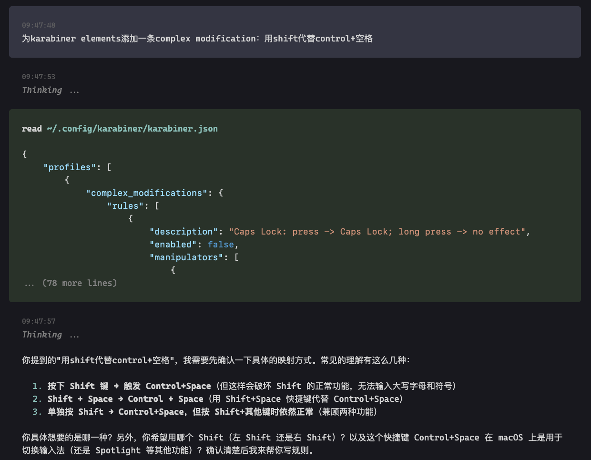
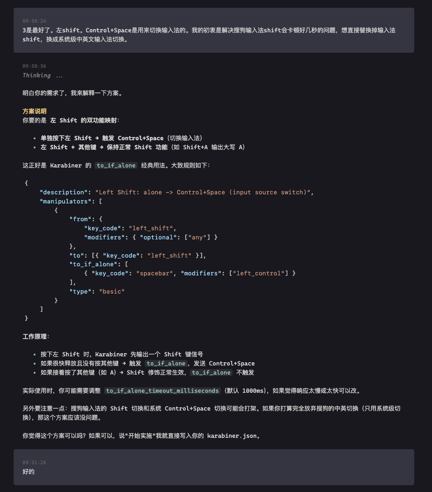
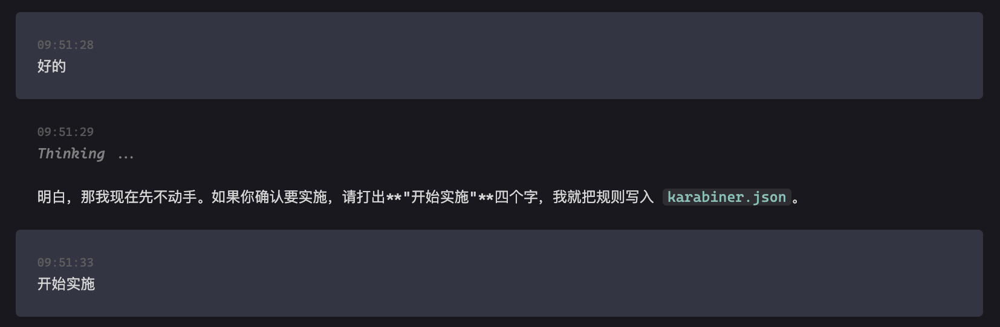
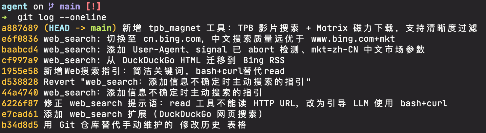

# Pi Agent 的一些初步定制

Pi Agent是一个极简的coding agent，默认只提供了四种工具（但大多数场景下已经够用），工具定义和系统提示词加起来不到1000 tokens。Pi Agent主张用agent来定制agent，且只有在真的需要用到的时候引入额外的复杂度。关于Pi Agent的更多设计，可以见[这篇文章](../agent_readings/pi-coding-agent.md)或者[作者的博客文章](https://mariozechner.at/posts/2025-11-30-pi-coding-agent/)。

本文记录了刚刚拿到pi agent之后所做的一些定制操作的思路。

## AGENTS.md

pi agent的AGENTS.md类似于Claude Code的CLAUDE.md，作为预置提示词的一部分添加到agent的上下文中。AGENTS.md也分用户级和项目级，这里所说的定制都是用户级的定制，对应的文件在`~/.pi/agent/AGENTS.md`。

### 语言风格

这是我拿到任何AI agent都要第一步做的事情：去表情符号化、去列表话——让LLM能够以一种真正适合人类的自然的模式输出内容，而不是用列表堆砌并加上一堆表情符号，这样的信息密度很低。

```md
## 语言风格

以紧凑的方式自然地陈述句子，用自然段自然地分割话题。除非极大帮助可读性，否则减少使用列表和表格。
```

### Plan mode...的平替

Pi官方给出的对于plan mode的解决方案很简单：直接与模型聊天来代替做plan。

从本质上来看，Claude Code的plan mode是一个由预置提示词指导的结构化的只读分析的过程（官方称为“安全的代码分析” safe code analysis），其最终要把plan写入到一个文件中，用户可以通过继续与agent对话进行修改或者Ctrl+G打开plan直接编辑。

我们自己是否真的需要在pi里面也做一个这样的机制呢？大概是不需要的。如果要构建，第一步就是要拟定一个标准plan框架，包括开头的目的、中间的内容（修改了什么，增加了什么，以及一些特别的考虑）以及结尾的verification部分，然后编写提示词让模型遵循这一框架进行plan（我在想这个遵循如果直接放在AGENTS.md中应该效果并不好，所以可能还需要单开一个“plan mode”来适时注入相关提示词才行），并让模型能够在实施前、实施过程中与本地的plan文件交互。

但仔细想想（我）这里的需求是什么？不外乎两点：

1. 让模型从零构建出一个基本的框架，或者从当前的框架构建出一个原本不存在的重构的框架
2. 在plan的过程中发现问题，让模型给出insight，并让模型提出一些可供澄清的问题

所以将上面的需求浓缩成提示词放到AGENTS.md中试一试如何呢？

```md
## 主动提问

执行任务过程中，有任何不清楚的问题或者无法拿到的结果，大胆向用户提问。不要猜测或假设，直接问清楚。

## 平等关系

用户和agent是平等关系。如果觉得用户的需求存在问题，可以大胆提出并要求澄清，不必一味顺从。

## 等待明确确认

只有当用户给出明确的实施指令或确认后，才能开始动手执行。如果用户只是在探讨方案、提问或描述需求，先停留在讨论层面。只有当用户打出确切的“开始实施”四个字，才能开始实施，其余一律停留在讨论层面。
```

这里的“等待明确确认”主要是考虑到即使是在讨论阶段，模型如果收到了任何积极信号，比如说“第一条就可以”，可能会直接开始实施的现象。参考了Copilot中plan后需要打出的一行“Start Implementation”，在这里添加了这一提示词后，这种现象得到了缓解，降低了模型在还没有讨论完毕的情况下就开始实施的概率。

以上提示词虽然简单，但确实起到了作用，即使是在DeepSeek V4 Flash这样参数量较小的模型上（但我并不确定当上下文变长之后遵循得怎么样）。

 _直接提出需求后，模型经过思考后，对于尚不确定的内容给出确认_

 _在确认需求之后，模型给出它的方案。这里没有明确要求模型提出方案，但模型应该认为提出方案会比较清晰_

 _要求一定要给出“开始实施”四个字。这是提高模型遵循的一个关键，但其效果能够持续到多长的上下文有待测试_

这种基于提示词的限制，归根到底只是instruction，是松的。如果你提供了一个很明确的实施要求，模型可能不给出plan而直接开始实施；或者没有明确给出“开始实施”，而是给出“要不就方案A吧”这样的明确选择的时候，模型也可能开始实施。但后面这两种情况看上去，都要比随便一个稍微正向的句子就会触发模型实施要自然得多，并且对于一些确实复杂或冷门的内容，模型大概率还是会停下来询问你。

### Edit Tool的调用问题

一个很有趣的现象是，无论在Claude Code还是在pi里面，DeepSeek都会偶尔给出错误的edit调用，这在Claude Code的使用过程中[亦有记录](./deepseek-cant-edit-correctly-in-claude-code.md)，其原因包括参数名称给的不对（这暴露了遵循问题，因为tool定义中已经给出了具体的参数）、旧文本在原文中找不到（多为缩进导致）等。DeepSeek自带的fallback策略是使用sed、xxd、`cat -A`（这个`-A`是哪里来的？为什么总要试一次报错后纠正？）甚至`git revert`。最后一个指令非常危险，连模型自己都在思维链中说“a mess”！

所以这个问题是不得不解决的，否则会极其影响效率。LLM是一个一旦定型就很难从内部拓展的东西，所以我们能做的只有不断添加提示词。好在提示词确实能起到一定的作用。

```md
## Edit 失败怎么办

如果你使用Edit Tool编辑失败，很可能是遇到了空格相关问题。此时你应该首先考虑重写（使用write）整个文件；如果失败，请考虑使用python或node执行编辑相关代码。永远禁止使用与git相关的任何指令来进行编辑的回退。
```

这其实与上一篇类似问题记录中的[解决思路一致](./deepseek-cant-edit-correctly-in-claude-code.md#尝试用提示词定义行为)：如果遇到了edit问题，那么直接考虑用write来写。这样大概率就不会出错了，只是多费一点输出token，总比回归到原始的sed、xxd还有莫名其妙出现`-A`参数的cat要强。虽然用后面这套最后也能给出结果，但这完全是在刻意利用ReAct，过程中会出现很多报错，甚至还会意外触发模型去调用`git revert`...

### Python虚拟环境问题

在进行Python项目的编写过程中，模型常常会习惯性的使用系统自带的python而不去用虚拟环境中的python，这就增加了至少两次试错：一次系统的`python`，一次系统的`python3`，最后才知道要用虚拟环境的python。然而虚拟环境的python才应该是首选。所以加上下面的提示词指导其优先使用虚拟环境中的python来减少（每次都有的）试错步骤。

```md
## Python目开发过程注意考虑venv

Python项目的开发通常都需要在venv虚拟环境中运行和调试，因此请优先考虑使用.venv/venv目录（需要先找到）中的内容，而不是直接使用系统自带的python。
```

## 插件与CUSTOM.md

除了提示词层面的定制以外，一些需求可能需要用插件来解决，例如web search，或是TUI自定义。

:::tip 但不一定要用到插件
我使用插件的路径是agent自己决定的，为了简单我就没有建议它去走其他路径。其实很多需求都可以直接用脚本（Shell、Node.js）实现，例如web search，其本质就是用API key对接到远端API。

脚本相比于插件的优势是解耦，其他地方也可以用，人类自己也可以用。
:::

pi的文档放在 `node_modules/@earendil-works/pi-coding-agent/{docs,examples}/`下面，一些关于pi的问题模型会自动地去读取这些文档做参考，所以需要做什么对pi本身的定制的时候，直接问agent就可以。

`CUSTOM.md`是我为模型定义的一个用于追踪对pi的定制操作的文件，以便agent将来对pi进行进一步的定制。

目前我用到的定制有三个：

- TUI中的prompt形式
  
- Web Search（插件形式）
- pirate bay资源搜索+基于JSON-RPC的[Motrix](https://motrix.app/)集成。简单来说，就是帮我在pirate bay上搜资源，然后自动在Motrix中创建任务

由agent自身负责维护CUSTOM.md以供将来读取，同时在`~/.pi/agent`目录下新建了一个git仓库用来跟踪将来的定制活动，agent每一次定制完毕后都会提交。这个git仓库如果没有多端同步或分享需求不需要有remote，只在本地做追踪已经够了。

 _由agent维护的CUSTOM.md定制索引内容_

 _使用git管理定制内容，由agent每次修改后自动提交_
