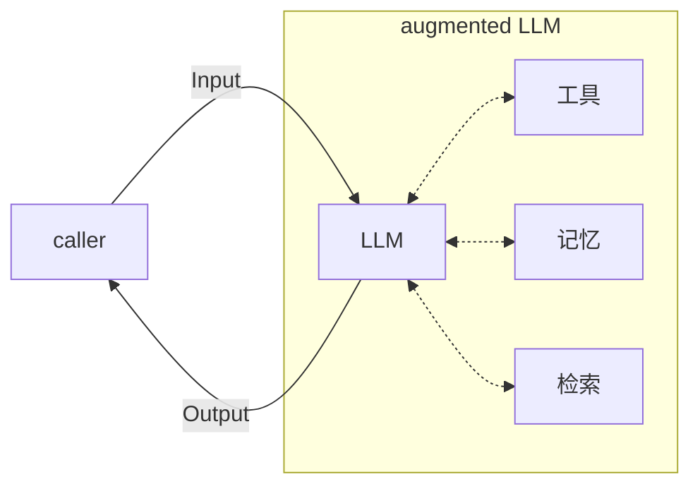
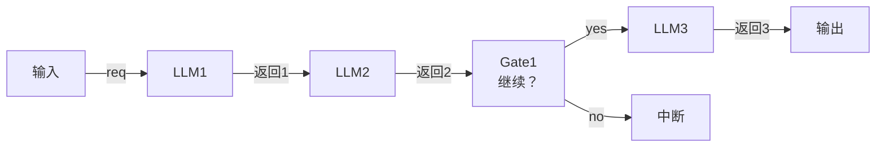
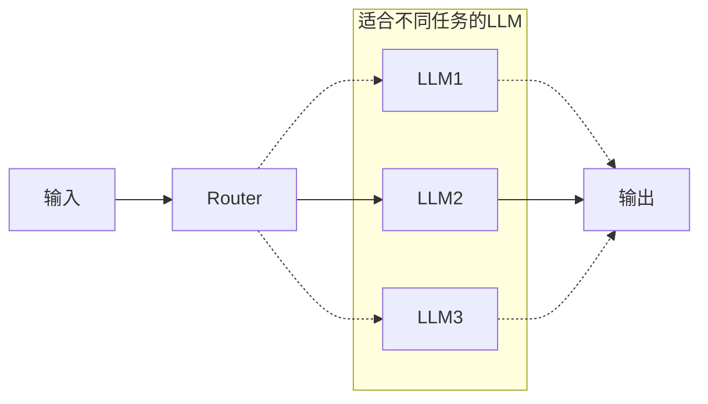
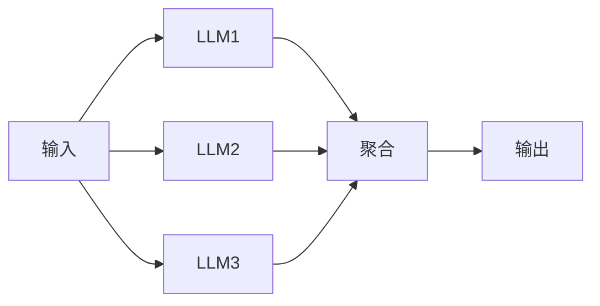
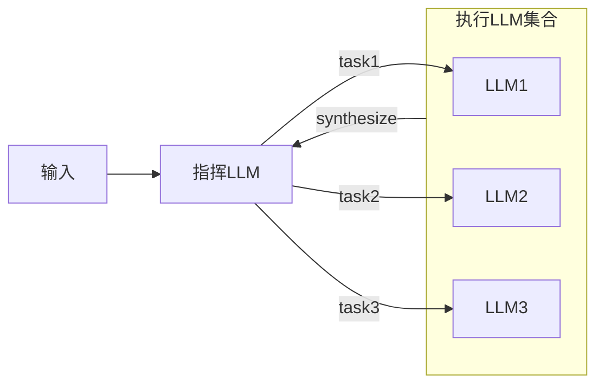
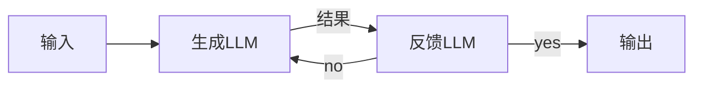
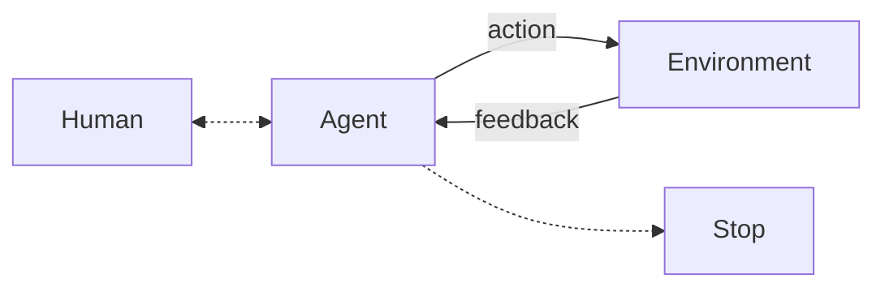
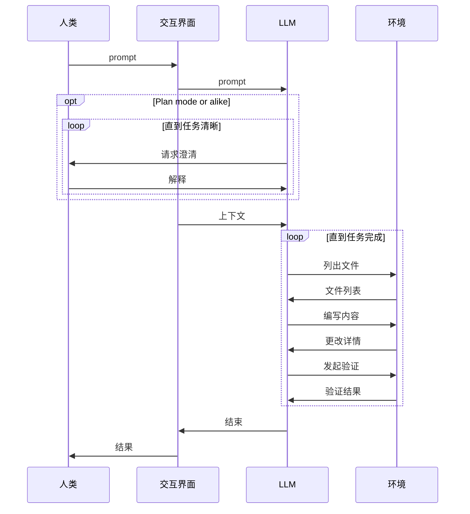

# 构建高效的 Agent

:::tip Non-prescriptive
正如原文结尾所述，本文中描述的内容不是正式的定义或最为规范的做法（actually, no such thing），而是一些常见的practice。
:::

## 代理系统

代理系统（agentic system）是对一类LLM应用的统称，包括一种能够长时间运行、自我反馈的自主系统（autonomous system），或者一种规范化的工作流实现等。一些人可能用“agent”这个没有标准化定义的词汇去代指它们，但必须指出workflow与agent之间的区别是不可忽略的。

- 工作流（workflow）：依照预定义路径执行的LLM或工具的综合。适合需要确定性、一致性的需求。
- 代理（agents）：模型在整个任务的执行过程中动态地规划路径、调用工具的系统，它适合可以采纳模型观点、倾向于构建自主运行的系统的需求。

关于是否要构建代理系统，如何代理系统，有两个关键的考虑：

1. 在构建涉及到LLM的软件系统时，应当仅在有必要的时候引入额外的复杂度。这主要是因为代理系统往往会引入额外的**延迟和成本**。引入这份延迟和成本是否真的值当，是我们做出该决定的一个关键考虑。
2. 是否要使用的框架也是一个值得考虑的问题。框架确实能够简化一些基础的操作，但它也隐藏了许多细节并提高了抽象层级。例如，框架内部用到了怎样的提示词、工作流，如何debug和理解框架所产生的模型输出，都是必须通过阅读源码才能彻底理解的内容。

> If you do use a framework, ensure you understand the underlying code.

### 基本组成部分

代理系统的基本组成部分是**拓展的大语言模型**（augmented LLM），其中的“拓展”指的是提供给无状态的LLM的工具或框架，例如记忆系统、工具列表、召回（检索）系统等。现代模型（文中此处用的是 _out model_，但考虑到这是一篇两年前的文章）可以有效地使用这些“拓展”，其具体体现为LLM可以生成调用参数、解读和评估返回的结果，并选择要保留哪些信息等。

_拓展的LLM_

为大模型提供的工具应当具有清晰的文档（便于LLM的理解），且最好针对实际需求进行优化定制。

## 工作流

### Prompt chaining

一种可能的工作流形式是 prompt chaining——将一个需求拆解为多个*简单*的任务，一个任务的输出作为下一个任务的输入（的一部分）。在任务与任务之间还可以插入检测模块（gates）用于判断任务的输出是否适合作为下一个任务的输入、是否需要采取措施或者彻底结束整个流程等。

这种工作流本质上是在用时间换得更高的准确率（trade off latency for higher accuracy），并且是基于这样一个通常成立的假设：更简单的需求有着更高的准确率。

对于任何容易拆解成简单任务的流程，均可以构建这样的工作流来解决。

_Prompt chaining workflow_

### Routing

有多种不同类型的任务（即使它们相似）时，可以通过在输入的请求与具体的处理逻辑之间设置一个作为分类器的LLM来对请求进行分流（路由），从而实现关注点分离。

这些任务可能相似但存在一些内在差异，这些差异使得它们不得不分离到不同的流程中，或者彻底不同/无关。我们几乎很难让同一套提示词对这两类任务都有比较好的效果，针对其中一类任务调整提示词往往会导致另一类任务的结果受到影响。这是routing主要解决的问题之一。

_Routing workflow. 实线表示可能的一条路径_

一些适合加入routing的例子：

- 智能客服中对于不同的询问请求（例如技术问题、一般问题、针对某些话题的问题等）进行分流
- 根据需求的难易程度将其分配给不同能力的模型解决
- 判断请求是否合法（这有点像gate，但主要是LLM在扮演判断逻辑）或处于某种状态

### Parallelization

采用并行的工作流主要有两种目的：

- 划分（sectioning）：对于彼此无关的任务，将其分离到单独的LLM上运行并且与其它任务并行，最终汇聚成结果。例如对一个数组中的各项的分析，LLM作为map，全部得出结果后reduce（可选）。
- 投票（voting）：将同一个任务并行地运行多次，每次均独立地给出一个结果。这适用于一些结果可能不稳定（例如找出一个代码中的漏洞或安全问题）或提高置信度（例如通过取最高频的结果来避免单次运行导致的假阳性/阴性）的场景。最后对这些结果进行综合统计，得出最终结果。

_Parallelization workflow_

### Orchestrator-workers

指挥—执行工作流适合一些比较复杂的场景。在结构上它与并行工作流很像，其任务都是并行执行的；区别在于指挥—执行工作流中的并行任务数量不是预先确定，而是由指挥LLM根据大的任务自行决定。

等到所有执行LLM工作完毕后，将结果汇总或合成（synthesize）给orchestrator用于进一步的操作。这与Claude Code里用于explore codebase的sub agent很像，但后者属于agent的范畴。

_Orchestrator-workers workflow 中，一个指挥LLM可以发起多个并行任务，并在所有任务执行完毕后分析其结果。_

### Evaluator-optimizer

评估—优化工作流适合满足以下两种条件的任务：
- 具有明确的评估标准，使得评估LLM可以有清晰的评估目标
- 结果可以有效地被迭代优化

我认为满足第一点是必要的，因为这里涉及到一个迭代的过程，其结果可能会因为此过程的存在而发生较大的变化，为了使这个过程可以预测，我们必须消除其中的一些不确定性。对于一些没有明确评估标准的需求，evaluator可能会在每一次请求乃至每一次请求内部的每一轮迭代都给出不一致的结果，最终导致了结果的高度不可预测性。

*Evaluator-optimizer workflow 中存在一个循环，其能否结束由反馈LLM确定*

能够从此过程中受益的任务通常有两个特征：第一个是人类可以完全替代反馈LLM的作用，换句话说就是生成LLM（优化LLM）的输出具有可指摘性，人类看到结果后可以清晰地描述（articulate）出其中的不足之处。这与任务的前提的第一条的含义是相同的。第二个是模型可以模仿人来给出这些不足之处，换句话说，就是LLM能够依靠自身知识或者在提示词的辅助下对输出给出正确的、符合最终目的的评估结果。

满足以上条件的一些任务包括：
- 翻译任务：翻译的内容可能会有一些小细节第一次注意不到，这就需要评估LLM的指出；且人类往往可以给出一定的标准来描述这究竟是什么样的小细节
- 搜索任务：搜索任务是一个逐步深入的过程，每当获得新的信息，评估LLM就要判断这些信息是否足以完成任务，如果不足仍然需要继续搜索，如果足够则停止

搜索任务的evaluator-optimizer设计实际上揭示了这种workflow的通用性或者说本质，它就像图示的那样，是一个不断自循环的结构，其中的一方负责完成工作，另一方负责给出指示或者决定。这相当于一种朝着一个固定的目标不断前进的过程。这个“目标”保留在evaluator中。

## Agents

workflow与agent虽然有着不可忽略的差异，但我们也能清楚地看到在workflow中，某一个关键的决定节点（eg. gate, aggregator, synthesizer, etc.）不一定是纯代码，而完全有可能是由LLM来担任。甚至在后续的evaluator-optimizer workflow中，我们瞥见了一丝循环的意味，这代表这个workflow已经能够在一定程度上自主运行，因其结束的条件主要是由evaluator决定（可能引入外部限制来避免无限循环）。

一个agent的核心同样是一种循环，这是其保持自主性的基础。这一循环的停止点通常是任务的目标已经完成（LLM所认为的）或是迭代次数限制。

*一个可以自主运行的 Agent 的大致框架*

agent相比于workflow的强大之处在于其可以完成那些几乎无法确定需要多少步的任务，这些任务可能本身不是很复杂，但任务的灵活性要求完成此任务的框架具有自主性，而非像workflow那样的硬编码路径。

相比于workflow，借助agent来完成任务在一定程度上会增加成本，并且建立在你相信agent的自主决定这一假设之上。通常需要引入沙盒/容器机制来避免agent做出不安全的行为。

下面的这张时序图近似描述了agent与人类与环境的交互过程。根据我的观察，其中请求澄清—解释循环不是现代agent（例如Claude Code）结构中普遍存在的过程，只有在明确进入了类似于plan mode的模式或提示词包含事实错误（并且没有强词夺理）或提示词明确要求（比较脆弱）的情况下，模型才会主动要求人类的澄清或者确认。

模型与环境的交互循环是agent工作的关键和主要部分，也是涉及到安全考虑的部分。

> The key to success, as with any LLM features, is measuring performance and iterating on implementations. To repeat: you should consider adding complexity only when it demonstrably improves outcomes.

> Success in the LLM space isn't about building the most sophisticated system. It's about building the right system for your needs. Start with simple prompts, optimize them with comprehensive evaluation, and add multi-step agentic systems only when simpler solutions fall short.

最近了解到Pi Agent，我觉得相比Claude Code本身，Pi似乎才更加符合这里的描述，即“... about building the right system for your needs”——指Pi开箱即用、在功能上几乎从零开始的特点；而Claude Code本身似乎就是这里所描述的“... isn't about building the most sophisticated system”中的*sophisticated system*，是一个闭源（虽然曾经“被”开源过）的黑箱子。

## 附录话题

### 1. 实际应用中的Agent

#### 智能客服（Customer support）

这里所说的智能客服不是一种走过场的简单chatbot，而是具有与实际文档交互能力乃至实际系统控制能力的一个综合性agent。它对于一些特定的问题可以启用召回从而给出符合真实场景的答复，并且对于某类需求（例如退款）等可以调用tool来获取用户的信息或执行操作。

智能客服agent的有效性（正确性）的衡量由端用户的反馈来决定，这使得其效果更易于评估。

#### 代码编辑智能体（Coding agent）

近六年，人工智能在代码编写（软件工程）领域的应用从最初的tab completion、chat界面的复制粘贴转变到完全自主的agent写代码，这主要得益于LLM问题解决能力、指令遵循能力和与外界环境的交互能力的提升。

代码编写活动自身的一些性质使其易于被agent处理。例如在软件工程领域以及现有的高级程序设计语言工具链中均有与程序测试相关的设计和工具可供使用，这些工具本身就具备一定意义上的自动化性质（可以被自然地集成到CI工作流中），因而可以直接被agent用于验证其产出的有效性、正确性。

程序设计本身是一个有着明确边界的问题，这也为agent解决提供了遍历。当然，这一条并不是始终成立，一些漫无目的的开发或brainstorming仍然存在，但其前置步骤往往也可以由LLM来辅助完成，待到agent实际实现的时候也已经成为了边界清晰的问题（否则就是poor engineering）。

另一方面，程序设计的稳定性使得其产出可以被客观地评估。这通常适用于大多数程序设计场景，但显然不包括一些与视觉效果紧密联系的内容，例如2C的定制化前端开发；不过这也可以通过给予明确指示来解决，只是衡量和评估变得不再容易自动化。

### 2. 模型工具的提示词工程

为模型提供的同一个工具具有多种表达方式。例如“编辑代码”这样一个工具，可以有下面的这些可能：
- 给出从当前代码到目标代码的差值（diff）
- 完全覆写新的代码而忽略原始代码
- 结构化输出用于填入参数，通常使用JSON或Markdown格式

从软件工程的角度来看，上述方法并没有本质差异，是可以相互转换的。但对于LLM而言，不同的表达形式的生成难度和错误概率有所不同。例如生成差值对于LLM而言并不简单，因为这涉及到对于每一行的精确理解和行号的精确掌握。结构化输出JSON相较于Markdown也引入了额外的麻烦，因为需要考虑JSON中的字符转义，例如换行符等（而Markdown的结构化程度远不及JSON，这也是其比JSON更适合LLM的原因；这也是为什么会有一些用于代替JSON的发明）。

文章在此处给出的对于模型工具定义方式的建议是：
1. 允许模型在编写模型调用之前进行思考
2. 使用一些互联网上常见文本中出现的形式（主要考虑到LLM的训练数据，换句话说，LLM对哪些格式更为熟悉）
3. 尽量避免格式上的额外负担，例如JSON引入的转义负担，或是diff方案引入的行号记忆负担

设计模型工具实际上是在设计一个模型与外部系统交互的接口，我们完全可以参考传统的人机交互（HCI）概念，去考虑更好的agent-机交互（ACI）practice。

对于设计出来的工具格式，我们最好直接站在agent的角度去思考：这样一种格式在使用之前是否需要经过一番深思熟虑才可以（比如一些复杂的参数的存在就会导致这一需要）？其参数和对参数的解释是否直观？或是需要经过特定的理解过程才能明白其参数的具体含义？如果其中的一些点对于你自己是成立的，那么它大概率对于agent来说也是成立的。

接下来，为了优化工具的参数，我们需要思考究竟哪种形参命名方式以及描述更容易理解。这一步骤可以参考为团队中的新人（或者所有人）编写doc string的过程。

最终还是要落地到具体的测试上面来，我们需要观察模型究竟有没有按照我们希望的方式去调用工具。在这里，测试用例的设计很重要。

最好为工具引入防呆（ポカヨケ，poka-yoke）机制，从而进一步降低模型调用工具的错误概率。这里的防呆，在一定程度上也属于优化工具参数的范围——如果工具的参数足够简单或显然，模型很难犯错误。这里的一个常识是，任何涉及到路径的参数，最好都使用绝对路径，从而消除模型需要根据环境推测相对路径的额外负担。

:::tip What is 防呆？
防呆一词在工业上最初用于日本丰田（Toyota）汽车的生产方式中，由新乡重夫提出。

我最初了解的“防呆”是在一些硬件接口的设计上，例如内存条、显卡金手指上开的孔就是一种防呆，用于避免在主板上插反；网线、MicroUSB等接口的单面可插入性也是一种防呆，对于这类单面性的接口，如果没有这种机制、两面均可插入的话，插入错误的一面可能会导致无法预料的结果（轻则软件故障，重则硬件故障乃至电路故障）。

文章这里所提到的防呆显然是一种软件方面的概念，大概意思应该是让参数尽可能显然，使得模型几乎不可能（在如此简单的问题上）犯错误。或是模型犯错误（往往是可以预料的）以后，工具可以即时纠正。例如Claude Code中，当模型没有读取就直接调用Write或Edit时，工具会抛出错误并给出“必须先读取内容再调用”的提示。这确实是一种防呆，因为如果模型直接写入或编辑的话，出错的很可能不是调用时传入的参数，而是写入的具体内容，这是一个更为严重的问题（幻觉污染环境）。
:::

:::warning 吐槽一下这个措不及防的poka-yoke
文章在这里突然来了一句“Poka-yoke your tools”，如果不搜的话还以为这是什么美国乡村slang（poka youk），搜了一下才发现这是防呆的日文（ポカヨケ）。甚至在这里当动词在用。很好奇为什么不直接用fool/idiot-proof......哦确实，“防傻子”有些贬义。
:::