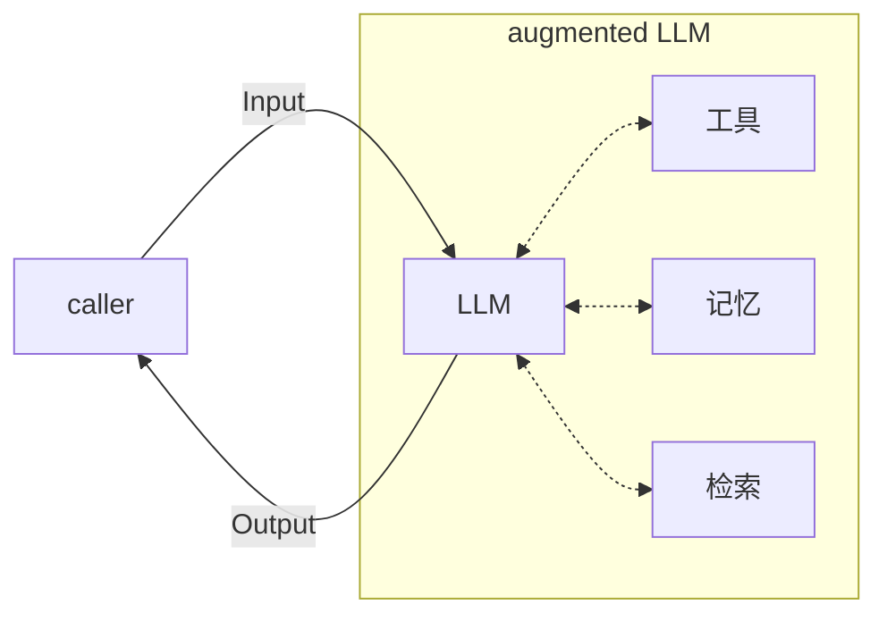
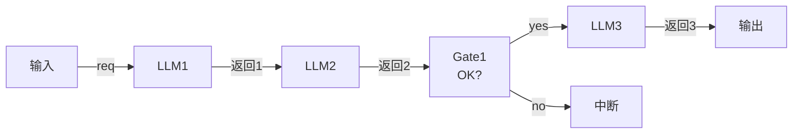
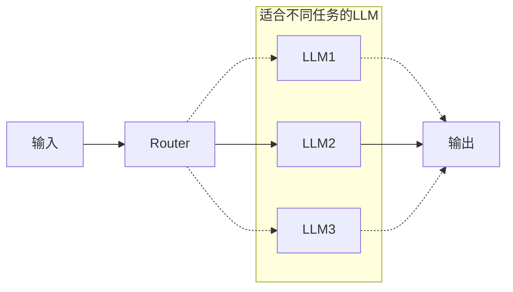
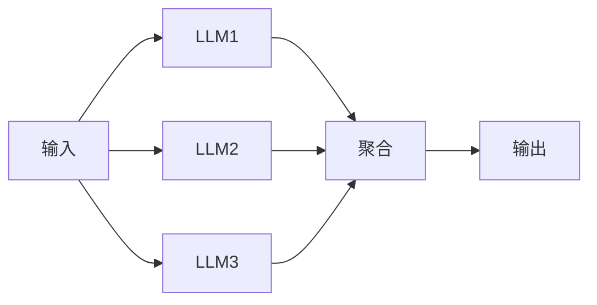
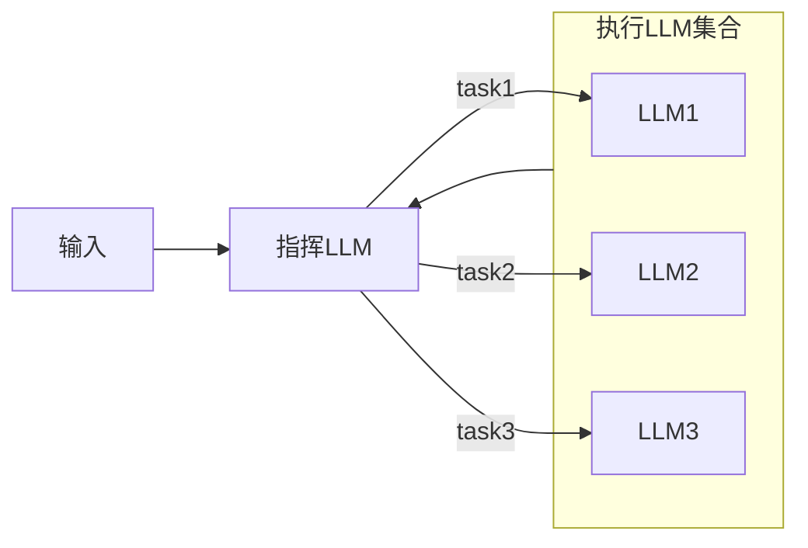
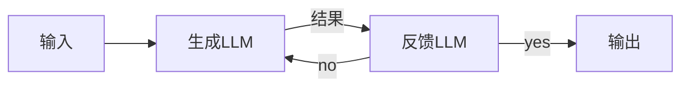
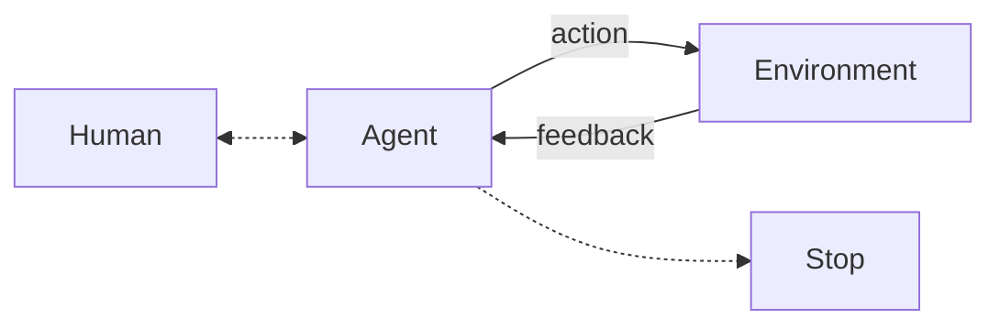
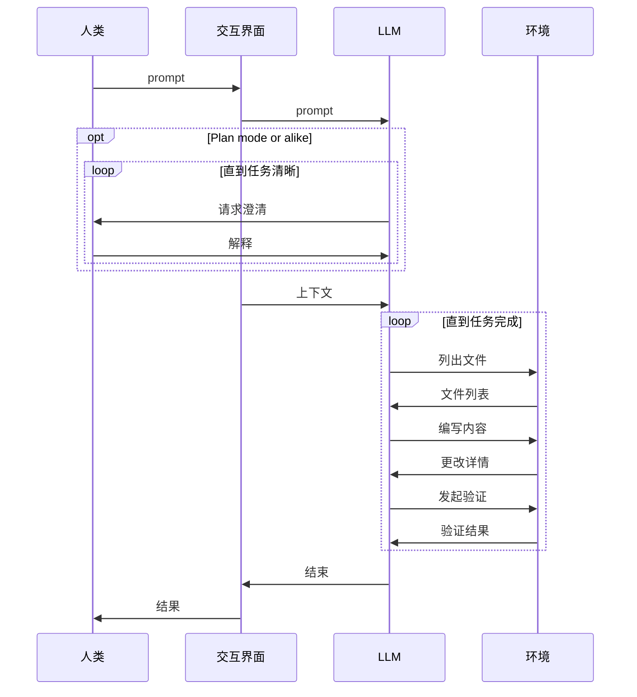

# 构建高效的 Agent

:::tip Non-prescriptive
正如原文结尾所述，本文中描述的内容不是正式的定义或最为规范的做法（actually, no such thing），而是一些常见的practice。
:::

## 代理系统

代理系统（agentic system）是对一类LLM应用的统称，包括一种能够长时间运行、自我反馈的自主系统（autonomous system），或者一种规范化的工作流实现等。一些人可能用“agent”这个没有标准化定义的词汇去代指它们，但必须指出workflow与agent之间的区别是不可忽略的。

- 工作流（workflow）：依照预定义路径执行的LLM或工具的综合。适合需要确定性、一致性的需求。
- 代理（agents）：模型在整个任务的执行过程中动态地规划路径、调用工具的系统，它适合可以采纳模型观点、倾向于构建自主运行的系统的需求。

关于是否要构建代理系统，如何代理系统，有两个关键的考虑：

1. 在构建涉及到LLM的软件系统时，应当仅在有必要的时候引入额外的复杂度。这主要是因为代理系统往往会引入额外的**延迟和成本**。引入这份延迟和成本是否真的值当，是我们做出该决定的一个关键考虑。
2. 是否要使用的框架也是一个值得考虑的问题。框架确实能够简化一些基础的操作，但它也隐藏了许多细节并提高了抽象层级。例如，框架内部用到了怎样的提示词、工作流，如何debug和理解框架所产生的模型输出，都是必须通过阅读源码才能彻底理解的内容。

> If you do use a framework, ensure you understand the underlying code.

### 基本组成部分

代理系统的基本组成部分是**拓展的大语言模型**（augmented LLM），其中的“拓展”指的是提供给无状态的LLM的工具或框架，例如记忆系统、工具列表、召回（搜索）系统等。现代模型（文中此处用的是 _out model_，但考虑到这是一篇两年前的文章）可以有效地使用这些“拓展”，其具体体现为LLM可以生成调用参数、解读和评估返回的结果，并选择要保留哪些信息等。

_拓展的LLM_

为大模型提供的工具应当具有清晰的文档（便于LLM的理解），且最好针对实际需求进行优化定制。

## 工作流

### Prompt chaining

一种可能的工作流形式是 prompt chaining——将一个需求拆解为多个*简单*的任务，一个任务的输出作为下一个任务的输入（的一部分）。在任务与任务之间还可以插入检测模块（gates）用于判断任务的输出是否适合作为下一个任务的输入、是否需要采取措施或者彻底结束整个流程等。

这种工作流本质上是在用时间换得更高的准确率，并且是基于这样一个通常成立的假设：更简单的需求有着更高的准确率。

对于任何容易拆解成简单任务的流程，均可以构建这样的工作流来解决。

_Prompt chaining workflow_

### Routing

有多种不同类型的任务（即使它们相似）时，可以通过在输入的请求与具体的处理逻辑之间设置一个作为分类器的LLM来对请求进行分流（路由），从而实现关注点分离。

注意这些任务可能相似，而它们之间的内在差异使得他们不得不分离到不同的流程中。这主要体现在我们几乎很难让同一套提示词对两类任务都有比较好的效果。针对其中一类任务调整提示词往往会导致另一类任务的结果受到影响，这也是routing主要解决的问题之一。

_Routing workflow. 实线表示可能的一条路径_

一些适合加入routing的例子：

- 智能客服中对于不同的询问请求（例如技术问题、一般问题、针对某些话题的问题等）进行分流
- 根据需求的难易程度将其分配给不同能力的模型解决
- 判断请求是否合法（这有点像gate，但主要是LLM在扮演判断逻辑）或处于某种状态

### Parallelization

采用并行的工作流主要有两种目的：

- 划分（sectioning）：对于彼此无关的任务，将其分离到单独的LLM上运行并且与其它任务并行，最终汇聚成结果。例如对一个数组中的各项的分析，LLM作为map，全部得出结果后reduce（可选）。
- 投票（voting）：将同一个任务并行地运行多次，每次均独立地给出一个结果。这适用于一些结果可能不稳定（例如找出一个代码中的漏洞或安全问题）或提高置信度（例如通过取最高频的结果来避免单次运行导致的假阳性/阴性）的场景。最后对这些结果进行综合统计，得出最终结果。

_Parallelization workflow_

### Orchestrator-workers

指挥—执行工作流适合一些比较复杂的场景。在结构上它与并行工作流很像，其任务都是并行执行的；区别在于指挥—执行工作流中的并行任务数量不是预先确定，而是由指挥LLM根据大的任务自行决定。

等到所有执行LLM工作完毕后，将结果汇总或合成（synthesize）给orchestrator用于进一步的操作。这与Claude Code里用于explore codebase的sub agent很像，但后者属于agent的范畴。

_Orchestrator-workers workflow 中，一个指挥LLM可以发起多个并行任务，并在所有任务执行完毕后分析其结果。_

### Evaluator-optimizer

评估—优化工作流适合满足以下两种条件的任务：
- 具有明确的评估标准，使得评估LLM可以有清晰的评估目标
- 结果可以有效地被迭代优化

我认为满足第一点是必要的，因为这里涉及到一个迭代的过程，其结果可能会因为此过程的存在而发生较大的变化，为了使这个过程可以预测，我们必须消除其中的一些不确定性。对于一些没有明确评估标准的需求，evaluator可能会在每一次请求乃至每一次请求内部的每一轮迭代都给出不一致的结果，最终导致了结果的高度不可预测性。

*Evaluator-optimizer workflow 中存在一个循环，其能否结束由反馈LLM确定*

能够从此过程中受益的任务通常有两个特征：第一点是人类可以完全替代反馈LLM的作用，换句话说，就是生成LLM（优化LLM）的输出具有可指摘性，人类看到结果后可以清晰地描述（articulate）出其中的不足之处。这与任务的前提的第一条是相同的。第二个点是模型可以模仿人来给出这些不足之处，换句话说，就是LLM能够依靠自身知识或者在提示词的辅助下对输出给出正确的、符合最终目的的评估结果。

满足以上条件的一些任务包括：
- 翻译任务：翻译的内容可能会有一些小细节第一次注意不到，这就需要评估LLM的指出
- 搜索任务：搜索任务是一个逐步深入的过程，每当获得新的信息，评估LLM就要判断这些信息是否足以完成任务，如果不足仍然需要继续搜索，如果足够则停止

搜索任务的evaluator-optimizer设计实际上揭示了这种workflow的通用性或者说本质，它就像图示的那样，是一个不断自循环的结构，其中的一方负责完成工作，另一方负责给出指示或者决定。这相当于一种朝着一个固定的目标不断前进的过程，这个目标保留在evaluator中。

## Agents

workflow与agent虽然有着不可忽略的差异，但我们也能清楚地看到在workflow中，某一个关键的决定节点（eg. gate, aggregator, synthesizer, etc.）不一定是纯代码，而完全有可能是由LLM来担任。甚至在后续的evaluator-optimizer workflow中，我们瞥见了一丝循环的意味，这代表这个workflow已经能够在一定程度上自主运行，因其结束的条件主要是由evaluator决定（可能引入外部限制来避免无限循环）。

一个agent的核心同样是一种循环，这是其保持自主性的基础。但agent的概念框架中的LLM与workflow中的augmented LLM不同，其具有对外界实际环境的访问能力。agent的停止点通常是任务的目标已经完成（LLM所人为的）或是迭代次数限制。

*一个可以自主运行的 Agent 的大致框架*

agent相比于workflow的强大之处在于其可以完成那些几乎无法确定需要多少步的任务，这些任务可能本身不是很复杂，但任务的灵活性要求完成此任务的框架具有自主性，而非像workflow那样的硬编码路径。

而相比于workflow，借助agent来完成任务在一定程度上会增加成本，并且建立在你相信agent的自主决定这一假设之上。通常需要引入沙盒/容器机制来避免agent做出不安全的行为。

下面的这张时序图近似描述了agent与人类与环境的交互过程。根据我的观察，其中请求澄清—解释循环不是现代agent（例如Claude Code）结构中普遍存在的过程，只有在明确进入了类似于plan mode的模式或提示词包含事实错误（并且没有强词夺理）或提示词明确要求（比较脆弱）的情况下，模型才会主动要求人类的澄清或者确认。

模型与环境的交互循环是agent工作的关键和主要部分，也是涉及到安全考虑的部分。

> The key to success, as with any LLM features, is measuring performance and iterating on implementations. To repeat: you should consider adding complexity only when it demonstrably improves outcomes.

> Success in the LLM space isn't about building the most sophisticated system. It's about building the right system for your needs. Start with simple prompts, optimize them with comprehensive evaluation, and add multi-step agentic systems only when simpler solutions fall short.

最近了解到Pi Agent，我觉得相比Claude Code本身，Pi似乎才更加符合这里的描述，即“... about building the right system for your needs”——指Pi开箱即用、在功能上几乎从零开始的特点；而Claude Code本身似乎就是这里所描述的“... isn't about building the most sophisticated system”中的*sophisticated system*，是一个闭源（虽然曾经“被”开源过）的黑箱子。