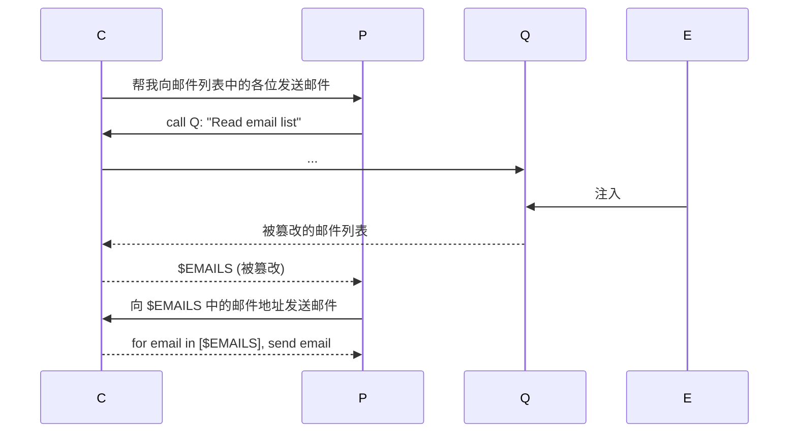

# 一种减弱提示词注入攻击的新方向 CaMeL

> The original sin of LLMs that makes them vulnerable to this is when trusted prompts from the user and untrusted text from emails/web pages/etc are concatenated together into the same token stream.

CApabilities for MachinE Learning（CaMeL，强行缩写成这样或许是想[贴近骆驼有两个驼峰的样子](https://simonwillison.net/2025/Apr/11/camel/#camels-have-two-humps)...）是论文[Defeating Prompt Injections by Design](https://arxiv.org/abs/2503.18813)中提出的一种对抗提示词注入攻击的方法。这种方法相较于其它尝试解决提示词注入的方法，没有引入额外的AI层，而是采用了一种向语法树元素添加标签并将其与access control相关联的策略。这种看上去有些“经典”的实现摆脱了LLM天生的概率性问题。

## 为什么AI不适合作为防护层

“一个系统是否安全”是建立在一种对攻击者、用户可访问的数据和进行的行为的假设的基础上，经过严密论证所得到的结论。如果我们构造了一个99%情况下安全的系统，就好似在说这个结论是“99%成立”，换句话说便是不成立——漏洞之所以被称为漏洞，正是因为它出现在小小的边缘，可以被攻击者乘虚而入。因此通过引入额外的AI层来解决安全问题的方法从逻辑上来看并不显得有效。

从实际应用的角度来看，你很难训练一个能够自主且正确地表现出“对一类内容遵循而对另一类内容又谨慎”的LLM。而如果这个过程不能完全可靠自主，就代表其需要引入外部的调整，这就又退化成了allow list。

因此CaMeL通过构造一门Python-like的语言，追溯该语言中的每一个变量的标签及其流向的方法，是更加值得借鉴和学习的。

## 双LLM框架存在的隐患

> ... but the Q-LLM is still exposed to potentially malicious instructions.

这个隐患在某种程度上来看是显然的。在双LLM框架中，P-LLM具有较高的权限并可与外界交互，但它不会读取除了prompt以外的任何外界信息；Q-LLM没有权限，专注于P-LLM委派过来的工作，并且其内容永远不会被直接传递给P-LLM。在这个过程中，Q-LLM的输出被默认是安全的或经过了过滤的，这就发生了一个毫无理由的不受信任内容向受信任内容的转变。

换句话说，在这种框架下，不受信任的邮件经过总结之后变成了受信任的邮件、不受信任的文件内容读取后变成了受信任的文件内容。提示词注入完全可以误导Q-LLM篡改返回的内容，进而误导后续链路的执行。

下面这张时序图演示了E通过误导Q给出错误的结果，从而实现数据外泄攻击的大致过程。注意，E注入的时机是不确定的，为了简单，将其放在提示词被提交之前。


*注入不一定需要Q-LLM亲自执行操作。可以在结果上做手脚，误导P-LLM执行操作*

更重要的是，这种框架的前提使得P-LLM无法对结果进行审查。Q-LLM成了这里的司令部，它无论把什么传给P-LLM，后者都会照做。我们能不能在这里增加一个Review LLM来做审查呢？当然可以，但正如上面所说，套一层AI无法确保可靠性。

## 定制的Python解释器

在CaMeL中，P-LLM执行的任务序列专门使用一个Python-like语言来表达，不再使用简单的tool call。使用Python-like语言是因为大多数LLM非常擅长编写Python代码。这样，上面的过程可以由P-LLM通过下面的代码表达出来。

```python
email = get_last_email()
address = query_quarantined_llm(
    "Find Bob's email address in [email]",
    output_schema=EmailStr
)
send_email(
    subject="Meeting tomorrow",
    body="Remember our meeting tomorrow",
    recipient=address,
)
```

CaMeL是在双LLM模式之上建立的机制，所以这里有着双LLM模式的影子：P-LLM和Q-LLM以及它们之间变量的传递。

Tool call的本质是函数调用，变量的传递可以直接由编程语言自带的内容来描述······让P-LLM用一种类编程语言来描述任务的过程是一个很自然的设计。形式上的转变并未影响到功能。

这个过程的特殊之处在于，经过定制的解释器可以对代码施加额外的分析步骤。具体来说，可以追踪每一个变量的流向，并为它们附加标签。例如`email`这个变量的值来自于外部，它是不受信任的。`address`是由`email`处理而言，是一个`email`的派生量，也是不受信任的。经过这种语法层面上的追踪，我们可以在函数被调用的时候检查其某些参数是否是不可信的，如果是，就针对性地采取一些措施。

上面的代码中，`email`、`address`是两个不可信的变量，`send_email`函数的`recipient`参数是一个不可信的参数。`recipient`可以有一套预定义的允许值，任何落在这些值外面的传入值都需要经过审查。

这种包含在变量上的标签就是capabilities，它描述了谁可以读取该变量，以及该变量的具体来源是哪里；基于capabilities，用于描述允许的函数、参数的规则称为策略policies。

## 端侧LLM的考虑

CaMeL保留了双LLM机制。我们会发现，这两个LLM不仅在权限上有区别，其实际执行任务的复杂程度也有区别。

Q-LLM所做的工作往往只是提取、总结等内容，它被作为P-LLM的一个工具来使用；P-LLM需要对任务进行规划并编写任务的编程语言描述。因此，我们可能可以使用本地、端侧部署的小模型来充当其中的Q-LLM。将模型放在端侧、屏蔽互联网进一步提升了其安全性，同时P-LLM看不到Q-LLM的结果前提依然成立，这避免了整个链路中隐私部分需要上云的所带来的隐患。

> On top of being faster and cheaper, this LLM can potentially also be run locally on the user’s machine. This would improve the user’s privacy with respect to the model provider: since the LLM used as the P-LLM is only provided with the user query, the P-LLM provider never sees the tool outputs.

## 提示词注入攻击被攻克了吗？

这是一个promising path，但仍有其限制。

> At the same time, it is well known that balancing security with user experience, especially with de-classification and user fatigue, is challenging.

> Anything that requires end users to think about security policies also makes me deeply nervous.

CaMeL内部仍然有类似于allow list的机制。这种机制会消耗用户的精力，并最终导致fatigue。这里的fatigue指的是弹出确认的次数太多，导致用户最后只愿意一个劲点Yes。

即使是安全领域的专业人士，也有可能会出现这种fatigue，这是我们日常使用过程中的惰性与这类工具本身标榜的目的一致混合的结果。Simon在这里举了安全研究者以及haveibeenpwned.com的运营者[Troy Hunt因为时差导致的疲倦而被钓鱼](https://simonwillison.net/2025/Apr/4/a-sneaky-phish/)的一个事件。

一个比较好的解决办法是预置一套allow list（使得用户不需要build it from scratch）并且优化UI的设计。

## 参考

- You can't solve AI security problems with more AI - https://simonwillison.net/2022/Sep/17/prompt-injection-more-ai/
- SQL injection - https://en.wikipedia.org/wiki/SQL_injection
- [双LLM模式的笔记](./dual-llm-pattern.md)