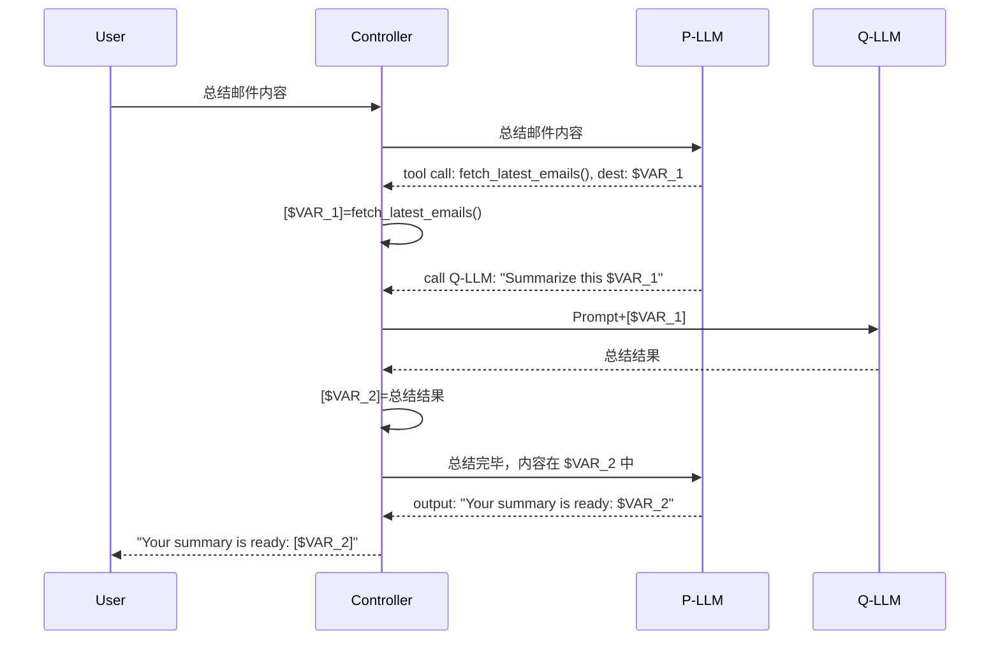

# 防止提示词注入的双模型设计

agent总是要与外界交互：读取文件、执行指令、编辑或删除文件等。在这个过程中，文件中的信息会被包含到上下文中供模型理解。提示词注入（prompt injection）就发生在这个过程：如果agent读取的信息中包含一些精心调配的恶意提示词，就有可能引导agent在任务执行的过程中走向歧途。

:::tip 注入攻击
提示词注入是一个来自SQL注入（SQL injection）的类比词，后者是在后端开发中常见的注入攻击。两类攻击的共同点都是信任了不可信的内容（用户输入）或没有专门的过滤机制，导致外部因素可以轻易地与内部系统进行交互。

提示词注入现象存在中性的场景，例如来自模型的预置上下文。当你在模型的预置上下文（CLAUDE.md/AGENTS.md/CODEBUDDY.md/...）中添加了一些让模型“始终遵循”的事情并划定范围，一些模型可能在工作的过程中会将这些事情与其实际工作混淆。归根结底这是一个上下文形式所导致的问题，即[这里](https://simonwillison.net/2025/Apr/11/camel/#camels-have-two-humps:~:text=The%20original%20sin%20of%20LLMs%20that%20makes%20them%20vulnerable%20to%20this%20is%20when%20trusted%20prompts%20from%20the%20user%20and%20untrusted%20text%20from%20emails/web%20pages/etc%20are%20concatenated%20together%20into%20the%20same%20token%20stream.)提到的一种原罪。
:::

提示词注入并不是篡改作为用户的我们给模型的提示词——在这个环节进行攻击显得有些过于明显且容易防范。提示词注入往往都是发生在模型对外部环境的读取、探索和理解的过程中。

> If you think you have an obvious solution to it (system prompts, escaping delimiters, using AI to detect attacks) I assure you it’s already been tried and found lacking.

提示词注入是一个无法让LLM直接避免的问题，LLM在这一方面难以变得可靠。一些其余显然的方法也都不会奏效。在安全领域，只要有1%的疏漏，剩余的99%的防护也会失去意义。只有达到一种“天衣无缝”的效果才能算作是真正的安全。

## 概念引入

### 模型对工具的调用

工具调用的本质几乎都是让模型生成一个事先约定好格式的字符串，包括要调用的工具的名称、参数等内容。用来接收模型输出的框架对字符串进行解析和识别，然后调用真正的函数，以达到模型调用工具的外部效果。

提示词注入的最终目的，就是让模型生成出符合攻击者意图的恶意工具调用文本。

### Confused deputy

混淆代理程序（confused deputy）是一个信息安全领域的术语，指的是一个具有用户授予的某种权限但容易被欺骗的计算机程序。这个程序是受用户信任的，但可能会因为外界的攻击而滥用了自己的权限去执行一些恶意的操作。

我们现如今使用的agent harness正是一种混淆代理程序，其本质的工作方式是**将可信内容与不可信内容拼接在一起**。安全问题便出在这里的不可信内容上。但我们又不可避免地要依赖这些不可信的内容。目前的防御手段是在执行之前要求人类批准，但这几乎只能算是走个过场；模型确实会在执行指令之前询问你，并且将指令的具体内容交付给你判断，但你真的会愿意去判断吗？或许刚开始是如此，但久而久之就会出现dialog fatigue，你会觉得越快点Yes越好，甚至希望能够彻底摘除这个机制，让模型完全“自主”地工作。

那么是否可以列出一些allow list呢？小范围可以，但是一旦范围扩大、指令数增多以后，allow list肯定会不可避免地出现通配符，其本质没有发生改变。是否可以分级处理，预先定义一些安全的行为，从而减少确认的次数呢？可以，但也不可靠，并且往往攻击就是在这些边界的场景中着手的。

### Data exfiltration attack

*exfiltration* 是一个牛津英汉词典中没有收录的词，它应该是infiltration（渗透）的反义词，意思是“外泄”。数据外泄攻击指的是未经允许从计算机中恶意窃取数据的行为，也就是偷数据。当我们赋予agent访问我们个人资料的权限的时候，就已经暴露在这种攻击风险之下。

使用agent的过程中，我们数据泄露的途径有下面几种形式：

1. HTTP请求：这是最直接的一种数据泄露的途径。具有网络访问权限的agent可以直接被引导向外界的服务器发送其经过提示词指示加工好的内容
2. 超链接：agent生成一个看似无害的超链接引导用户去点击，URL参数中包含被泄露的数据
3. 图片：agent显示一张看似无害的图片，但请求该图片的URL本身包含被泄露的数据

虽然这三种攻击的形式在网页注入攻击中就已经很常见，但其在agent的框架下仍然是有效的。攻击者只需要想办法向其服务器发送一个基本的GET请求就可以完成数据的窃取，并可以将发送出的数据用一些秘密的形式加密使这个过程难以发现或追踪。

## 最严格的实现

如果希望一个会包含不可信内容的LLM自主工作，我们对其施加的限制是非常多的：
- 不能具备任何可能被滥用的外部操作的能力。例如任何读取操作、编辑操作、删除操作等。
- 只能调用可信的API（allow list）
- 不能生成链接、图片等。

这样一个LLM大概率也无法实现什么“智能”。我们需要另辟蹊径。

## 双LLM模式

Simon Willison在这里提出了一个基于两个LLM的协作模式来减轻这个过程的风险。这两个LLM是：
- 特权LLM（Privileged LLM, P-LLM）：用户赋予了权限的LLM，它以常见的ReAct pattern工作，具有调用工具的能力
- 隔离LLM（Quarantined LLM, Q-LLM）：不具备访问外部环境的能力，被隔离的LLM。它几乎可以看作是P-LLM的一个附属或工具

这个模式的约束条件，除了P、Q原本的定义外，还有：
- Q-LLM的输出内容不能被直接原样送给P-LLM
- P-LLM不能接触到任何不可信的内容

第一条有一个例外。如果确实需要从Q向P传递，必须经过某种完全可靠、无概率性问题的过滤，例如对类似于分类器这样的具有明确pattern/schema/可能性的结果过滤。

要使这个模式真正工作起来，还需要引入一个控制器（Controller）作为协调两者的软件框架。控制器是一个经典程序，不具备任何LLM元素。三个部分具体的工作可见于下面这张时序图，图中的 `$VAR_1` 是变量名，`[$VAR_1]` 表示该变量中存储的值。

*P-LLM、Q-LLM之间的信息交换由Controller负责，二者都可以进行“变量的赋值”。P-LLM看不到Q-LLM返回的内容，但知道存储这个内容的变量名。*

总结邮件内容是涉及到不受信任的内容的操作，因此由P-LLM交给Q-LLM进行。Q-LLM在总结的过程中，即使受到了提示词注入，但由于没有任何与外部环境交互的权限，注入的攻击无法实现。以上链路确保了Q-LLM在生成内容的过程中不会有任何多余的操作。

这个过程利用了变量名引用机制。Q-LLM返回的内容不能也不需要被包含在P-LLM的上下文中，P-LLM全程看到的都只是变量名。这就实现了P与Q之间的隔离。有了Controller的中间处理与后处理，这个过程对于用户来说看不出什么特殊之处（因为Controller中始终存有所有的数据，可以随时展示），却实现了P与Q的协作。

## 总结

> You may have noticed something about this proposed solution: it's pretty bad!

Simon Willison对于自己提出的这一模式的看法是：it's pretty bad! 原因主要有：
- 实现复杂度的大幅增加
- 用户体验的降级（但其中的一些细节是可以隐藏的；可能与系统额外的复杂度有关？）
- 无法防止社会工程（social engineering, but who can?）

## 双LLM的瑕疵与CaMeL

2025年3月24日，Google DeepMind发表了论文[Defeating Prompt Injection by Design](https://arxiv.org/abs/2503.18813)，提出了一种基于自定义解释器的变量标签（Capabilities）的提示词注入防御方向CaMeL，并与本博文作者的双LLM模式进行了对比，提出了这一双LLM模式的一点不安全之处：既然Q-LLM是暴露在具有威胁的环境中，那么其输出应当是不可信的；攻击者完全可以通过提示词注入来篡改Q-LLM输出的内容，进而误导后续特权链路的运行。见于[原博文](https://simonwillison.net/2025/Apr/11/camel/)。