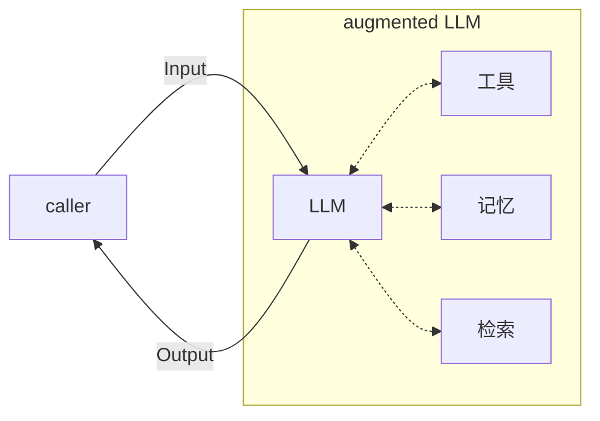
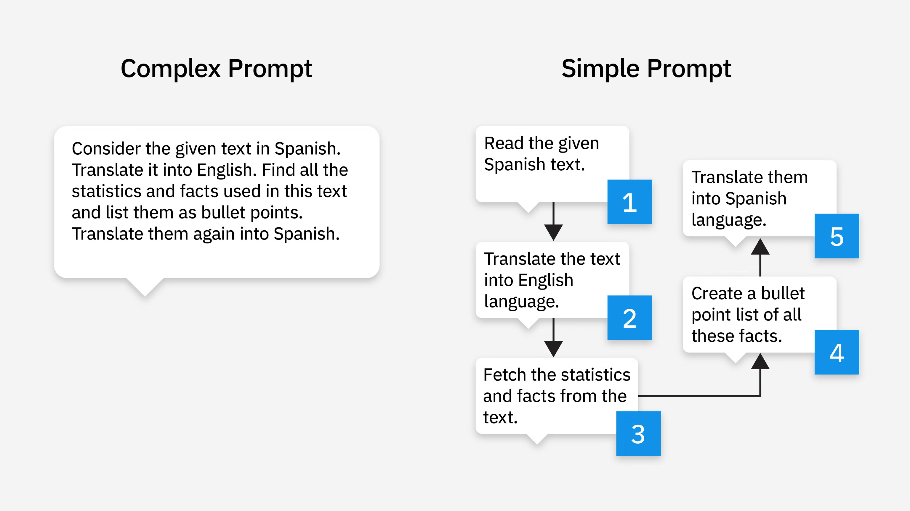
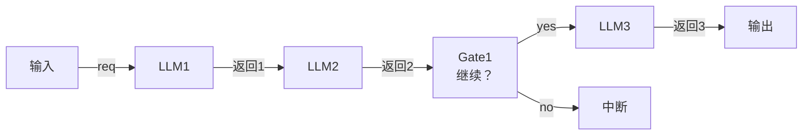
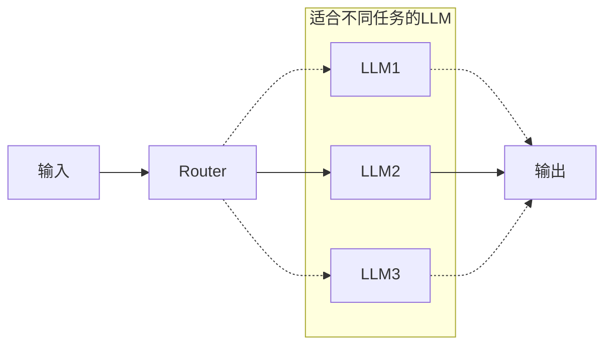
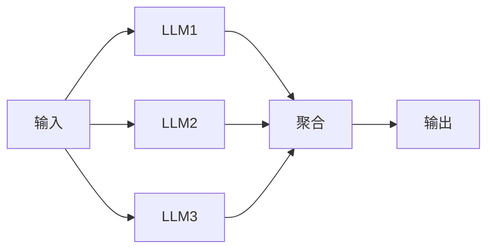
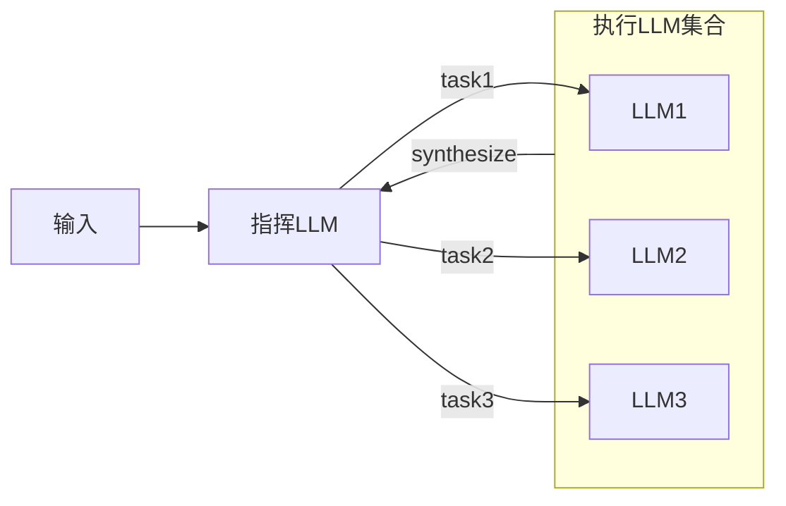
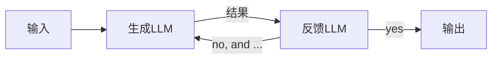
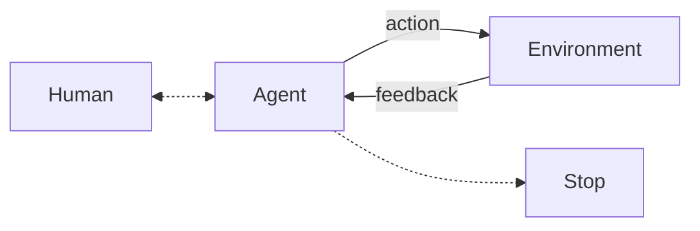
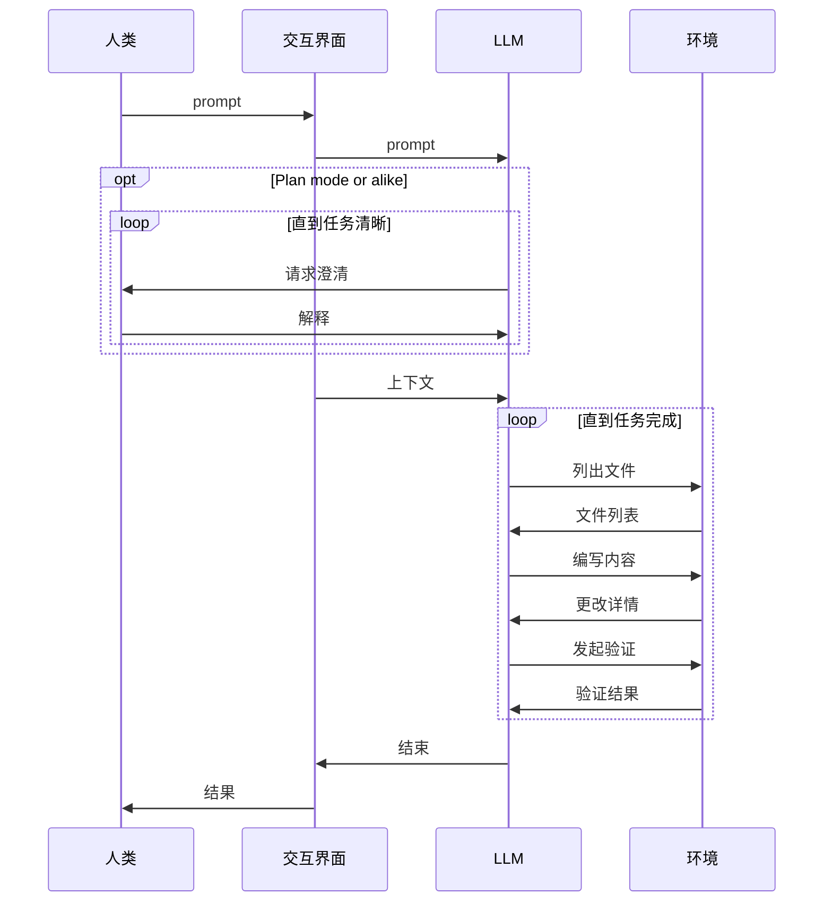

# Anthropic Reading: Building Effective Agents

- 原文链接：https://www.anthropic.com/engineering/building-effective-agents
- 原文发布日期：2024年12月19日

**导语：**本文是对Anthropic Engineering博客上“Building Effective Agents”一文的阅读记录。博客上的这一篇文章说明了什么是代理系统以及两类典型的代理系统（工作流和智能体）的区别，提供了围绕Agentic System、Agent、Workflow等概念的一个基本的图谱、细分和解释。

这里提出的这些概念不是存在于教科书上的定义。由于AI领域常有的**实践先于定义**的现象的存在，除非专门拟定标准（如MCP），否则很难对一个词语做出广泛认可的定义。因此本文中出现的名词可以认为是其“Anthropic定义”。

## Agentic System

代理系统（Agentic System）是对一类LLM应用的统称，主要分为两种：
1. 智能体（agent）：由模型在整个任务执行的过程中规划执行路线和调用工具的系统。
2. 工作流（workflow）：按照预先定义好的路径执行的LLM或工具的组合。

智能体和工作流的共同点是都有LLM的参与，而最大的区别在于LLM在其中的角色是什么。
- 在智能体中，LLM负责规划整个流程
- 工作流的流程是人为规划好的，LLM由流程中的步骤调用

工作流对每一个步骤调用的LLM的输出的使用方式是自由的。这些模型输出不仅可以用于步骤的输入，还可以直接用于控制流程，从而形成模型主导的循环（如Evaluator-optimizer）、分支（如Routin和Orchestrator-worker）。处于工作流中的LLM也有控制流程的能力，但整个流程框架仍然是预先定义的。

关于构建这样的代理系统，有两个关键的考虑：
1. **是否要引入代理系统 & 代理系统的复杂度应如何**：引入代理系统、拓展代理系统均会引入额外的成本和延迟。在“这份工作是否真的需要一个LLM来参与”以及“是否需要额外的环节”等问题上，需要专门考虑。
2. **是否需要引入框架（包括开发框架、MCP等）**：框架会提升代理系统的抽象层级。只有明确了框架内部用到的提示词和工作流，才能够更好地理解模型在框架下的输出以及debug。

> If you do use a framework, ensure you understand the underlying code.

## Augmented LLM


_拓展的LLM_

代理系统的基本组成部分是**拓展的大语言模型**（augmented LLM），其中的“拓展”指的是提供给无状态的LLM的工具或框架，例如记忆系统、工具列表、召回（检索）系统等。现代模型可以有效地使用这些拓展。

下文工作流中提到的LLM、LLM1/2/3等，均是指拓展的大语言模型。这些拓展模型的底层模型可能不同，也可能是更换了提示词、工具或框架中的一种或几种后的同一种模型。

## Workflow: 常见的工作流模式

### Prompt Chaining

当我们需要做一个复杂的任务的时候，一个选择是像写工作流程一样在交给大模型的提示词中详细描述自己所要做的事情。这个提示词的详细的程度和结构化程度因人而异，既可能是一整段关于目标的叙述，也可能是整理好的步骤。这样编写出来的是复杂提示词（complex prompt），其相较于简单提示词错误率会更高（注：随着模型能力的不断提升，模型所能够应对的提示词复杂程度也在提高）。

将复杂提示词拆分成简单提示词，并将简单提示词一句一句提供给模型来达成任务，称为提示词链化（Prompt Chaining）。

 *一个不懂西班牙语的英语母语者希望从一段西班牙语文本中提取关键信息，并以西班牙语交付。这个任务可以通过为模型提供一个复杂提示词或多个简单提示词完成。图源 https://www.ibm.com/think/topics/prompt-chaining*

对于能力更强的模型，我们拆分的单位不一定是一个复杂的提示词，而是一系列步骤，或是一个复杂的需求。通过将这个需求拆分成单步，每一步一个模型调用，我们得以构造一个简单的prompt chaining工作流。这个工作流的特点是，每一轮的输出作为下一轮的输入，或是作为门限步骤（gate）决定是否继续的判据。


_Prompt chaining workflow_

### Routing

如果我们的系统面对的是不同类型的输入，且需要对不同类型的输入区别处理，一个选择是在提示词中描述不同类型输入的特征及应对方法。这形成了一个带有判断逻辑的复杂提示词。

```md
- 如果满足 condition1，则 action1
- 如果满足 condition2，则：
    - 如果此时满足 condition3 和 condition4，且 condition5，则 action2
    - 如果此时满足 condition6，则 action3
    - 否则 action4
- 其余情况 action5
```

这种复杂提示词的结果不是确定的，且可靠性因模型能力而异。

Routing的方法通过单独设置一个LLM，称为Router（路由器），来对输入进行分类。分类后由工作流的确定流程交付给不同的LLM执行。一些典型的可以用到路由的例子：
- 智能客服中对于不同的询问请求（例如技术问题、一般问题、针对某些话题的问题等）进行分流
- 根据需求的难易程度，将其分配给不同能力的模型解决，从而有效控制成本
- 判断请求是否合法，或处于某种状态


_Routing workflow_

### Parallelization


*Parallelization workflow*

并行工作流同时将一轮输入交给多个LLM处理，再对每一个LLM的输出做聚合得到结果，有两种模式：

1. 划分（sectioning）：若任务彼此无关，可以将它们中的若干个同时分配到LLM上执行，最后的结果根据需要做聚合。这个过程类似于Map(-Reduce)。
2. 投票（voting）：将同一个任务并行地运行多次，对结果进行统计得到最终结果。适用于结果不确定、不稳定的情况，例如：
   - Code Review对多轮结果做合并
   - 统计结果中的阳性/阴性频率，取最高频来提高置信度

### Orchestrator-workers



Orchestrator-workers工作流与并行工作流类似，但这里并行LLM的数量以及各自的职责不是预先确定的，而是由Orchestrator根据输入确定。这与Claude Code鼓励主agent开的sub-agent模式很像。显然，Orchestrator应该是一个能力比较强的模型，而它所指挥的Worker则根据任务的复杂度各异。

### Evaluator-optimizer

满足下面两种条件的任务适合Evaluator-optimizer工作流：
1. 评估标准明确、可描述
2. 结果可以被有效地迭代优化

我认为满足第一点是**必要的**。这里涉及到一个迭代的过程，其结果可能会在迭代的过程中发生较大的变化，最后趋于稳定。为了使这个过程可预测、可解释，我们必须消除其中的一些不确定性，让模型有清晰的评估目标和标准。对于一些没有明确评估标准的需求，Evaluator可能会在每一次请求乃至每一次请求内部的每一轮迭代都给出不一致的反馈。


*Evaluator-optimizer workflow 中存在一个循环，其能否结束由Evaluator LLM确定*

能够从此过程中受益的任务通常有两个特征：
1. Optimizer的输出具有可指摘性，人类看到结果后可以清晰地描述（articulate）出其中的不足之处。这与任务的前提的第一条的含义是相同的。
2. Evaluator能够依靠自身知识或者在提示词或召回数据的辅助下对输出给出正确的、符合最终目的的评估结果。

一些适合Evaluator-optimizer的典型任务：
- 翻译任务：翻译的内容可能会有一些小细节第一次注意不到，这就需要评估LLM的指出，并迭代优化。类比于人类往往可以给出一定的标准来描述翻译究竟有怎样的小细节。
- 搜索任务：搜索任务是一个逐步深入的过程，每当获得新的信息，评估LLM就要判断这些信息是否足以完成任务，如果不足仍然需要继续搜索

搜索任务的Evaluator-optimizer设计揭示了这种workflow的本质，它就像图示的那样，是一个不断循环的结构，其中的一方负责完成工作，另一方负责给出指示或者决定。这相当于一种朝着一个固定的目标不断前进的过程。这个“目标”保留在Evaluator中。

## Agent

虽然Workflow中存在由模型输出控制后续流程的例子，但这不代表模型在**自主地**（autonomously）进行规划。Workflow中的模型，往往扮演的是一个接受输入、进行智能过程后给出输出的黑盒。外层的Workflow用来控制每一个黑盒的输入从哪里来，输出要用到哪里，运行时（runtime）的流程因此而多变，存在分支和循环，但都离不了外围这个人为拟定的框架。

Agent与Workflow的不同体现在，Agent中的步骤是由模型自行规划的，其核心只有一个循环。该循环停止点通常是LLM所判断的任务完成点（或是迭代次数达到上限的时间点）。



这一循环由人类、Agent和环境共同参与：
- 人类发布任务和指挥模型
- Agent与环境不断进行交互以逼近结果
- 环境为Agent提供真实环境的状态

Agent与环境不断交互的过程的典型模型是**Re**asoning and **Act**循环，它描述了Agent与环境的交互循环遵循“推理、执行、观察”三个步骤，其中“观察”是对执行结果的推理，所以也可以概括为“推理、执行”两个步骤，这也与其名称ReAct相符。

:::details[人类与Agent交互典型交互流程的时序图]

:::

## 摘录

> The key to success, as with any LLM features, is measuring performance and iterating on implementations. To repeat: you should consider adding complexity only when it demonstrably improves outcomes.

> Success in the LLM space isn't about building the most sophisticated system. It's about building the right system for your needs. Start with simple prompts, optimize them with comprehensive evaluation, and add multi-step agentic systems only when simpler solutions fall short.


## 附录话题

### 1. 实际应用中的Agent

#### 智能客服（Customer support）

这里所说的智能客服是具有与实际文档交互能力乃至实际系统控制能力的一个综合性agent。它对于一些特定的问题可以启用召回从而给出符合真实场景的答复，并且对于某类需求（例如退款）等可以调用tool来获取用户的信息或执行操作。

智能客服agent的有效性（正确性）的衡量由端用户的反馈来决定，这使得其效果更易于评估。

#### 代码编辑智能体（Coding agent）

近六年，人工智能在代码编写/软件工程领域的应用从最初的tab completion转变到完全自主的agent写代码，这主要得益于LLM问题解决能力、指令遵循能力和与外界环境的交互能力的提升。

在软件工程领域以及现有的高级程序设计语言工具链中均有与程序测试相关的设计和工具可供使用，这些工具本身就具备一定意义上的自动化性质（可以被自然地集成到CI工作流中），可以直接被agent用于验证其产出的有效性、正确性。

### 2. 模型工具的提示词工程

为模型提供的同一个工具具有多种表达方式。例如“编辑代码”这样一个工具，可以有下面的这些可能：
- 给出从当前代码到目标代码的差值（diff）
- 完全覆写新的代码而忽略原始代码
- 结构化输出用于填入参数，通常使用JSON或Markdown格式

从工程的角度来看，上述方法在结果上没有本质差异，是可以相互转换的。但对于LLM而言，不同的表达形式的生成难度和错误概率有所不同。

文章在此处给出的对于模型工具定义方式的建议是：
1. 允许模型在编写模型调用之前进行思考
2. 使用一些互联网上常见文本中出现的形式（考虑到LLM的训练数据，换句话说，LLM对哪些格式更为熟悉）
3. 尽量避免格式上的额外负担，例如JSON引入的转义负担，或是diff方案引入的行号记忆负担

设计模型工具本质上是在设计一个模型与外部系统交互的接口，我们完全可以参考传统的人机交互（HCI）概念，去考虑更好的智能体—计算机交互（ACI）practice。

对于设计出来的工具格式，我们最好直接站在agent的角度去思考：
- 这样一种格式在使用之前是否需要经过一番深思熟虑才可以（比如一些复杂的参数的存在就会导致这一需要）？
- 其参数和对参数的解释是否直观？或是需要经过特定的理解过程才能明白其参数的具体含义？

如果其中的一些点对于人类是成立的，那么它大概率对于agent来说也是成立的。另外还有：

- 为了优化工具的参数，我们需要思考究竟哪种形参命名方式以及描述更容易理解。这一步骤可以参考为团队中的新人（或者所有人）编写doc string的过程。
- 我们需要观察模型究竟有没有按照我们希望的方式去调用工具，测试用例的设计很重要。
- 最好为工具引入防呆（poka-yoke或idiot-proof）机制，从而降低模型调用工具的错误概率或是在模型错误调用工具后及时给出反馈，帮助模型纠正。一个惯例是任何涉及到路径的参数最好都使用绝对路径，从而消除模型需要根据环境推测相对路径的额外负担。

**Claude Code中的防呆设计：**在Claude Code中，当模型没有读取一个文件就直接调用Write或Edit时，工具会抛出错误并给出“必须先读取内容再调用”的提示。这也是一种防呆。如果模型直接写入或编辑，出错的很可能不是调用时传入的参数而是写入的具体内容，这是一个更为严重的问题。