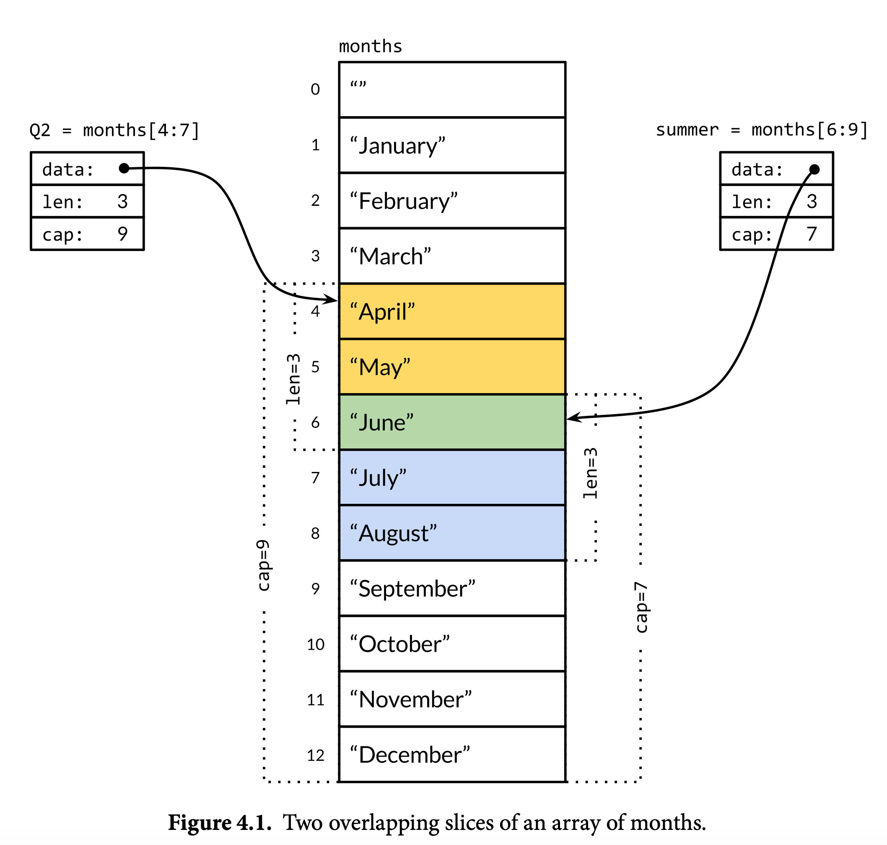

# Ch4. Composite Types

在Go中，数组、切片、映射和结构体被称为组合类型（composite type）。需要特别注意在Go中数组（array）和切片（slice）不一样。

数组和结构体都是聚合类型（aggregate type），这说明它们的值是内存中其它值的拼接。数组中的元素的类型相同，结构体中的元素类型不一定相同。

数组和结构体都是定长的，映射和切片的大小可以根据需要改变。

## 数组

数组是零个或多个同种类型元素的定长序列。

```go
var a [3]int // 元素均为int的零值
fmt.Println(a[0]) // 0
```

可以使用数组字面量来对数组初始化

```go
var a [3]int = [3]int{1, 2} // 注意，这里字面量中[n]int照写
fmt.Println(a[2]) // 0
```

数组的长度是其类型的一部分，不同长度的数组不是一种类型。在初始化的时候为了方便，可以不明确指定一个数组变量的类型，而是在初始化字面量中用`...`代替其类型中表示长度的部分，让编译器自动识别长度。

```go
var a = [...]int{1, 2, 3}
fmt.Printf("%T\n", a) // [3]int
```

除了使用`[n]T{a, b, ...}`的形式，还可以用类似于键值对的形式来表示数组字面量，其中键就是元素的下标。

```go
type Currency int

const (
    USD Currency = iota
    EUR
    GBP
    RMB
)

symbol := [...]string{USD: "$", EUR: "€", GBP: "£", RMB: "￥"}
fmt.Println(symbol[RMB])
```

这种形式下，指定键的顺序不受限制且无需连续。例如

```go
arr := [...]int{99: 1}
```

定义了一个`[100]int`，其中前面的99个元素都被初始化为零值（0）。

### 数组的可比性

如果两个数组的元素的类型是可比的，那么两个数组就是可比的（当然，前提是需要为同种类型）。使用`==`或者`!=`去比较两个数组等价于分别比较其中的每一项。

```go
a := [2]int{1,2}
b := [2]int{1,2}
c := [...]int{1,3}
fmt.Println(a==b) // true
fmt.Println(b==c) // false
```

package `sha256`中的`Sum256`可以给出一个`[]byte`的哈希值用于验证两个数据是否相同，其返回的是一个256bit（`[32]byte`）的值。利用数组的可比性可以直接对结果进行比较。

```go
h1 := sha256.Sum256([]byte("x"))
h2 := sha256.Sum256([]byte("X"))
fmt.Println(h1 == h2) // false
```

### 作为函数参数的数组默认是值传递

在许多其他编程语言（例如JavaScript）中，对于数组这种具有引用特征的类型常常直接隐式地进行引用传递，但在Go中数组的行为与其他类型保持一致，其被实参化以后会进行一次拷贝，这就导致大数组的传递非常昂贵。可以将参数定义为数组的指针类型来规避大数组的复制问题，以及让函数能够直接修改数组的值。

```go
func zero(v *[32]byte) {
    for i := range v {
        v[i] = 0 // 注意在这里发生了一种类似于自动解引用的行为（实际上是一个语法糖），不需要写成*v[i]
    }
}
```

或者直接使用零值

```go
func zero(v *[32]byte) {
    *v = [32]byte{} // 记得要解引用
}
```

## 切片

切片表示一个可变长的相同类型值的序列，其类型写作`[]T`，看上去像是一个没有指定大小的数组。

在内部，切片与数组有着紧密的联系。本质上切片是对一个底层数组的引用截取，其本身不存储数据。

> A slice is a lightweight data structure that gives access to a subsequence (or perhaps all) of the elements of an array, which is known as the slice's **underlying array**. (p84)

切片由三个要素组成：
- 指针 pointer：指向第一个可被当前切片访问的底层数组元素
- 长度 length：切片中元素的数量，可以用`len`函数获取
- 容量 capacity：长度的最大值，通常是从*切片的第一个元素*到*底层数组的最后一个元素*之间的元素个数，可以用`cap`函数获取

### 切片运算符（slice operator）

`s[i:j]`是一个获取切片的表达式，其中`s`可以是一个数组（最直接的写法）、一个指向数组的指针（语法糖）或者是一个切片（用于获取切片的切片），i和j满足0 <= i < j <= `cap(s)`，其中`cap(s)`是底层数组的长度或者说是切片的容量（大于或等于其任意切片的长度）；注意最后一个等号能成立是因为`[i:j]`表示的是左闭右开的下标区间。

现有一个数组包含了12个月的信息，将其作为底层数组取`Q2`和`summer`两个切片，下图形象地展示了切片运算符获得的切片与其底层数组之间的关系，以及切片的len和cap值与底层数组之间的关系。



当切片运算中的`j`大于`cap(s)`时将引发panic；若小于等于`cap(s)`但超过了`len(s)`，相当于对切片进行了拓展。

```go
itsCruelSummer := summer[:5] // len(summer) == 3, cap(summer) == 7
```

这里`5`的含义是将summer往后拓展2个月（即从summer pointer即June开始，切到下标为5、第六个元素、November之前的位置）。

### 字符串的切片

之前提到过切片运算符可以用于取一个字符串的子串而不分配额外的空间，这一操作与切片很像，所以取子串也可以看成在取字符串的切片。

表达式`x[m:n]`返回一个string，当x是一个string；返回一个`[]byte`，当x是一个`[]byte`。

### 切片作为函数参数*类似于*引用传递

当切片作为函数的参数时，其在效果上类似于引用传递。其值传递性质并未改变，在其实参化的时候仍然会做一份拷贝，但此拷贝操作相当于为切片创建了一个别名。
```go
// reverse reverses a slice of ints in place.
func reverse(s []int) {
    for i, j := 0, len(s)-1; i < j; i, j = i+1, j-1 {
        s[i], s[j] = s[j], s[i]
    }
}
```

虽然以上函数是为切片类型设计的，但是仍然可以通过下面的方式作用在一个数组上（因为数组是切片的来源）。

```go
a := [...]int{0, 1, 2, 3, 4, 5}
reverse(a[:]) // a[:]是对a的引用
```

下面用反转函数实现了数组元素的左环移（2个位置，如果是右环移则先反转整个数组）。

```go
reverse(a[:2]) // 先反转前n个元素
reverse(a[2:]) // 再反转剩下的元素（第n+1到len个元素，或者[n:]）
reverse(a[:]) // 反转整个数组
```

### 切片字面量

可以用切片字面量`[]T{...}`来初始化切片`[]T`。该字面量的作用相当于创建一个底层数组`[...]T{...}`然后将其整个数组的切片引用赋给变量。与数组字面量一样，切片字面量也可以使用键值对的形式表示。

### 切片不具有可比性

与数组不同，任何一个切片类型`[]T`都没有可比性，不能直接使用`==`或者`!=`进行比较。为了方便，package `bytes`提供了高效的`bytes.Equal`函数来帮助比较两个`[]byte`，除此之外的切片比较需要自行实现。切片唯一能够进行的比较是与`nil`的比较。

But ***Why***? 切片之间的（深）等值性比较需求并不少见。例如下列比较两个`[]string`的深等值性的函数

```go
func equal(x, y []string) bool {
    if len(x) != len(y) {
        return false
    }
    for i := range x {
        if x[i] != y[i] {
            return false
        }
    }
    return true
}
```

这个函数很有可能就是slice `==`的一种实现。作者给出了不在语言层面提供slice之间的`==`运算符的两点原因：
1. 由于切片是一种引用，导致一个切片可以自引用，产生循环，这使得对其深度等值性的判断无法轻易实现；固然有方法，但是这些方法没有一个能做到简洁（simple）、高效（efficient）以及最重要的直观（obvious）。
2. 由于切片是一种引用，即使一个切片本身不发生变化，其底层数据也有可能发生变化。用作哈希表中的键的值只会被浅拷贝（只复制最外面这一层“壳”），同时要求在哈希表存在的整个期间，其等值性不能发生任何改变。切片的深度等值性使得它不能用作哈希表的键。而channel、指针这两种引用类型可以用作键是因为其`==`只比较引用等值性（即是否指向同一个数据）。如果让切片也只比较引用等值性，可以解决这个问题，但会导致于数组`==`之间的不一致徒增理解成本。所以不考虑为切片添加`==`。

### 切片的零值

切片类型的零值是`nil`，表示这个切片还没有底层数组。这样的一个切片的length和capacity都是0，但length和capacity都是0的不一定是nil切片，例如`[]int{}`、`make([]int, 3)[3:]`都满足，但不是nil切片。

与任何可以为nil的类型类似，可以使用`T(nil)`的写法去定义一个nil T，如`[]int(nil)`定义了一个nil int切片。

在Go中，如果想要判断一个切片是否为空，正确的做法是判断其长度是否为0，而不是它的值是否为`nil`。**nil切片与非nil但长度为0的切片的行为应当是一致的**，例如你可以调用`reverse(nil)`。所以这里的`nil`不表示空指针，而是一个nil切片。

```go
fmt.Println(len([]int(nil))) // 0
// 注意：必须带上[]int(...)表示这个nil对应一个切片
```

不过这只是推荐的实现，实际中可能有例外，需要参考文档。

> Unless clearly documented to the contrary, Go functions should treat all zero-length slices the same way, whether nil or non-nil. (p87)

### 使用`make`来创建切片

```go
make([]T, len) // 省略cap时，cap=len
make([]T, len, cap)
make([]T, cap)[:len]
```

第二行和第三行是等价的。在底层，make会创建一个未命名的数组，然后返回对它的切片，这个切片是访问这个数组的唯一方式。

### `append`函数

下面的例子给出了实现一个针对`[]int`的append的方法，其原则是如果增长后的长度在容量的范围内，就直接将新的元素加入；否则就要创建一个新的slice（伴随新的底层数组），将原slice的所有内容拷贝到这个新的slice中再追加新的元素。

```go
func appendInt(x []int, y int) []int {
    var z []int
    zlen := len(x)+1
    if zlen <= cap(x) {
        z = x[:zlen] // 拓展slice（未分配空间）
    } else {
        // allocation & copy
        // zcap=max(len(x)+1, 2*len(x))
        zcap := zlen
        if zcap < 2*len(x) {
            zcap = 2*len(x)
        }
        z = make([]int, zlen, zcap)
        copy(z, x)
    }
    z[len(x)] = y
    return z
}
```

推荐使用copy函数而不是一个循环去完成内容的复制。`copy(dst, src)`的作用是将src中的内容拷贝到dst中去，这个参数的顺序可以想象为在执行`dst = src`。`dst`和`src`是相同类型的slice。copy函数的返回值是一个数字，表示实际拷贝的元素数量，该值等于`min(len(dst), len(src))`，这说明当dst装不下src中的所有元素时会被截断，实际拷贝的数量就是`len(dst)`，因此无需担心二者长度不匹配带来的问题。

当`zlen<=cap(x)`时，代码新建了一个`[]int`，该`[]int`的容量是`max(len(x)+1, 2*len(x))`，而 $\max\{x+1,2x\}\equiv2x, x>1$，相当于除了初始的追加以外，后续的追加如果遇到容量不足均会采用双倍扩容。这种双倍扩容的策略是为了避免过于频繁的allocation & copy导致性能问题，并且让追加操作在平均意义上维持常数的执行时间。某种意义上这也是一种空间换时间。

上面的`appendInt`函数在容量足够与不足够情况下所走的两种分支会产生不一样的底层数组：容量足够情况下，其底层数组不变，只是对slice进行了拓展；容量不足的情况下，将新建底层数组并将数据从原数组中拷贝到新数组。在实际使用中，我们同样不能确定builtin `append`的返回值是否与传入的那个slice共享一个底层数组，同样的，我们也无法假设对输入slice和输出slice中元素的修改操作是否共享一个底层数组。所以一般在调用`append`之后我们会将原slice覆盖掉，相当于丢弃对旧slice的访问。

```go
x = append(x, y)
```

对于任何可能会修改一个slice的底层数组、容量或是长度的函数，都应该使用这种覆写（更新原slice变量）。切片之所以没有被直接称为一种引用类型（reference type），是因为它相比于真正的引用类型，如channel，更像是一种聚合类型，即结构体：

```go
type IntSlice struct {
    ptr *int
    len, cap int
}
```

### 就地修改切片

#### filter

函数`nonempty`将一个`[]string`中的所有空字符串过滤掉，它的输入和输出slice共享底层数组，但我们只应该访问输出的slice（因为输入的slice中的数据语义已经被破坏了）。

```go
func nonempty(strings []string) []string {
    i := 0
    for _, str := range strings {
        if str != "" {
            strings[i] = str
            i++
        } 
    }
    return strings[:i]
}
```

还可以使用`append`来实现这个函数，其性质与上面的函数一致，关键是从一个共底层数组的空slice开始追加。

```go
func nonempty(strings []string) []string {
    result := strings[:0] // 共底层数组的0长度slice
    for _, str := range strings {
        if str != "" {
            result = append(result, str)
        }
    }

    return result
}
```

两种写法都实现了对底层数组的复用，这样可以节省allocation & copy的时间。但要注意这种方式要求函数至多产生一个输出，所以适合用来写一些filter（`nonempty`就是一种）。这一用法属于奇技淫巧（intricate slice usage）。

#### 用slice来模拟栈

- 进栈 `stack = append(stack, v)`
- 查看栈顶 `stack[len(stack)-1]`
- 出栈 `stack = stack[:len(stack)-1]`

注意进栈和出栈操作都是在替换原slice。

#### 从数组中删除某个下标的元素

```go
func remove(slice []int, i int) []int {
    // 将下标为i+1的位置直到切片末尾的数据拷贝到以下标为i位置起始的区域
    // 相当于将下标为i的元素之后的所有元素向前移动一位
    copy(slice[i:], slice[i+1:]) 
    return slice[:len(slice)-1] // 长度缩短1
}
```

如果不需要保持顺序，可以直接让最后一个元素填入到要删除的那个元素的位置：`slice[i] = slice[len(slice)-1]`。

## 字典

在Go中，map指的是一种指向哈希表的引用，其类型写作`map[K]V`。为了简便，下面将map与哈希表（字典）等同看待。一个字典中的所有键的类型都是`K`，所有值的类型都是`V`。

`K`必须是一个可以用`==`比较等值性的类型。

|可作为`K`的类型|备注|
|:-:|:-:|
|基本类型|*|
|指针|引用等值性|
|数组|必须是可比较数组|
|结构体|必须是可比较结构体|
|通道|引用等值性|
|`any`/`interface{}`|必须可比较|

*虽然基本类型都可以用作key，但是不建议使用浮点数，一是因为精度原因其等值性并不显然，二是因为NaN这种值的存在（它不等于自身）。`V`的类型没有限制。

建立一个字典的方法有两种：使用`make`或者使用字典字面量（map literal）。

```go
ages := make(map[string]int)
ages["Alice"] = 32
ages["Bob"] = 64
// or
ages := map[string]int {
    "Alice": 32,
    "Bob": 64
}
// 空字面量用map[string]int{}表示
```

要从map中删除一个键值对，使用内置的`delete(m, k)`：
```go
delete(ages, "Alice")
```

从map中取值或者删除键值对的操作都不要求这个键一定存在，这里也有零值机制。

```go
ages["John"] = ages["John"] + 1 // happy birthday!
fmt.Println(ages["John"]) // 1
```

map中的值不支持取地址，它们与`var`定义的变量不一样。其中一个原因是当map中的键值对增长，可能根据需要对整个哈希表重新计算哈希并放入到内存中的其它区域，这会导致原始地址无效。

```go
_ = &ages["John"] // compile error
```

map使用`range`进行遍历。遍历过程中获得的键值对顺序是未定义的（unspecified），但实际上其顺序是刻意随机化的，这样是为了促使编写者能够完全放弃依赖其顺序，进而写出可以在不同编译器实现之间稳定运行的高鲁棒性代码。如果我们确实需要获取有序的键值对，则需要自己引入package `sort`来对键排序，然后使用排序后的键去取值。

```go
for name, age := range ages {
    // ...
}
```

map的零值是nil，表示它没有指向的哈希表。对于一个nil map，大多数操作都是可以正常进行的，如同一个空的哈希表。唯一会导致panic的，是对空哈希表中元素的赋值操作。

```go
whatever["whatever"] = 1 // panic
```

对一个map中或存在或不存在的键的访问都会返回一个值，如果不存在返回的就是`V`的零值。但如果需要检查其存在性，可以在subscript表达式LHS加上一个额外的接收值`ok`，它是一个布尔值。

```go
age, ok := ages["Nancy"] // age = 0, ok = false 表示未记录，而非Nancy的age是0
```

和slice类似，map之间不能直接比较等值性，如果需要，我们需要自己编写循环来解决

在Go中没有提供集合（Set）类型，但map的性质使它可以完成相关工作。如dedup的过程可以用一个`seen map[string]bool`来记录，这种情况下`map[string]bool`一般被称为一个“字符串集合”（set of strings），且其中的`bool`大概率只会是`true`。

### 手动哈希

在实际使用中，如果需要让一些不可作为key的类型（例如slice、map、不可比的struct等）能够作为key，我们可以自己写哈希函数来将这些类型映射为可以作为key的类型，最常见的就是使用string。只要我们写的哈希函数在我们使用范围内满足哈希性质即可。

除了对于不可作为key的类型，我们也可以在一些需要改变等值性含义的情况下自己写哈希函数，例如不区分大小写的键，可以通过一个中间函数处理区分大小写的string来实现。

### 用map来表示图的邻接表

之前提到的`map[string]bool`可以看成Go中string的*集合*，为图中的每一个顶点都附加这样一个集合，就构成了图的邻接表，也就是`map[string]map[string]bool`。

```go
var graph map[string]map[string]bool

func addEdge(from, to string) {
    edges := graph[from]
    if edges == nil {
        // 如果是一个nil map，为了能够赋值，需要先建立map
        edges = make(map[string]bool)
        graph[from] = edges
    }
    edges[to] = true // 将to加入集合
}

func hasEdge(from, to string) bool {
    return graph[from][to]
}
```

Note:
1. 该代码展示了对一个map的惰性装填，也就是只有在遇到某个键的时候才对其值进行初始化，见于`addEdge`的`if edges == nil`分支
2. 该代码也展示了Go中零值机制的作用，`hasEdge`的参数可以是任意的string，即使`from`和`to`在map中都不存在，它也会正常返回`false`

## 结构体

在Go中，结构体定义为由一个或多个任意类型的具有名字的值组成的聚合类型，这些值称为字段（field），可以认为与`var`定义的变量具有相同的性质，例如可以被赋值也可以取地址（区别于map中的值）。

```go
dilbert.Salary -= 5000 // demoted, for writing too few lines of code
position := &dilbert.Position
*position = "Senior " + *position // promoted, for outsourcing to Elbonia
```

一个指向结构体的指针的字段也可以直接用点号访问，也就是`p.Field`相当于`(*p).Field`，这也是一个语法糖。

```go
func EmployeeByID(id int) *Employee {}

EmployeeByID(id).Salary = 0
```

注意这里`EmployeeByID`的返回值不是一个指针类型，那么下面的赋值语句无法编译，因为其左侧不再是一个具体的变量。

### 定义结构体

结构体的定义中，一般是一行一行的字段名+类型名的格式。对于同类型的字段，如果它们之间存在某些关联，则可以写在同一行。一个结构体由它的字段以及定义这些字段的次序确定，如果将下面的结构体中`Position`的位置变化一下，或者交换`Name`和`Address`的位置，那么得到的将是不同的结构体。

```go
type Employee struct {
    ID int
    Name, Address string
    DoB time.Time
    Position string
    Salary int
    ManagerID int
}
```

结构体字面量的语法往往很繁复，因此一般和`type`搭配，将`struct {...}`作为一个永远不用在其它地方的底层类型，实际中使用用`type`定义的别名。

### 递归结构体

在Go中，聚合类型不能直接包含自身，结构体`S`中的字段不能是`S`类型（但可以是`*S`），对数组也有相同的限制。通过使用`*S`可以实现递归的数据结构，例如树。

### 结构体的零值、空结构体

结构体的零值中各个字段的值是其类型的零值。通常我们希望零值有一定的意义或者可以直接使用。像`bytes.Buffer`和`sync.Mutex`等结构体都可以直接使用。部分情况下，结构体的零值自动具有意义，但一些情况下可能需要我们自己去做这方面的机制。

一个空的结构体用`struct{}`表示，它没有任何字段，不占空间。一些人使用它来表示用于模拟集合的map的值类型，例如`map[string]struct{}`，因为这样一个map本质上只有key在起作用。不过，这样带来的收益很小并且语法会变得复杂（初始化一个空的结构体需要写成`struct{}{}`）。

### 结构体字面量

结构体字面量有两种形式

- 不带字段名称，要求把字段**按顺序**写**全**。这种写法的灵活性比较差，且不适合字段顺序不自然或者字段过多的结构体。
```go
type Point struct { x, y int }

p := Point{1, 2}
```
- 带字段名称，可以不写全，顺序任意。没有填写的字段是零值。

### 结构体作为函数参数

结构体可以作为函数的参数和返回值，非指针类型会被复制。对于一些较大的结构体，或者需要修改结构体内容的函数，需要用结构体指针作为参数。

### 创建结构体指针

可以使用`&Point{1, 2}`这样的写法快速创建一个结构体并获得它的地址，这样一行表达式的写法等价于

```go
pt := new(Point)
*pt = Point{1,2}
```

### 结构体嵌入与匿名字段

定义一个结构体用来表示圆圈，一个结构体用来表示轮子。显然它们之间有相似之处，对于更加复杂的结构体，一味地重复相同类型甚至相同含义的字段是不合理的，所以我们可能需要把它重构一下。

```go
type Circle struct {
    X, Y, Radius int
}

type Wheel struct {
    X, Y, Radius, Spokes int
}
```

```go
type Point struct {
    X, Y int
}

type Circle struct {
    Center Point
    Radius int
}

type Wheel struct {
    Circle Circle
    Spokes int
}
```

具体提取公共部分的方法是不唯一的，以上代码是一种比较符合直觉和常识的表达。在这里我们很容易注意到一个问题：我们需要为我们提取出的这个部分取一个名字，而原本我们并不需要它们的名字。例如，我们需要为X和Y的组合起一个名字叫做点，然后将其放入一个`Circle`中时还需要给他分配一个适当的名称，即中心点。在`Wheel`上面，圆圈就直接叫圆圈了，没有起另外的名字。如果要访问其中的值，则需要写一大串字段：`Circle.Center.X`、`Wheel.Circle.Center.Y`等等。

为了简化，可以利用Go的结构体嵌入：

```go
type Point struct {
    X, Y int
}

type Circle struct {
    Point
    Radius int
}

type Wheel struct {
    Circle
    Spokes int
}
```

在这里，被嵌入的是类型。如果我们不为某个结构体类型的字段添加名称，而只包含其类型，这个类型就称为是嵌入的（embedded），被嵌入的这些字段被称为匿名字段（anonymous fields）。被嵌入的结构体的特点是：
- 可以直接在根结构体上访问到被嵌入的结构体上的字段，无需访问路径
- 同时也可以以与类型同名的字段访问到被嵌入的这个结构体

第二个特点让“匿名字段”这种叫法不甚准确（misnomer），但需要知道这样做的主要目的就是去隐去这些中间的名称，重点在第一条特点上。

不过，在结构体字面量中并没有对应的简便表达，我们必须一五一十地去初始化这样一个嵌套的结构体。

```go
w = Wheel{Circle{Point{8, 8}, 5}, 20}
// or
w = Wheel{
    Circle: Circle{
        Point: Point{X: 8, Y: 8},
        Radius: 5, // 不要忘记带,
    },
    Spokes: 20, // 不要忘记带,
}

fmt.Printf("%#v\n", w)
// Wheel{Circle:Circle{Point:Point{X:8, Y:8}, Radius:5}, Spokes:20}
```

Tips: 在这里使用了`#`来修饰`%v`，从而让输出中带有结构体的字段名称（就像在Go里面写结构体的形式）。

所谓的匿名字段依然有着隐式名称（implicit name，也就是其类型名），因此不能嵌入两个同名的类型；同时类型本身的大小写也会决定嵌入的字段的大小写，进而影响其是否被导出。在这里有一个性质需要注意，即使被嵌入的这个类型不是导出类型，在外部仍然能够访问到被嵌入的匿名字段中的导出字段（直接方式），而丢失的是通过隐式名称访问的权限。

```go
type point struct {
    X int
    Y int
}

type circle struct {
    point
    Radius int
}

type Wheel struct {
    circle
    Spokes int
}
```

```go
fmt.Println(wheel.X) // 可以
fmt.Println(wheel.circle.point.X) // compile error
```

在Go中，**组合**（composition）是用于实现OOP的基础。请注意以上嵌入不仅嵌入了字段，还嵌入了该类型上所带有的方法。在后续的章节会提到能够嵌入到结构体的并非只有结构体类型。

### JSON

JSON是用于数据交换最通用的一种格式，package `encoding/json`提供了相关功能。在Go中，将结构体或字段转换成JSON的过程被称为marshal（整理），它也可以用来泛指序列化。反序列化则是unmarshal。

- `json.Marshal` 返回一个序列化以后的`[]byte`，其转换成字符串以后是一种JSON的紧凑表达（不包含任何空格）
- `json.MarshalIndent`与`Marshal`类似，不过它返回的是一种更适合人类阅读的形式，可以自定义每一行的前缀以及缩进字符串。

默认情况下marshal结果JSON中的键与结构体/map上的键（字段）名保持一致，并且结构体上未导出的键不会被marshal到结果中。在没有任何配置的情况下，结构体被marshal的结果中键名大概率总是PascalCase。

为了自定义marshal行为，我们可以在结构体中字段定义的后面加上一个字符串字面量。该字符串字面量被称为**字段标签（field tags）**，它在编译期描述了这个字段的一些元数据。这个字面量的值没有严格的规定，但是一般其遵从下面的格式：

```go
`key1:"value1" key2:"value2" ...`
```
即以空格分隔的键值对，其中的值又是另一个字符串的表示。由于在这里字符串用`""`包围起来，所以字段标签一般用反引号包围，使之成为一个原始字符串字面量（raw string literal）。

对于JSON而言，字段标签中`json:"..."`部分的值的第一部分用于表示该字段在JSON中的键名（这样在marshal的时候就不仅限于是PascalCase），此外还可以添加一个`omitempty`选项用于表示如果该字段的值在marshal的时候发现为零值（无论是默认零值还是设置的零值），就不将其包括在JSON结果中。

字段标签对marshal和unmarshal都有指导作用，例如在unmarshal的时候也会参照标签中指定的键名去做对应。在这里需要注意的一点是，在unmarshal过程中，键名的对应大小写不敏感，因此在这里PascalCase和camelCase是等价的，`totalCount`可以被正常地赋值给未加标签的`TotalCount`结构体字段上（而kebab-case、snake_case都需要加标签）。

另外，如果结构体中不包含JSON中的某个字段，那么JSON中的这个字段会被忽略。

## 文本与HTML模板

为了格式化输出，我们会用到`fmt.Printf`或者类似的函数，但这仅限于简单的数据。对于复杂的数据，一个更好的办法是使用模板。package `text/template`和`html/template`分别提供了对纯文本和HTML文本的模板相关功能。

在这里，一个模板（template）的含义是一个包含一个或多个用<code>&lbrace;&lbrace;&rbrace;&rbrace;</code>包围的部分的字符串或者文件，被包围的部分被称为action（动作）。action里面包含的是模板语言（template language）的表达式，可以用于访问结构体的字段、调用函数、表达控制流（if-else、range）、调用其它模板等。

```go
const templ = `{{.TotalCount}} issues:
{{range .Items}}----------------------------------------
Number: {{.Number}}
User: {{.User.Login}}
Title: {{.Title | printf "%.64s"}}
Age: {{.CreatedAt | daysAgo}} days
{{end}}`
```

这里的`|`与Unix系统中shell提供的管道运算符相似，将前一个表达式的输出定向到下一个表达式的输入。`daysAgo`是模板引擎提供的一个外部的函数，这个函数接收一个`time.Time`，返回一个`int`。

```go
func daysAgo(t time.Time) int {
    return int(time.Since(t).Hours() / 24)
}
```

### `text/template`

从一个模板到获得渲染结果分两步：
1. 对模板进行解析，变成模板的内部表示
2. 使用数据执行模板，完成渲染

模板的解析通过`templates.New`以及一连串的链式调用后跟上`Parse`来实现，可以看到`daysAgo`函数是通过调用`Funcs`并传入一个`template.FuncMap`从而在模板中变得可用的。
```go
report, err := template.New("report").
    Funcs(template.FuncMap{"daysAgo": daysAgo}).
    Parse(templ)
if err != nil {
    log.Fatal(err) // 模板的解析失败算是一种fatal
}
```
或者为了方便错误处理，可以用`Must`包装起来。
```go
var report = template.Must(template.New("issuelist").
    Funcs(template.FuncMap{"daysAgo": daysAgo}).
    Parse(templ))
```

然后在解析好的模板上调用`Execute`完成渲染。
```go
func main() {
    result, err := github.SearchIssues(os.Args[1:])
    if err != nil {
        log.Fatal(err)
    }
    if err := report.Execute(os.Stdout, result); err != nil {
        log.Fatal(err)
    }
}
```

### `html/template`

package `html/template`与`text/template`共用一种模板语言，不过`html/template`添加了一些对用户输入的自动处理（包括HTML、JS、CSS、URL等方面），从而防止注入攻击（injection attack）。

对于无需保护的字符串，使用底层类型为`string`的`template.HTML`（CSS、JS等同理）作为传入的类型。下面的例子中，B处将渲染出粗体文本。

```go
func main() {
    const templ = `<p>A: {{.A}}</p><p>B: {{.B}}</p>`
    t := template.Must(template.New("escape").Parse(templ))
    var data struct {
        A string // untrusted plain text
        B template.HTML // trusted HTML
    }
    data.A = "<b>Hello!</b>"
    data.B = "<b>Hello!</b>"
    if err := t.Execute(os.Stdout, data); err != nil {
        log.Fatal(err)
    }
}
```