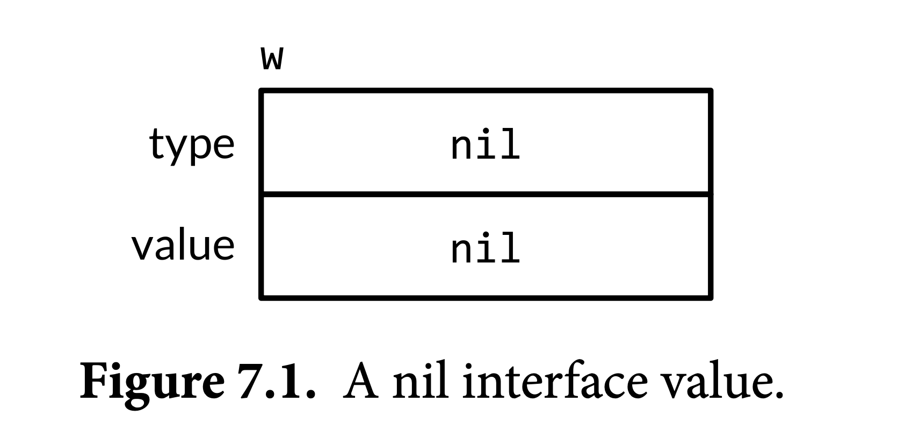
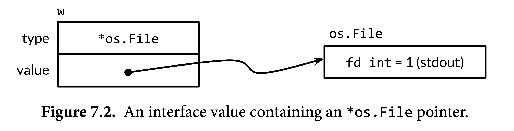
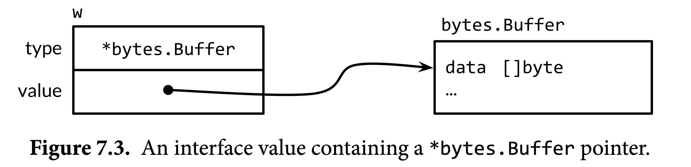

# Ch7. Interfaces

## 接口即约定

> Interface types express generalizations or abstractions about the behaviors of other types.

Go中的接口的不同之处在于，它是隐式实现的（satisfied implicitly），这表示我们无需针对某一个类型来定义一系列的接口让其实现。一个类型只要拥有了某个接口定义的方法，就直接认为它实现了此接口。这种设计使得你可以实现一种“先实现接口，后定义接口”的效果，对于一些不受我们控制的类型（例如来自其它package的）尤其有用。

在之前了解到的所有数据类型都是**实类型（concrete type）**。一个实类型确定了这个值的底层表示以及内在操作（representation & intrinsic operations），例如数字类型之间的算术运算、slice的下标、map的range等。挂在一个实类型上的方法拓展了实类型支持的操作。拿到一个实类型之后，我们不仅知道这是一个怎样的值，还知道它能够做什么操作、我们能对它做什么操作。

Go中还有另外一种类型，称为**接口类型（interface type）**，它是一种**抽象类型（abstract type）**，它既没有描述值的底层表示，也不包含其内在操作的信息，而只描述了这个类型上有哪些方法。拿到一个接口类型后，我们只知道它能够做什么，其余均一无所知。

以package fmt中的几个用于格式化输出的函数为例。`fmt.Printf`和`fmt.Sprintf`几乎做了一样的事情，区别是一个输出到了stdout，一个返回字符串。这两个函数如果只是为了这一点点差别而重新实现了整个格式化的逻辑，会显得极其不划算。实际上，其底层都调用了`fmt.Fprintf`，函数名中的F表示file（文件），它的第一个参数是一个`io.Writer`。

- `fmt.Printf`内部传入给Fprintf的是`os.Stdout`，它是一个`*os.File`类型的值
- `fmt.Sprintf`内部先定义了一个`bytes.Buffer`，然后将其引用传给`fmt.Fprintf`

在这里，之所以`os.Stdout`、`bytes.Buffer`能直接传给`io.Writer`类型的参数，正是因为`io.Writer`是一个接口类型。

```go
package io

interface Writer {
    // Write ...
    // 此处省略很重要的一大段注释
    Write(p []byte) (n int, err error)
}
```

通过在Fprintf的参数中引入Writer这一接口类型，其与调用方订立了一个合约，即传入到这个位置的参数上必须带有恰好符合该签名的名为Write的方法。具体该值的底层表示是什么样的，这里并不关心。Fprintf的函数体中对于w这个参数，能做的也只有调用它的Write方法并对其返回值做处理，而全然不知道Write里面到底做了什么事情。这种可以任意修改传入参数的值的类型的性质被称为可替换性（substitutability），这是OOP的主要特征之一。

因此，我们可以实现一个比较另类的Writer，称为ByteCounter，它会统计写入了多少个字节，并且将写入的字节全部丢弃。

```go
type ByteCounter int
func (c *ByteCounter) Write(p []byte) (int, error) {
    *c += ByteCounter(len(p)) // convert int to ByteCounter
    return len(p), nil
}
```

我们完全可以将一个ByteCounter类型的值传入到Fprintf中。Fprintf仍然会调用Write函数，而不关心其到底做了什么事情。这样ByteCounter就可以统计实际写入的字符串的len。

```go
var c ByteCounter
var name = "Dolly"
fmt.Fprintf(&c, "hello, %s", name)
fmt.Println(c) // "12", = len("hello, Dolly")
```

fmt中还有另外一个重要的接口`fmt.Stringer`，它是我们实现类型的格式化输出的核心。

```go
type Stringer interface {
    String() string
}
```

## 常见接口类型

接口类型规定了一系列的方法，当一个实类型上拥有这些方法后，这个实类型就被认为是该接口类型的一个实例，或者说实现了该接口。`io.Writer`是最常用的接口类型之一，它表示了一个可以写入字节的位置，这个“位置”包括了文件、HTTP客户端、内存缓冲区等对象。除了Writer外还有Reader，表示一个可以从中读取字节的对象。Closer接口表示任意可供关闭的值。

```go
package io

type Reader interface {
    Read(p []byte) (n int, err error)
}

type Closer interface {
    Close() error
}
```

注意到Stringer、Writer、Reader和Closer都只有一个方法。Go中对于这种只有一个方法的接口的naming convention就是在动词后面加er，即使有的在英语中不太常见，例如Stringer、Closer，但是在表意上已经足够。

这些单一方法的接口之间可以互相组合，构成一些新的接口，这些新的接口的名字也是这些方法之间的组合加上末尾的er。这种组合的写法也被称为嵌入，确切地说是接口的嵌入，表示将该接口上的所有方法嵌入到这个地方。

```go
type ReadWriter interface {
    Reader
    Writer
}
type ReadWriteCloser interface {
    Reader
    Writer
    Closer
}
```

## 接口满足（Interface Satisfaction）

在这里，满足（satisfaction）就是其它语言中常常说的接口实现（implementation），在Go中的这种模式下有了新名字。例如，`*os.File`满足了`io.Reader`、Writer、Closer和ReadWriter四个接口，`*byte.Buffer`满足了Reader、Writer、ReadWriter而不满足Closer接口。在Go中，当一个实类型满足了某个接口类型时，人们一般直接将这个实类型称为该接口类型，例如我们可以说`*byte.Buffer`是一个Reader或Writer或ReadWriter。

需要注意这里`os.File`和`byte.Buffer`前面都加上了`*`，这是因为它们上面用于满足这些接口的方法的receiver是指针类型的。我们在传入到接收该接口类型的参数位置时，也必须区分是指针类型还是值类型，例如上面将ByteCounter传入Fprintf的时候使用了`&`取地址转化为一个`*ByteCounter`。

对于一个接口类型的变量，其可赋值性取决于某个值是否满足该接口，只要满足，就可赋值。这条规则对于同为接口类型的右值也适用。

```go
var w io.Writer // 一个接口类型的变量
w = os.Stdout // OK: *os.File has Write method
w = new(bytes.Buffer) // OK: *bytes.Buffer has Write method
w = time.Second // compile error: time.Duration lacks Write method
```

关于如何确定一个类型拥有哪些方法，我们需要特别注意其方法的receiver。根据方法表达式，一个类型的方法要么使用`T.Method`来获取，要么使用`(*T).Method`来获取，它们之间是有区别的。在一个指针上调用值类型的方法，或者反过来，都是需要满足一定的条件才能进行的语法糖；在接口实现中则没有这种语法糖，我们需要严格地判断究竟这个方法在哪种类型上面。这也是先前对于一个类型的方法的receiver最好保持统一的这种convention存在的原因。

例如，先前在IntSet上定义的String方法是挂在其指针类型上的，我们仍然可以通过语法糖在一个可以取地址的值（i.e. 变量）上面调用这个方法，但我们不能认为IntSet满足了Stringer接口。满足Stringer接口的是`*IntSet`。

```go
var s IntSet
var _ = s.String()
var _ fmt.Stringer = &s // OK
var _ fmt.Stringer = s // compile error
```

接口就像一个信封一样会向外部隐藏其底层的值除了接口规定的那些方法之外的任何其它信息，也就是说，对于一个接口类型的值，我们只能看到它上面有且仅有该接口规定的那些方法，而其底层表示、内在操作以及额外的方法（不在该接口中定义）均不可见。例如，如果我们将一个`os.Stdout`赋值给一个`io.Writer`变量，虽然Stdout也满足Closer、Reader，但我们不能再在这个变量上调用除了Write以外的任何方法。

一个接口定义可以没有任何方法，这样的一个类型`interface{}`被称为空接口类型，它上面没有附加任何方法，为该类型的变量将不具有任何操作，相当于一个在类型系统中没有任何要求和限制的值。也正因为这种性质，我们可以将任意类型的值赋值给它，与此同时我们也将丢失该类型上的所有信息，后续只能通过类型断言*尝试*将其取回。

在Go中，接口满足是隐式实现的，一个实类型只要拥有某个接口上定义的所有方法，就被认为是满足了该方法。这种关系在有的时候并不明确，且如果我们手动检查也会很麻烦。我们可以通过一个空的接口变量赋值来让编译器帮我们检查某个类型是否真的实现了该接口，换句话说，就是对于接口满足的断言。

例如，我们要断言`*bytes.Buffer`必须满足`io.Writer`，就可以在程序的任意一个位置加上这样一句

```go
var _ io.Writer = (*bytes.Buffer)(nil)
```

这一句最初来自于`var w io.Writer = new(bytes.Buffer)`，但我们在这里只是为了断言，所以这个变量不需要有名字，我们用空标识符来占位。同时，这个变量也不需要实际分配内存空间，所以我们使用类型断言将nil转换为该类型（注意nil也是`*bytes.Buffer`的一个合法的值），只为完成检查。这里凸显了将方法定义在指针接收器上的好处，即使用这种写法进行断言的时候没有任何实际的损耗。

> Non-empty interface types such as io.Writer are most often satisfied by a pointer type, particularly when one or more of the interface methods implies some kind of mutation to the receiver, as the Write method does. A pointer to a struct is an especially common method-bearing type. (p177)

上面这段话是在说，一个接口只要有一个修改其receiver的方法，那么满足该接口的类型上的方法大概率都挂在该类型的指针上。一个结构体指针类型是最常见的带有方法的类型。

### 例子：隐式实现带来的灵活性

```go
type Artifact interface {
    Title() string
    Creators() []string
    Created() time.Time
}
type Text interface {
    Pages() int
    Words() int
    PageSize() int
}
type Audio interface {
    Stream() (io.ReadCloser, error)
    RunningTime() time.Duration
    Format() string // e.g., "MP3", "WAV"
}
type Video interface {
    Stream() (io.ReadCloser, error)
    RunningTime() time.Duration
    Format() string // e.g., "MP4", "WMV"
    Resolution() (x, y int)
}
```

我们为每一种媒体类型都定义了一个接口来描述它的功能。在未来的某个时间，我们希望将Audio和Video的串流共同点提取出来单独使用时，我们可以再定义一个接口Streamer。这样，所有的Audio和Video都自动地满足了Streamer，而不需要做任何其它修改；它们都可以被赋给类型为Streamer的变量。

```go
type Streamer interface {
    Stream() (io.ReadCloser, error)
    RunningTime() time.Duration
    Format() string
}
```

## 使用`flag.Value`接口实现自定义命令行参数解析逻辑

package flag提供的命令行参数解析功能的基本用法是，先用对应类型的函数对命令行参数进行“声明”，在程序入口处，调用`flag.Parse()`完成解析，如果没有问题，这些声明的参数变量会被赋予相应的值。

```go
var period = flag.Duration("period", 1*time.Second, "sleep period")
func main() {
    flag.Parse()
    fmt.Printf("Sleeping for %v...", *period)
    time.Sleep(*period)
    fmt.Println()
}
```

`flag.Value`的定义如下，显然它是一个`fmt.Stringer`。它上面的Set方法用于将命令行中接收到的字符串进行解析并赋值给相应的参数变量，相当于是String方法的逆过程。

```go
// Value is the interface to the value stored in a flag.
type Value interface {
    String() string
    Set(string) error
}
```

假设我们要在先前的Celsius类型上面实现`flag.Value`。由于Celsius已经有了String方法，我们只需要再加一个Set方法。这个方法的作用是接收命令行传入的可能的温度表示字符串，然后将该字符串转换为Celsius类型的值。在这里用到了`fmt.Sscanf`来格式化输入一个字符串。

```go
// *celsiusFlag satisfies the flag.Value interface.
type celsiusFlag struct{ Celsius }
func (f *celsiusFlag) Set(s string) error {
    var unit string
    var value float64
    fmt.Sscanf(s, "%f%s", &value, &unit) // 在这里不需要进行错误的检查，因为如果有问题，就不会走入下面的switch分支
    switch unit {
    case "C", "°C":
        f.Celsius = Celsius(value)
        return nil
    case "F", "°F":
        f.Celsius = FToC(Fahrenheit(value))
        return nil
    }
    return fmt.Errorf("invalid temperature %q", s)
}
```

至此我们在Celsius这个类型上面实现了Value接口。接下来我们需要写一个函数，使得我们可以像调用`flag.Duration`那样“声明”出一个命令行参数变量。这个函数的参数与`flag.Duration`等类似功能的函数保持一致，第一个参数是其名称，对应在命令行中指定的参数名，第二个参数是其默认值，第三个参数是用法提示文本。其内部调用了`flag.CommandLine`这一全局变量上的Var方法，它的第一个参数是一个`flag.Value`，在这里我们需要传入实现了`flag.Value`的`*Celsius`。

```go
func CelsiusFlag(name string, value Celsius, usage string) *Celsius {
    f := celsiusFlag{value}
    flag.CommandLine.Var(&f, name, usage)
    return &f.Celsius
}
```

这样就可以正常使用CelsiusFlag来声明命令行参数了。`flag.Parse`解析的时候将调用`flag.Value`上的Set方法进行解析。

```go
var temp = tempconv.CelsiusFlag("temp", 20.0, "the temperature")
func main() {
    flag.Parse()
    fmt.Println(*temp)
}
```

## 接口值

一个接口类型的值被称为一个接口值（interface value）。一个接口值由两个部分组成

1. 它所存储的那个实际值的实类型，称为这个接口值的动态类型（dynamic type）
2. 以及该实际值，称为该接口值的动态值（dynamic value）

Go是静态类型语言，它的类型不属于值，且只存在于编译期。在概念模型中，这种表示一个值的类型的特殊值被称为类型描述符（type descriptor）。接口值中动态类型这一部分就由一个类型描述符表示。

```go
var w io.Writer
w = os.Stdout
w = new(bytes.Buffer)
w = nil
```

在上面的四行语句中，w这一个接口类型变量被赋予了三种不同的值：nil、`os.Stdout`和`new(bytes.Buffer)`。

|         RHS         |    动态类型     |                         动态值                          |       图示       |
| :-----------------: | :-------------: | :-----------------------------------------------------: | :--------------: |
|      无，零值       |      `nil`      |                          `nil`                          |    |
|     `os.Stdout`     |   `*os.File`    | `os.Stdout`的一个拷贝，与`os.Stdout`指向同一个`os.File` |  |
| `new(bytes.Buffer)` | `*bytes.Buffer` |            指向一个新建`bytes.Buffer`的指针             |  |

当一个接口值的动态类型是nil时，我们就认为该接口值就是nil接口。将一个接口类型变量赋值为nil也会将其动态类型和动态值都设置为nil。可以使用`==`和`!=`来做接口值与nil的判断。在编译期无法确定该接口值是否为nil，所以编译器不会阻止你在值为nil的接口类型上调用方法，但这样会导致panic（nil pointer dereference）。

将一个接口类型变量赋值为一个实类型，相当于在进行一种隐式的类型转换：`w = os.Stdout`相当于`w = io.Writer(os.Stdout)`，其效果是相同的。正是这一转换语句确定了该接口值的动态类型和动态值。

由于编译期无法确定一个接口值的动态类型是什么，一个接口值的方法必须使用动态调用（dynamic dispatch）。编译器会生成相关代码，这些代码

1. 拿到该接口值的动态类型（类型描述符）上的方法的地址，如`(*os.File).Write`
2. 然后将接口值作为receiver实参去调用这个方法，如`(*os.File).Write(w, args...)`

以Write方法为例，`w.Write([]byte("Hello"))`的效果相当于我们直接写

```go
os.Stdout.Write([]byte("Hello"))
```

### 接口值可以容纳任意大小的值

我们可以认为任意大小的值都可以被赋给一个接口类型（不过其底层实现没有看上去这么简单）。

```go
var x interface{} = time.Now()
```

### 接口值的可比性

接口值是*可比的*，这说明它们之间可以使用`==`和`!=`去比较，还可以用作map的键。

两个接口值相等的条件是其动态类型相等的同时，其动态值在`==`意义上也相等。这说明接口值之间的等值性最终取决于其动态值的等值性。如果其动态值并不可比，例如是一个slice，将引发panic，这可能发生在用作map的key或者将这种接口值放在switch的操作数位置时。这一点与实类型的值有很大的不同。

```go
var x interface{} = []int{1, 2, 3}
fmt.Println(x == x) // panic: comparing uncomparable type []int
```

### 获取接口值的动态类型

我们可以借助fmt提供的格式化输出函数，使用`%T`动词拿到一个接口值的动态类型。其内部使用了反射来实现这一效果。

### 注意：一个包含了空指针的动态值不一定是nil接口值

一个nil接口值（nil interface value），指的是其动态类型和动态值都是nil的值。如果一个接口值的动态类型不是nil，但其动态值是nil（空指针），那么它**不是**一个nil接口值。这一条很重要的原因在于，一个接口值是否为nil接口值影响了它与nil的等值判断。某个接口值是否与nil相等，只取决于它是不是nil接口值。

在下面这个例子中，如果我们将debug改为false，该程序并不会如我们想象的那样不去收集output正常执行，而是会panic。这个panic发生在`out.Write`的调用内部。这里有两个问题需要解决：

1. 为什么会panic
2. 为什么panic发生在`out.Write`的调用内部

```go
const debug = true
func main() {
    var buf *bytes.Buffer
    if debug {
        buf = new(bytes.Buffer) // enable collection of output
    }
    f(buf) // NOTE: subtly incorrect!
    if debug {
        // ...use buf...
    }
}
// If out is non-nil, output will be written to it.
func f(out io.Writer) {
    // ...do something...
    if out != nil {
        out.Write([]byte("done!\n"))
    }
}
```

关于第一个问题，根源在于`var buf *bytes.Buffer`这一个变量声明语句。这里我们直接使用的是一个实类型`*bytes.Buffer`而不是接口类型`io.Writer`。

设buf为false，当我们在main函数中调用`f(buf)`的时候，这个`*bytes.Buffer`的类型的值buf会作为参数传入`f`中，经过值拷贝和类型转换完成实参化。由于out的类型被定为`os.Writer`，这个过程会有一个转换`os.Writer(buf)`，此处转换得到的`os.Writer`接口值的动态类型不是nil，而是`*bytes.Buffer`，这很显然；其值是nil，因为外面的buf并没有被赋值，保持为零值。这就产生了这样一个值：

- 动态类型不为nil：`*bytes.Buffer`
- 动态值为nil

按照接口值是否为nil的判断规则，这是一个非nil接口值。因此在函数f中添加的那条判断不会拦截`out.Write`的调用，这说明这条判断的目的没有达到。

解决方法很简单，就是将外面的buf的变量声明的类型从`*bytes.Buffer`修改为`os.Writer`，这样它的零值就是一个动态类型为nil，值也为nil的值，i.e. nil接口值，f中的那条判断就可以正常运作，且不影响外部向其传入的`new(bytes.Buffer)`的正常工作。

关于第二个问题：为什么panic发生在`out.Write`调用内部，而不是直接在`out.Write`触发？其原因也与这个值是不是真的nil接口值有关。如果一个值是nil接口值，在它上面调用方法会直接panic，因为其没有对应的类型。但是在这里有对应的类型，即使这个值是nil，也认为它上面有满足该接口的全部方法，所以`out.Write`的动态调用形式`(*bytes.Buffer).Write`是存在的，该调用实际上**会发生**。但是，不同于`*os.File`，`*bytes.Buffer`的Write方法天然不支持作为nil的receiver，所以这个调用虽然能发生，但是是非法的，原因是其Write的实现并不包含对nil这一receiver 实参的处理。

## 借助`sort.Interface`进行排序

package sort的就地排序函数`sort.Sort`借助接口机制将排序的算法逻辑与被排序数据的结构做了分离。通过在任意一个类型上实现`sort.Interface`，可让该类型被就地排序。

一个就地排序算法有三要素

- 序列的长度
- 比较函数：用于比较两个下标位置元素的大小
- 交换函数：用于交换序列中两个下标位置的元素

`sort.Interface`这一接口就描述了这三个要素

```go
package sort
type Interface interface {
    Len() int
    Less(i, j int) bool // i, j are indices of sequence elements
    Swap(i, j int)
}
```

例如我们要在`[]string`上实现`sort.Interface`，就为其编写对应的方法：

```go
type StringSlice []string
func (p StringSlice) Len() int { return len(p) }
func (p StringSlice) Less(i, j int) bool { return p[i] < p[j] }
func (p StringSlice) Swap(i, j int) { p[i], p[j] = p[j], p[i] }
```

然后，对于任意一个`[]string`，调用`sort.Sort(StringSlice(names))`来完成就地排序。在这里，将`[]string`转换为StringSlice产生了一个长度、容量以及底层数组都与原切片相同的切片值。由于`[]string`的排序比较常用，以上实现可以直接用`sort.Strings`传入一个`[]string`来代替。

这个接口上的Less函数和Swap函数的可扩展性很强。通过修改它们的逻辑，我们不仅可以自定义排序的顺序，还可以引入更多机制实现复杂的排序效果，例如不区分大小写的字符串排序，或者罗马数字排序。

在实际使用中，假设我们有一个播放列表，用`[]*Track`来表示。我们需要根据该播放列表的每一列进行排序。

```go
type Track struct {
    Title string
    Artist string
    Album string
    Year int
    Length time.Duration
}
```

以Artist这一列为例，要为`[]*Track`实现根据艺术家这一字段排序的功能，我们需要定义一个类型`type byArtist []*Track`，然后在该类型上实现`sort.Interface`。单独定义一个类型主要是因为在这里我们不止有一个排序的依据，所以我们用一个类型来表示一个排序依据。并且将该类型的名称直接命名为by+排序字段名，在调用时可读性会更强。

为该类型实现`sort.Interface`：

```go
func (x byArtist) Len() int { return len(x) }
func (x byArtist) Less(i, j int) bool { return x[i].Artist < x[j].Artist }
func (x byArtist) Swap(i, j int) { x[i], x[j] = x[j], x[i] }
```

这样就可以通过调用`sort.Sort(byArtist(tracks))`来就地按照艺术家字段排序tracks。如果我们希望反过来呢？我们不需要为此在定义一个`byArtistReversed`，而是直接使用`sort.Reverse`这个函数，在传入`sort.Sort`之前用它来处理一下实现了`sort.Interface`的那个类型即可。

```go
sort.Sort(sort.Reverse(byArtist(tracks)))
```

为了保持行为上的一致性，在实现`sort.Interface`上的Less方法时，最好遵循其名称来实现Less的语义，然后根据实际需要再做反向即可。在这里深究一下`sort.Reverse`这个函数。它的作用是接收一个`sort.Interface`后，做一定的加工，然后返回一个Less函数语义逆转后的`sort.Interface`，不难想到底层用组合来实现。

其底层定义了一个unexported结构体reverse，这个结构体内只有一个匿名的字段嵌入了Interface。当收到外界传来的待反向Interface后，将该接口直接作为该匿名字段的值嵌入到reverse中，这样reverse这一结构体上就自动有了提升后的三要素方法以及被覆盖的Less方法。

reverse这个结构体上定义了一个底层匿名字段Less方法的wrapper，目的是将其下标调换，达到反向的效果。这里利用了selector解析按照自顶向下顺序进行的特点。

```go
type reverse struct{ Interface } // that is, sort.Interface
func (r reverse) Less(i, j int) bool { return r.Interface.Less(j, i) }
func Reverse(data Interface) Interface { return reverse{data} }
```

如果需要按照年份进行排序，就需要再定义一个`type byYear []*Track`，实现相关方法。显然这些不同的排序方式之间相差的只有排序的依据，Len函数和Swap函数的实现是完全相同的，可以封装一个customSort来简化此过程。

```go
type customSort struct {
    t []*Track
    less func(x, y *Track) bool
}
func (x customSort) Len() int { return len(x.t) }
func (x customSort) Less(i, j int) bool { return x.less(x.t[i], x.t[j]) }
func (x customSort) Swap(i, j int) { x.t[i], x.t[j] = x.t[j], x.t[i] }
```

这样，我们只需要构造一个customSort结构体并填入它的所有字段：t表示被排序的那个数组，less包含了排序依据和顺序的信息，然后就可以**直接**将这个结构体传入到`sort.Sort`中，而不需要定义`[]*Track`的命名类型。下面展示了用它来实现一个多级排序。

```go
sort.Sort(customSort{tracks, func(x, y *Track) bool {
    if x.Title != y.Title {
        return x.Title < y.Title
    }
    if x.Year != y.Year {
        return x.Year < y.Year
    }
    if x.Length != y.Length {
        return x.Length < y.Length
    }
    return false
}})
```

这里的原地排序算法的时间复杂度都是$O(n\log n)$。

除了`sort.Sort`外，package sort还提供了Sorted系列函数来判断一个序列是否有序。这个函数与Sort有一样的考虑，也用到了`sort.Interface`实现逻辑与具体的序列结构的分离。显然，判断一个序列是否有序的时间复杂度为$O(n)$（因为至多需要n-1次判断）。

```go
values := []int{3, 1, 4, 1}
fmt.Println(sort.IntsAreSorted(values)) // "false"
sort.Ints(values)
fmt.Println(values) // "[1 1 3 4]"
fmt.Println(sort.IntsAreSorted(values)) // "true"
sort.Sort(sort.Reverse(sort.IntSlice(values)))
fmt.Println(values) // "[4 3 1 1]"
fmt.Println(sort.IntsAreSorted(values)) // "false"
```

package sort预置了对`[]int`、`[]string`和`[]float64`三种切片类型的支持，其它类型需要我们自己来实现。

## `http.Handler`

### ServeHTTP与ListenAndServe的基本用法

```go
package http

type Handler interface {
    ServeHTTP(w ResponseWriter, r *Request)
}

func ListenAndServe(address string, h Handler) error
```

package http中的ListenAndServe方法的第二个参数是一个Handler，该接口需要实现一个ServeHTTP方法，表示对一次Web请求的处理流程。ListenAndServe这一函数的执行效果是阻塞到程序结束或者发生错误，该函数会将所有HTTP请求都传入到Handler的方法上进行处理。

下面的示例实现了一个简单的键值对服务器，它在一个`map[string]dollars`上面实现了ServeHTTP方法。

```go
func main() {
    db := database{"shoes": 50, "socks": 5}
    log.Fatal(http.ListenAndServe("localhost:8000", db))
}

type dollars float32
func (d dollars) String() string { return fmt.Sprintf("$%.2f", d) }

type database map[string]dollars
func (db database) ServeHTTP(w http.ResponseWriter, req *http.Request) {
    for item, price := range db {
        fmt.Fprintf(w, "%s: %s\n", item, price)
    }
}
```

由于ListenAndServe方法会将**所有**请求都交给ServeHTTP方法，但对于一个多功能的Web服务器来说，我们可能需要划分一些路由。此时，我们需要用到req参数（`*http.Request`）上的属性，即`req.URL.Path`来获取当前传入的路径地址。

```go
switch req.URL.Path {
case "/list":
// ...
case "/price":
// ...
default:
// 404 situation
}
```

我们可以使用参数w上的WriteHeader方法来修改请求返回的状态码，该方法必须在向w写入其他数据之前调用。或者我们也可以使用package http提供的`http.Error`函数来向这个ResponseWriter写入一个错误。

```go
http.Error(w, fmt.Sprintf("no such page: %s\n", req.URL.Path), http.StatusNotFound)
```

### 使用ServeMux分离逻辑

对于更复杂的场景，一个ServeHTTP+switch的结构并不足够，我们需要将各个接口的逻辑分别写在单独的函数中。并且也不仅仅是分离逻辑，一些逻辑我们还可能需要复用，例如对于所有`/images/*.png`的路由，我们需要同一个handler。

> Go doesn't have a canonical web framework analogous to Ruby's Rails or Python's Django. This is not to say that such frameworks don't exist, but the building blocks in Go's standard library are flexible enough that **frameworks are often unnecessary**. Furthermore, although frameworks are convenient in the early phases of a project, **their additional complexity** can make longer-term maintenance harder. (p193,194)

package http中提供了一个结构ServeMux，如其名称所示，它扮演一个多路复用器的作用，用于将多个独立的handler组合成一个handler传入到ListenAndServe中。其使用示例如下：

```go
func main() {
	db := database{"shoes": 50, "socks": 5}
	mux := http.NewServeMux()
	mux.Handle("/list", http.HandlerFunc(db.list))
	mux.Handle("/price", http.HandlerFunc(db.price))
	log.Fatal(http.ListenAndServe("localhost:8000", mux))
}

type database map[string]dollars

func (db database) list(w http.ResponseWriter, req *http.Request) {
	for item, price := range db {
		fmt.Fprintf(w, "%s: %s\n", item, price)
	}
}

func (db database) price(w http.ResponseWriter, req *http.Request) {
	item := req.URL.Query().Get("item")
	price, ok := db[item]
	if !ok {
		w.WriteHeader(http.StatusNotFound) // 404
		fmt.Fprintf(w, "no such item: %q\n", item)
		return
	}
	fmt.Fprintf(w, "%s\n", price)
}
```

在这里需要用到`http.HandlerFunc`这一转换对方法值`db.list`进行封装，这是因为`db.list`只是一个方法值（相当于一个绑定了receiver参数的函数指针），而不是一个实现了Handler接口的值。该函数用于将一个类ServeHTTP函数转换成一个合法的Handler接口值。

特别注意这里`http.HandlerFunc(...)`不是函数调用，而是转换。`http.HandlerFunc`是一个实现了Handler的函数类型。这是让一个类ServeHTTP函数成为一个Handler最直接也最直观的方法。

```go
package http
type HandlerFunc func(w ResponseWriter, r *Request)
func (f HandlerFunc) ServeHTTP(w ResponseWriter, r *Request) {
    f(w, r)
}
```

以上`mux.Handle`的调用，对于此种情景可以简化为使用`mux.HandleFunc`。

```go
mux.HandleFunc("/list", db.list)
mux.HandleFunc("/price", db.price)
```

还可以更加简化。一般来说，即使是一个复杂的后台要挂很多路由，也大概率只需要开一个HTTP服务器。为了省略上面手动新建ServeMux的流程，我们可以直接使用自带的全局ServeMux。其用法甚至不需要接触到这个ServeMux。

- 添加路由可直接调用`http.Handle`或者`http.HandleFunc`
- 使用该ServeMux，可直接向ListenAndServe的第二个参数传入nil，其含义就是使用这个全局的ServeMux

所以上面例子中的main函数可以简化为

```go
func main() {
    db := database{"shoes": 50, "socks": 5}
    http.HandleFunc("/list", db.list)
    http.HandleFunc("/price", db.price)
    log.Fatal(http.ListenAndServe("localhost:8000", nil))
}
```

## `error`

error是一个预定义（predefined）的标识符，其真实面目是一个简单的接口：

```go
type error interface {
    Error() string
}
```

而整个package errors只有四行代码：

```go
package errors
func New(text string) error { return &errorString{text} }
type errorString struct { text string }
func (e *errorString) Error() string { return e.text }
```

在这里，用一个struct将一个字符串包装起来是为了避免有意或无意的对`errors.New`返回值的重新赋值行为；返回一个`*errorString`而不是值类型是为了每一次调用New都会产生新的error“实例”，使得`errors.New("abc") != errors.New("abc")`总是成立（这里的考虑是，我们并不希望仅仅因为错误信息相同就将两个错误实例视为相同）。

相比于`errors.New`更常用的构造error的方法是使用fmt提供的`Errorf`，它同时提供了格式化功能，其底层调用了`errors.New`。

我们也可以定义自己的错误类型，只要满足error接口即可。`errorString`就是一个满足error接口的例子。另外一个例子是package syscall下的Errno，它的底层类型是一个uintptr，且满足error接口。它有一个表用于专门返回可读的错误信息。

```go
var errors = [...]string{
    1: "operation not permitted", // EPERM
    2: "no such file or directory", // ENOENT
    3: "no such process", // ESRCH
    // ...
}

func (e Errno) Error() string {
    if 0 <= int(e) && int(e) < len(errors) {
        return errors[e]
    }
    return fmt.Sprintf("errno %d", e)
}
```

```go
var err error = syscall.Errno(2)
fmt.Println(err.Error()) // "no such file or directory"
fmt.Println(err) // "no such file or directory"
```

由于error是一个接口类型，上面的err是一个接口类型的变量。将一个Errno赋值给该变量，其动态类型是`syscall.Errno`，动态值是2。

## 例子：表达式求值器

TODO

## 类型断言

类型断言是针对一个接口值所做的操作，格式为`x.(T)`，其中x是一个返回接口类型的表达式（一个接口值），T是被断言的类型（asserted type）。类型断言就是在做一个接口值上的动态类型与被断言类型之间的检查，这样的检查分为两类：

1. 被断言类型T是一个实类型，那么该类型断言成立当且仅当该接口值的动态类型与T**完全相同**。这种类型断言的效果类似于将该实类型的值从该表达式中“提取”出来，如果实类型不相同就无法提取。
    ```go
    var w io.Writer
    w = os.Stdout
    f := w.(*os.File) // success: f == os.Stdout
    c := w.(*bytes.Buffer) // panic: interface holds *os.File, not *bytes.Buffer
    ```
2. 被断言类型T是一个接口类型，那么该类型断言成立当且仅当该接口值的动态类型**满足**接口T。这种类型断言的效果类似于改变被断言的表达式的接口类型，但不改变该接口值的动态类型。其动态类型保持不变。这种断言往往用于扩大一个值上可用方法的范围，例如将一个方法较少的`io.Writer`断言为一个`io.ReadWriter`，从而调用其动态实类型上本就包含的Read方法。

    ```go
    var w io.Writer
    w = os.Stdout
    rw := w.(io.ReadWriter) // success: *os.File has both Read and Write
    w = new(ByteCounter)
    rw = w.(io.ReadWriter) // panic: *ByteCounter has no Read method
    ```

    上面的例子中，rw成功断言，其RHS从`io.Writer`变为了`io.ReadWriter`，但其接口值的动态类型保持为`*os.File`不变。

    一个nil接口值（动态类型为nil的接口值）的类型断言不会成功，且一般我们只从小方法集接口类型断言到大方法集接口类型，而不会反过来。反过来的类型断言是多余的，因为这种情况下可以直接进行赋值，这个过程会自动进行一个强制类型转换（例如使用`io.Writer(...)`）。

    ```go
    w = rw // io.ReadWriter is assignable to io.Writer
    w = rw.(io.Writer) // fails only if rw == nil
    ```

对于一些不是很确定的类型断言，例如处理用户的输入时，我们可以在LHS附加第二个参数来查看断言是否成功，该参数是一个布尔值，通常称为ok。当断言失败时，该布尔值为false，且LHS的第一个参数的值是**被断言类型的零值**。例如下面的例子中，b的值nil的含义是`*bytes.Buffer`的零值。

```go
var w io.Writer = os.Stdout
b, ok := w.(*bytes.Buffer) // failure: !ok, b == nil
```

以上写法可用于if中做判断，此时通常不需要为这个变量专门命名，而是可以复用其原名进行遮蔽。

```go
if w, ok := w.(*bytes.Buffer) {
    // ...
}
```

### 使用类型断言来区分错误类型

在os中，提供了判断某个错误是否表示文件不存在、文件已存在（重复）、拒绝访问的函数。这些函数都返回布尔值，表示该错误是否有此含义。我们考虑这些函数的内部实现是什么样的。

一个最粗略的想法是，为了判断某个错误是否表示文件不存在，我们只需检查其Error方法的返回值是否描述了这样一件事情。但是这个方法的鲁棒性显然不足，因为Error只是作为格式化输出的媒介，而不具有任何标识性质，在不同的系统或平台上，其值也会改变，因此这种方法不适合用于生产。

在实现时，为了区分不同的错误，我们会为不同的错误定义不同的变量，例如，`os.PathError`专门用来表示与路径相关的问题，出现在Open、Delete函数的返回值中；`os.LinkError`专门用来表示涉及到两个路径的问题，出现在Symlink、Rename函数的返回值中。

```go
package os
// PathError records an error and the operation and file path that caused it.
type PathError struct {
    Op string
    Path string
    Err error
}

func (e *PathError) Error() string {
    return e.Op + " " + e.Path + ": " + e.Err.Error()
}
```

虽然PathError的Error方法与其底层表示是一一对应的关系（简单拼接），但是更好的方法是使用类型断言，将一个错误断言为该特定的错误类型，进而获取到其底层表示。Error方法返回的字符串往往只是用于日志、显示用途，而不适合参与到程序中与错误相关的决策中去。

以`os.IsNotExist`为例，其判断一个错误是否表示文件不存在的步骤中的一环就是类型断言。

```go
func IsNotExist(err error) bool {
    if pe, ok := err.(*PathError); ok {
        err = pe.Err
    }
    return err == syscall.ENOENT || err == ErrNotExist
}
```

该逻辑的含义是检查该error是否是`syscall.ENOENT`或`os.ErrNotExist`这两个专门表示类型不存在的错误（根源错误对象），或者是一个包含了它们的`*PathError`。这里类型断言的作用是从这个PathError结构体中取出其底层错误，然后参与到最后的那个表达式的判断中。

> Error discrimination must usually be done immediately after the failing operation, before an error is propagated to the caller. (p208)

对一个错误类型的区分通常应该放在可能产生该错误的操作之后，在该错误被传播之前进行。

### 使用类型断言来查询类型支持的行为

```go
func writeHeader(w io.Writer, contentType string) error {
    if _, err := w.Write([]byte("Content-Type: ")); err != nil {
        return err
    }
    if _, err := w.Write([]byte(contentType)); err != nil {
        return err
    }
    // ...
}
```

在我们需要向一个`io.Writer`写入字符串时，由于`io.Writer`已经规定了其写入的必须是一个`[]byte`，我们必须对字符串进行转换。根据之前的内容可以知道，将一个字符串转换为`[]byte`会复制内容并分配内存，在这一场景下，我们写入完毕之后该部分内容又会被马上丢弃，这就导致这种方法的效率不高（同时容易让强迫症觉得难受）。而在许多已经实现了`io.Writer`的类型上，我们会发现一个名为WriteString的方法，专门用来写入字符串，从而避免了转型过程中复制与分配的过程。

> This may seem like a shot in the dark, but a number of important types that satisfy io.Writer also have a WriteString method, including *bytes.Buffer, *os.File and \*bufio.Writer. (p209)

因此我们可以通过类型断言，对拿到的这个`io.Writer`类型的接口值进行拓展，使得我们可以条件性地去调用这个WriteString方法，进而尽可能地提高此过程的效率。为了简化此过程，我们将断言加上选择性调用的逻辑封装成writeString函数，在这里我们定义了一个stringWriter接口，专门用于将接口值断言为可以调用WriteString方法的那个接口值。

```go
// writeString writes s to w.
// If w has a WriteString method, it is invoked instead of w.Write.
func writeString(w io.Writer, s string) (n int, err error) {
    type stringWriter interface {
        WriteString(string) (n int, err error)
    }
    if sw, ok := w.(stringWriter); ok {
        return sw.WriteString(s) // avoid a copy
    }
    return w.Write([]byte(s)) // allocate temporary copy
}
```

到这里我们就实现了提高效率这一目的。由于以上逻辑用的很多，package io提供了一个类似的函数`io.WriteString`。

在这里仍然存在着一个疑问：Go中并没有任何自带的接口指出有WriteString这一方法，也没有什么地方规定了它的行为。只因为一系列重要结构都提供了这一方法，我们就按照这套规律*折腾*出了这样一个writeString函数。实际上，writeString函数在这里做出了一个假设：所有的`io.Writer`上可能存在的`WriteString(str)`的行为与`Write([]byte(str))`的行为必须是一致的，否则无法确保逻辑的正确性，这就隐形地规定了下面的接口必须如我们所说的那样工作。

```go
interface {
    io.Writer
    WriteString(s string) (n int, err error)
}
```

这里所印证的是Go中的隐式实现特性，即在一个特定的类型上面定义某一种方法，就隐式地建立起了某种约定，这个过程不需要任何显式的声明作为支撑，它只要在那里就足够了。实践证明这种隐式实现不太会导致一种不希望的接口实现行为。

> Newcomers to Go, especially those from a background in strongly typed languages, may find this lack of explicit intention unsettling, but it is rarely a problem in practice. With the exception of the empty interface interface{}, interface types are seldom satisfied by unintended coincidence. (p210)

通过类型断言，我们可以去查询某个接口类型是否支持某一种它本没有的行为，这种行为往往在某种情况下更优或者更合适。这样我们就可以选择性地为这个接口类型拓展用法。`fmt.Fprintf`在底层用于处理error、Stringer以及其它类型的输出也是用的这种方法，其大体逻辑就是对于输入的这个值（是一个`interface{}`）一一测试是否支持某些既定的字符串表示方法，如果支持就使用这种方法，否则就使用反射得到一个兜底的字符串输出。

```go
func formatOneValue(x interface{}) string {
    if err, ok := x.(error); ok {
        return err.Error()
    }
    if str, ok := x.(Stringer); ok {
        return str.String()
    }
    // ...all other types...
}
```

通过在`fmt.Sprintf`中引入这一串判断，相当于又在近乎语言层面进行约定：任意类型，只要实现了名为String、返回string的这一方法，就会成为一个Stringer，进而固定其String方法的含义仅有一种：用于以字符串的形式表示该类型蕴含的信息。这也是一种隐式合约。

### 类型断言switch语句

在Go中，接口主要存在两类用法：

- 第一类，对应于OOP理论中的子类型多态（subtype polymorphism），这种情况下接口类型的作用是表示一些实类型之间的共同点，忽略这些实类型的底层表示与内在操作，只关注这些类型上面包含的方法。这种情况下，重点在于类型上的方法，而不会用到与实类型相关的特性。
- 第二类，对应于OOP理论中的特设多态（ad hoc polymorphism），这种情况下接口类型只被用作一种可承载多种不同类型的值的媒介，我们认为该接口类型是其预期承载的各种类型的一个联合（union），或者更确切地称为可区分联合（discriminated union）。类型断言在这种情况下用于从一个可区分联合中提取出其隐藏的实类型。这种情况下，重点在于实类型，而不是接口上定义的那些方法（所以往往会使用`interface{}`类型作为载体）。

以Go中`sql.DB`上提供的Execute方法为例，该方法的其中一个作用是将参数正确且安全地填入到SQL语句中，满足SQL语法的同时防止注入攻击。在这里我们的关注点在它是如何将Go中不同类型的值转换为其正确的SQL对应的。下列sqlQuote函数是相关的逻辑。

```go
func sqlQuote(x interface{}) string {
    if x == nil {
        return "NULL"
    } else if _, ok := x.(int); ok {
        return fmt.Sprintf("%d", x)
    } else if _, ok := x.(uint); ok {
        return fmt.Sprintf("%d", x)
    } else if b, ok := x.(bool); ok {
        if b {
            return "TRUE"
        }
        return "FALSE"
    } else if s, ok := x.(string); ok {
        return sqlQuoteString(s) // (not shown)
    } else {
        panic(fmt.Sprintf("unexpected type %T: %v", x, x))
    }
}
```

我们会发现这里用了一连串的if-else来表示x属于不同类型时的情况。Go中专门提供了类型断言的switch语法（type switch）来简化这些写法，其基础格式为 `switch x.(type)`，其中的type是一个关键字，在这里看成是特殊用法，无具体含义。

```go
switch x.(type) {
case nil: // ...
case int, uint: // ...
case bool: // ...
case string: // ...
default: // ...
}
```

注意对于nil的那个分支，仅当`x == nil`成立，即x是一个nil接口值时进入。在type switch中，可能需要关注每个分支的顺序，因为在这个时候可能有多个分支被满足。**type switch中不允许使用fallthrough语句。**

除了这种用法外，拓展写法 `switch x := x.(type)`允许我们在分支中直接拿到类型转换好的值。在这里我们可以直接复用外部x的名字对其进行遮蔽。sqlQuote可以重写如下。注意这里的两处细节：

- 当一个分支实际匹配了两种不同的类型时，即使x经过了类型断言，其类型会保持为原本的可区分联合，即`interface{}`，如`case int, uint`分支和default分支
- 在default分支中抛出了panic而不是其它处理，是因为考虑到这个函数的具体作用，我们已经假设输入的`interface{}`类型是一个int、uint、bool、string类型和nil的可区分联合（而不是任意/所有类型的可区分联合），不属于该联合的内容作为异常情况考虑。

```go
func sqlQuote(x interface{}) string {
    switch x := x.(type) {
    case nil:
        return "NULL"
    case int, uint:
        return fmt.Sprintf("%d", x) // x has type interface{} here.
    case bool:
        if x {
            return "TRUE"
        }
        return "FALSE"
    case string:
        return sqlQuoteString(x) // (not shown)
    default:
        panic(fmt.Sprintf("unexpected type %T: %v", x, x))
    }
}
```

### 例子：基于Token的XML解析

package xml除了提供一些类似于json包的序列化与反序列化功能外，还提供了基于token的底层API。我们可以使用`xml.NewDecoder`返回值上挂的Token方法来获取一个Token类型的值。根据包中的定义可以发现，Token类型是一个不携带任何方法的接口值，换句话说，它扮演一个可区分联合，联合的具体内容就是各种Token的类型，例如StartElement、EndElement等。XML的自动纠正机制使得即使是对于不正确的XML构造，也会返回正确的Token序列，且我们可以认为Token所表示的可区分联合是一个严格约定内容的有限集合。

```go
package xml

type Token interface{}

type StartElement struct { // e.g., <name>
    Name Name
    Attr []Attr
}

type EndElement struct { Name Name } // e.g., </name>
type CharData []byte // e.g., <p>CharData</p>
type Comment []byte // e.g., <!-- Comment -->
// ...
```

既然Token是一个可区分联合，我们就要用到type switch来提取出其中的实类型来做操作，这是接口在这种用法下的common practice。

```go
func main() {
    dec := xml.NewDecoder(os.Stdin)
    var stack []string // stack of element names
    for {
        tok, err := dec.Token()
        if err == io.EOF {

        } else if err != nil {
            fmt.Fprintf(os.Stderr, "xmlselect: %v\n", err)
            os.Exit(1)
        }
        switch tok := tok.(type) {
        case xml.StartElement:
            stack = append(stack, tok.Name.Local) // push
        case xml.EndElement:
            stack = stack[:len(stack)-1] // pop
        case xml.CharData:
            if containsAll(stack, os.Args[1:]) {
                fmt.Printf("%s: %s\n", strings.Join(stack, " "), tok)
            }
        }
    }
}
```

## 来自作者的建议

这一节中，作者的建议+个人总结可以归纳如下：

1. 不建议采用先定义接口，后定义实类型去实现的做法。这样的做法往往会导致最后只有一个实类型实现了这个接口。而接口值由于其动态特性，是有运行时损耗的，这样做并不值当，且有过度/刻意抽象的倾向。接口最大的作用是提取实类型在方法上的共同点，然后统一地处理它们，因此最好不要出现一个接口只有一个实现的情况。
2. 一个接口只有一个实现的情况有一种例外，就是接口的定义与其实现由于包之间的依赖关系，无法存在于同一个包中，这个时候将二者分开反而是一种将包解耦的措施。这符合某种“使用者定义接口”的规律。
3. 接口设计的一个比较好的原则是，只包含那些你真正需要的方法（ask only for what you need）。对于一些潜在有作用，但不是立马派上用场的方法，可以不包括。并且要注意组合在这个过程中起到的作用。一些经常用到的接口，如`io.Writer`、Stringer等，均只有一个方法，但这并不影响它们在程序中起到至关重要的作用。这种只有一两个方法的小接口的另一个优势是易于将来实现。或者反过来，在已经有实现的情况下定义小接口，更容易让现有的实现自然满足。

    我个人在这里的理解是，倾向于小接口是Go中的接口隐式实现以及组合式编程这两种设计的必然结果，也是一种兼顾自然、简单和功能性的模式。
