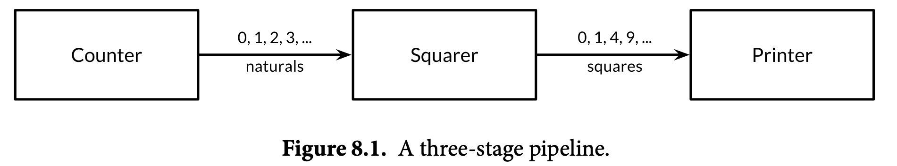
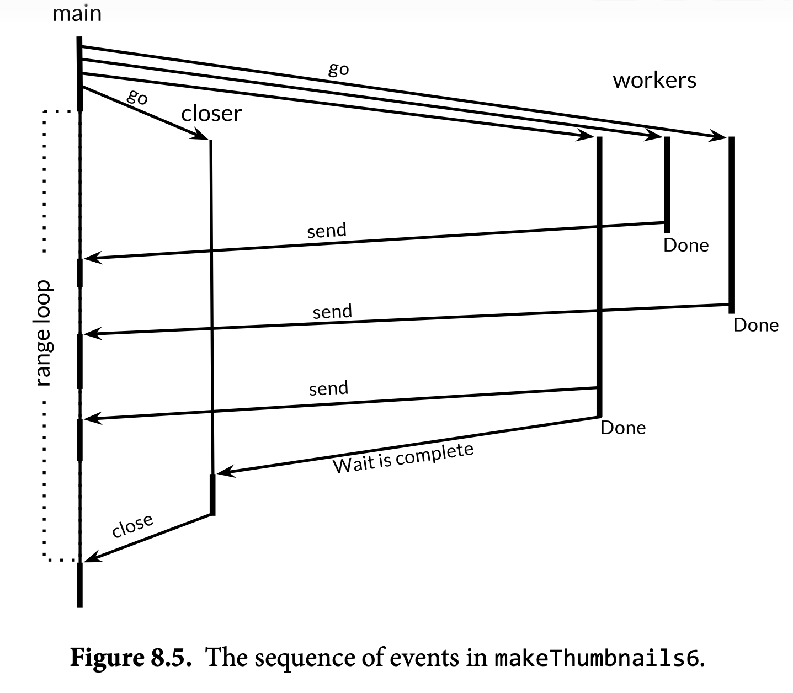

# Ch8. Goroutines and Channels

> Even traditional batch problems—read some data, compute, write some output—use concurrency to hide the latency of I/O operations and to exploit a modern computer's many processors, which every year grow in number but not in speed. (p217)

Go提供了两种并发编程方式，本章涉及的goroutine和channel机制用于通信顺序进程（CSP，communicating sequential processes）方式的并发编程。在CSP方式中，程序中的少部分值在不同独立的活动（在Go中，这种活动就是goroutine）之间传递。

> Even though Go’s support for concurrency is one of its great strengths, reasoning about concurrent programs is inherently harder than about sequential ones, and intuitions acquired from sequential programming may at times lead us astray. (p217)

## goroutine

在Go中，一个并发执行的活动被称为一个goroutine，这个概念与操作系统或者其他编程语言中的一个线程（thread）类似。其与线程之间仍然有量上（quantitative）而非性上（qualitative）的区别。

程序开始执行时，会启动一个goroutine，该goroutine调用main函数开始程序的执行，被称为主（main）goroutine。可以使用go关键字后跟一个函数调用来让该函数调用在一个新的goroutine中执行，这样的一个语句的调用是立即完成的，而不是像普通函数那样会等待函数执行完返回。

当main函数返回或者程序退出（`os.Exit`）的时候，程序中所有运行的goroutine会被立即终止运行，除此之外并没有一种直接令一个goroutine返回的方式。

## 通道

通道是不同goroutine之间通信的方式。一个通道中承载的类型称为这个通道的元素类型（element type），一个元素类型为T的管道类型写作`chan T`。与map类似，channel的底层值可以用make函数来创建。一个管道类型的变量中存储的是指向底层数据结构的引用，因此作为值传递时发生引用的复制，拷贝以后的引用与原引用指向同样的底层数据。

相同类型的管道可以比较等值性，此处的等值性是其引用等值性，即是否指向了同一个底层数据。管道值也可以与nil比较。

一个管道值上有发送与接收两种基本操作，并称为通信（communications）。它们是搭配着使用的：发送操作将一个值从一个goroutine传输到另外一个在进行着接收操作的goroutine上。

两种操作都使用`<-`运算符来表达。

- 当一个通道值位于该运算符的左侧时表示发送。
    - send statement: `ch <- x`是一个语句，表示将x通过ch发送。
- 当一个通道值位于该运算符的右侧时表示接收
    - receive statement: `<-ch`是一个语句，表示从ch接收一个数据并丢弃
    - receive expression: `x = <-ch`RHS的`<-ch`是一个表达式，表示从ch接收一个数据

除了发送和接收之外，通道值的第三个操作是关闭，通过对一个通道值调用close内置函数实现：`close(ch)`。关闭一个通道实质上是将该通道标记为不再有新的值能够发送或接收。对于一个已经关闭的通道：

- 发送值会导致panic
- 如果通道内部还有值，接收值正常工作
- 如果通道内部没有值，接收表达式会返回元素类型的零值

make函数的第二个参数对于一个通道值而言，是该通道的容量（capacity）。当没有传入该参数或将容量定为0时，产生一个无缓冲通道（unbuffered channel）。当容量x大于0时，产生的是一个带有x容量的有缓冲通道（buffered channel）。

### 无缓冲通道

对于一个无缓冲通道，其发送和接收操作如下性质：如果一个goroutine进行了发送，那么该发送语句将阻塞到另一个goroutine对该通道内的值进行一次消费（接收）。反过来，如果一个通道上面没有发送的数据，但是一个goroutine对其进行了接收，那么它会阻塞到该通道上有发送一个数据的时候。

以上性质使得借助一个无缓冲通道，两个goroutine得以同步（synchronize）。因此无缓冲通道又叫同步通道（synchronous channel）。当一个值被发送到了一个无缓冲通道时，对这一值的接收**先行发生于（happens before）**发送goroutine的恢复执行。

> In discussions of concurrency, when we say x happens before y, we don't mean merely that x occurs earlier in time than y; we mean that it is guaranteed to do so and that all its prior effects, such as updates to variables, are complete and that you may rely on them. (p226)

这里的先行发生于并不强调时间顺序，而是强调先行发生的那个部件的作用已经完成，后发生的那个部件可以依赖于先行发生的部件的作用及其产生的值。在这里，对于一个无缓冲通道中值的接收先行发生于发送goroutine的恢复执行，意味着当发送值的那个goroutine恢复执行时，其值已经被另外一个goroutine接收并可用了。

如果x既不是先行发生（happens before）于y，又不是滞后（happens after）于y，就称x和y是并发的（x is concurrent with y）。这里的“并发”只是对既不先行也不滞后的概括，而并不包含x与y是同时发生（simultaneous）的含义，x与y的发生顺序仍然是不确定的。

通道除了传递值外，还可以用于通知，此时其重点变为该信息传递的时机而非传递的信息本身。通道传递的用于通知的信息称为事件（event）。一个传递不携带任何信息的事件的通道通常用`chan struct{}`、`chan bool`、`chan int`等来表达。

### 流水线

使用通道将一个goroutine的输出作为下一个goroutine的输入，可以将一系列goroutine串联起来形成流水线（pipeline）。图8.1展示了由三个goroutine形成的流水线，它们通过两个channel连接起来，其中用作Printer的是main goroutine。



```go
func main() {
    naturals := make(chan int)
    squares := make(chan int)
    // Counter
    go func() {
        for x := 0; ; x++ {
            naturals <- x
        }
    }()
    // Squarer
    go func() {
        for {
            x := <-naturals
            squares <- x * x
        }
    }()

    // Printer (in main goroutine)
    for {
        fmt.Println(<-squares)
    }
}
```

目前这个程序是无限运行的。如果希望这个程序有一个限度，我们可以关闭通道naturals、squares，并利用receive expression产生的第二个返回值来检测一个通道是否已经关闭且干涸（drained，指一个被关闭的通道中的剩余内容全部被消费）。于是Squarer从一个无限循环，改为当发现naturals已经关闭且干涸时就跳出循环然后关闭squares，从而继续触发Printer的结束行为。

```go
// Squarer
go func() {
    for {
        x, ok := <-naturals
        if !ok {
            break // channel was closed and drained
        }
        squares <- x * x
    }
    close(squares)
}()
```

上面的这种写法较为常见，语言自带了对其简化写法的支持，通过使用range去“遍历”一个通道来实现。当naturals关闭且干涸，这个for循环会自动终止。

```go
for x := range naturals {
    squares <- x * x
}
```

需要注意的是，不同于文件、网络等操作，对一个通道的关闭行为不是必须的，我们通常可以直接依靠GC来释放不可达的通道值。对通道的关闭行为往往有明确目的，例如上面的例子中，close用于通知另外的goroutine这个通道不会产生更多数据了。

重复关闭同一个通道，或者关闭一个nil通道，都会导致panic。

### 单向通道类型

上面的程序中，如果将每一个goroutine独立成函数，我们会得到下面的函数签名：

```go
func counter(out chan int)
func squarer(out, in chan int)
func printer(in chan int)
```

这些函数的共性是它们的参数都是通道类型，参数的名称表达了该通道类型的用途，是作为输入还是作为输出。但除了名字上的区别，我们并没有某种手段去阻止函数内部的逻辑对一个本应输入的通道采取接收操作，也无法快速判断是否将一个输入的通道传递到了一个输出通道的参数位置。为了让这种逻辑更加明确，并且引入编译期检查的能力，我们可以使用单向通道类型。

一般而言，只要函数的参数是通道类型，我们就应该考虑用单向通道类型来标示出它的具体用途。单向通道类型与普通通道类型的不同就是用于修饰元素类型T的chan发生了变化，一个仅发送通道使用`chan<-`来修饰，一个仅接收通道使用`chan<-`来修饰，其中`<-`与chan的位置与其相对应的语句或表达式中的位置是一致的，可辅助记忆。

- `chan<- T` 表示一个仅发送T通道类型
- `<-chan T` 表示一个仅接收T通道类型

确定了一个通道的方向后，我们就可引入编译期检查，不仅限于通道类型是否匹配，还包括对close对象的检查。一个close操作只对可发送值的通道有意义，所以close一个仅接收通道无法通过编译。

将一个双向的通道赋值给一个单向通道变量将会发生隐式的类型转换（例如在实参化的过程中），这个转换不能反过来。

### 有缓冲通道

有缓冲通道中持有一个元素的队列，队列的大小就是该通道的容量。

- 发送到一个有缓冲通道的操作相当于将元素入队，放至队列的末尾（生产）
- 从一个有缓冲通道接收的操作相当于从队头获取元素，并删除该元素（消费）

有缓冲通道的队列如果已满，其发送操作将会阻塞，直到队列中的一个元素被消费。反过来，如果队列是空的，接收操作将会阻塞，直到队列中新加入一个元素。在这一点上，无缓冲通道与零长度有缓冲通道的表现是相同的。以上性质换句话说，只要队列中仍有空间或仍有元素，那么对一个有缓冲通道的发送或接收操作都不是阻塞的。

可以使用cap函数来获取一个通道的容量或队列的最大长度，len函数获取队列的当前长度，不过都很少用于实际业务逻辑，往往用于分析或错误诊断。

> Novices are sometimes tempted to use buffered channels within a single goroutine as a queue, lured by their pleasingly simple syntax, but this is a mistake. Channels are deeply connected to goroutine scheduling, and without another goroutine receiving from the channel, a sender—and perhaps the whole program—risks becoming blocked forever. If all you need is a simple queue, make one using a slice. (p233)

下面的例子展示了使用有缓冲通道实现从三个镜像站获取信息，择返回最快的那一个返回。这三个镜像站在单独的goroutine中请求，其结果写入到同一个通道responses中。这个通道一个容量为3的通道。mirroredQuery函数执行将被`return <-responses`语句阻塞，直到responses中出现了一个结果。

```go
func mirroredQuery() string {
    responses := make(chan string, 3)
    go func() { responses <- request("asia.gopl.io") }()
    go func() { responses <- request("europe.gopl.io") }()
    go func() { responses <- request("americas.gopl.io") }()
    return <-responses // return the quickest response
}
func request(hostname string) (response string) { /* ... */ }
```

在这里，responses如果是一个无缓冲通道，虽然该函数仍然能完成其目的，但会导致余下的两个goroutine返回的值没有地方接收，进而使这两个goroutine无限阻塞，产生goroutine泄露（leak），这属于一种bug，因为一个泄露的goroutine不会被GC回收，本质是一种内存泄露。

### 一些考虑

是选择有缓冲还是无缓冲的通道，以及一个有缓冲通道的容量应该是多少，都会影响到程序最终的正确性。

- 无缓冲通道提供强同步性质，任意一个发送操作都应该对应一个接收操作
- 有缓冲通道的发送操作和接收操作是解耦的
- 如果我们知道要发送数据的上限，通常我们会创建一个有该上限容量的有缓冲通道，然后在接收发生之前发送全部的数据。如果这个上限设置的有问题，程序可能会死锁

通道的缓冲也会影响程序的性能。以蛋糕店为例，假设一个蛋糕的出品分三步，按照无缓冲通道的方式，第一步完成后交由第二步，第二步完成后交由第三步。在第二步或第三步没有准备好下一次接收时，第一步和第二步不能产生新的产物。这样，某一个缓慢的步骤就会拖累前一个步骤的执行，因为它需要前一个步骤的等待。

按照有缓冲通道的方式，在每一步之间加设缓冲区，这样每一步就可以在一定限度上专注于自己的产出速度，将多余产物放到缓冲区中。这种方式可以抹平不同步骤之间在速度上的临时细微差异，并且缓冲区越大，其效果越明显。

不过考虑到实际情况，如果前一步的速度稳定大于后一步的速度，那么缓冲区很可能一直都是满的，因为缓冲区的生产速率要大于消费速率。反过来，如果前一步的速度稳定小于后一步的速度，那么缓冲区又很可能一直都是空的。这些情况下，缓冲区的带来的好处不多。

还有一点就是，如果某一步的工作更加细致耗时，那么它可能与前一步和后一步的速度都不匹配，这个时候就可以考虑为这一步引入更多并发的处理者，同时对输入缓冲和输出缓冲进行处理。

## 并行循环

假设现在要将缩小一系列图片成为缩略图，我们使用`gopl.io/ch8/thumbnail`这个package中的ImageFile函数来进行缩小。一个直截了当的写法是直接借助for循环。

```go
func makeThumbnails(filenames []string) {
    for _, f := range filenames {
        if _, err := thumbnail.ImageFile(f); err != nil {
            log.Println(err)
        }
    }
}
```

在这里很显然，缩小的任务是串行执行的，必须等待上一个图片缩小完毕，下一个图片的缩小操作才能开始，所以这种方法效率不高。也很显然，每一个图片的缩小任务是独立的，这些任务对彼此没有任何依赖，所以我们完全可以让它们并发执行。这种因为没有相互依赖而可以直接并发化的任务被称为过易并行（embarrassingly parallel）问题。

为了让这些任务能够并发执行，我们需要做一些改写。一个最容易想到但是错误的方法是直接在for循环中的每一个`thumbnail.ImageFile`调用前面加上一个go关键字。这个时候会发现，如果只需要处理一个文件，加上go以后的运行速度会比没有加go的要快，这是因为缩小并没有真正执行，程序只是发起了一堆goroutine后就立即结束了。

所以，我们引入基于通道的阻塞是有必要的。下面的例子中使用filenames的长度作为循环次数，共消耗`len(filenames)`次ch中传输的值，从而确保在恰好`len(filenames)`次处理后退出程序。注意在这里我们使用了一个相对复杂的内联函数写法，用于传入当前循环下的f值。这是为了避免直接让go后的函数捕获环境中的f导致实际执行时f的值被循环更新的问题。

```go
func makeThumbnails3(filenames []string) {
    ch := make(chan struct{})
    for _, f := range filenames {
        go func(f string) {
            thumbnail.ImageFile(f) // NOTE: ignoring errors
            ch <- struct{}{}
        }(f)
    }
    // Wait for goroutines to complete.
    for range filenames {
        <-ch
    }
}
```

上面我们用到了`chan struct{}`因其只起到通知作用而不携带信息。如果我们不再希望忽略`thumbnail.ImageFile`返回的错误，可以让这个通道起到通知加上携带信息的作用，将其改为一个`chan error`即可。此时我们很容易将下面起到等待作用的for修改为一个错误的循环。

```go
for range filenames {
    if err := <-errors; err != nil {
        return err // NOTE: incorrect: goroutine leak!
    }
}
```

这个循环会导致goroutine泄露。其最大的问题在于在一个无缓冲通道上做了提前返回这一操作，导致后续的所有send都会无限阻塞。比较显然的修复方法有两种：一是将这个无缓冲通道改为有缓冲通道，且容量（至少）为`len(filenames)`；二是另开一个单独的goroutine来专门负责完全读取ch中的值。

以上所有实现的共性是，我们需要得知所有并发任务结束的时机，然后在这个正确的时机结束程序。这个时机是由所有goroutine的执行共同决定的。一个goroutine所能获知的，只有它自身是什么时候结束的，体现在goroutine结束时向外界传递一个信息。这一整个过程可以用一个计数器来描述，计数器的值表示待完成的goroutine数量。每当启动一个goroutine时就令其加一，每当一个goroutine运行结束就令其减一。当这个计数器减到零时，表示所有的goroutine都已经退出。

Go的标准库中有专门用于这种用途的计数器`sync.WaitGroup`，其上的Add方法对应启动时的增加操作，Done方法对应运行结束的减少操作，Wait方法对应等待计数器减到零的过程。使用`sync.WaitGroup`重新编写缩小图片的过程如下，这个函数的参数从切片变为了一个`<-chan string`，因此我们无法事先确定filenames的长度。

```go
func makeThumbnails6(filenames <-chan string) int64 {
	sizes := make(chan int64)
	var wg sync.WaitGroup // number of working goroutines
	for f := range filenames {
        // 每启动一个goroutine，将计数器加一
		wg.Add(1)
		go func(f string) {
            // 当goroutine无论什么原因返回，都让计数器减一
            // wg.Done() 等价于 wg.Add(-1)
			defer wg.Done()
			thumb, err := thumbnail.ImageFile(f)
			if err != nil {
				log.Println(err)
				return
			}
			info, _ := os.Stat(thumb) // OK to ignore error
			sizes <- info.Size()
		}(f)
	}
	go func() {
        // 当计数器减为零时，关闭sizes
		wg.Wait()
		close(sizes)
	}()
	var total int64
	for size := range sizes {
		total += size
	}
	return total
}
```

> The structure of the code above is a common and idiomatic pattern for looping in parallel when we don’t know the number of iterations.

这里有一个疑问需要解决：`wg.Wait()`所检测的是计数器是否为零，而无法区分其是否是减到了零还是一开始就为零，为什么还能正常工作呢？其关键在于`wg.Add`需要在外部调用，从而确保`wg.Add(1)`先行发生于`wg.Wait()`。

为了确保work group的正常工作，实际运行中如果出现并发关系的`wg.Wait`和`wg.Add`，程序会panic。

另外，对于单开的closer goroutine（等待然后close的那个），它与下面的对sizes通道的遍历循环（简称为range loop）必须是并发关系，反证法：

- 如果closer goroutine先行发生于range loop，那么`wg.Wait()`永远不会结束。因为每一个goroutine中都有对sizes的发送操作，由于`wg.Wait()`阻挡了下面的for循环进行，进而阻挡了对sizes的消费，导致无一goroutine会结束，`wg.Wait()`不会结束。
- 如果range loop先行发生于closer goroutine，那么`wg.Wait()`永远不会执行。因为通道没有被关闭，for循环将会无限进行下去，导致`wg.Wait()`的代码不可达。

所以在编写时将closer单开一个goroutine来执行，从而构成与range loop的并发关系是必需的。

整个函数的执行流程用时序图来表示如图8.5所示，其中细的竖直线表示等待或sleep，粗的竖直线表示具体的执行过程，时间轴竖直向下，箭头表示同步。在这张图里面可以更直观地看到range loop和closer goroutine之间的并发关系

- 每个worker执行完毕后都会向sizes发送信息，range loop逐个处理
- closer goroutine全程等待worker的执行，直到最后一个worker执行结束后，`wg.Wait`返回，sizes被关闭，进而导致range loop结束



## 爬虫的例子

这个例子的目标是将第五章中的爬虫程序修改为并发执行。

下面代码中值得注意的是，worklist的初始内容必须在一个单独的goroutine中提供，否则将导致死锁，这是在实际应用中无缓冲通道的一个限制。如果采用有缓冲通道则没有此问题。

```go
func main() {
	worklist := make(chan []string)
	// Start with the command-line arguments.
	go func() { worklist <- os.Args[1:] }()
	// Crawl the web concurrently.
	seen := make(map[string]bool)
	for list := range worklist {
		for _, link := range list {
			if !seen[link] {
				seen[link] = true
				go func(link string) {
					worklist <- crawl(link)
				}(link)
			}
		}
	}
}
```

在运行了这个爬虫之后，先是看到控制台很快刷出了一些输出，然后输出了一些问题。其中的too many open files指出了并发操作中的一个关键性的问题：一切并发都必须有所限度，因为计算机的资源不是无限的，CPU核数、外部设备的I/O能力、网络带宽、服务器能力限制等均会对并发有所影响。为了程序的正常运行，我们必须对并发的程度做一些限制。

```
2015/07/15 18:22:12 Get ...: dial tcp: lookup blog.golang.org: no such host
2015/07/15 18:22:12 Get ...: dial tcp 23.21.222.120:443: socket: too many open files
```

一个简单的限制方法是，让`links.Extract`至多被同时调用20次。20这个数字是选择的一个小于系统文件描述符上限的任意数字。

> This is analogous to the way a doorman at a crowded nightclub admits a guest only when some other guest leaves. (p241)

要实现这种限制，我们使用一个有缓冲通道来模拟一种并发原语：计数信号灯（counting semaphore），规定这个通道中的每一个空位表示一个可被获取的“夜场入场券”，填入一个通道的空位表示对入场券的获取，从中接收表示释放入场券。虽然将这些操作反过来会更加符合直觉，但这需要对该通道的缓冲区进行预填充。直接开箱使用一个有缓冲通道是更加符合Go惯例的写法。另外，在实际编写代码时，信号灯的操作最好尽可能靠近其控制的那些语句，所以我们将`links.Extract`用tokens的send和receive语句“包围”起来就实现了上述限制。

可以发现，这个计数信号灯的使用方法与`sync.Mutex`非常像，实际上，其在功能上就是这里计数信号灯中计数器数量只允许为0或者1时的特例。

```go
tokens <- struct{}{} // acquire a token
list, err := links.Extract(url)
<-tokens // release the token
```

在正确调整程序后，施加了该限制的程序可以正常运行，其速度约为串行运行的20倍。

除了使用信号灯来控制`links.Extract`的调用上限外，我们还可以直接一开始就启动20个常驻的goroutine，每一个goroutine都尝试从unseenLinks中获取待处理项目，获取到一个就处理一个。对于unseenLinks，这20个goroutine相当于在抢占其中的元素，谁抢到了谁就去处理，不会出现两个goroutine处理同一个项目的情况。

> The crawler goroutines are all fed by the same channel, unseenLinks. The main goroutine is responsible for de-duplicating items it receives from the worklist, and then sending each unseen one over the unseenLinks channel to a crawler goroutine. (p243)

```go
func main() {
	worklist := make(chan []string)  // lists of URLs, may have duplicates
	unseenLinks := make(chan string) // de-duplicated URLs
	go func() { worklist <- os.Args[1:] }()
	for i := 0; i < 20; i++ {
		go func() {
			for link := range unseenLinks {
				foundLinks := crawl(link)
				go func() { worklist <- foundLinks }()
			}
		}()
	}
	seen := make(map[string]bool)
	for list := range worklist {
		for _, link := range list {
			if !seen[link] {
				seen[link] = true
				unseenLinks <- link
			}
		}
	}
}
```

seen这个map被限制（is confined with）在了main goroutine中，这意味着它只能在这个goroutine中访问，防止的原理很简单：seen在上面go语句之下被声明，由于这是local作用域，因此上面的goroutine无法获知seen的存在。这种方式与无法在结构体外部访问结构体上的unexported字段、无法访问函数中未逃逸的那些变量、无法在外部访问函数中定义的local variable等类似，都是为了限制程序各个部分之间可交互的程度，进而避免一些意料之外的行为。

## 使用select语句进行多路复用

为了使stdin的一次回车终止倒计时，我们另外启动一个goroutine来“监听”这一回车的行为。

```go
func main() {
	fmt.Println("Commencing countdown.")
	tick := time.Tick(1 * time.Second)
	for countdown := 10; countdown > 0; countdown-- {
		fmt.Println(countdown)
		<-tick
	}
	launch()
}
```

```go
abort := make(chan struct{})
go func() {
	os.Stdin.Read(make([]byte, 1)) // read a single byte
	abort <- struct{}{}
}()
```

要让abort通道能够真正起作用，我们需要在倒计时所在的goroutine中添加对它到来的检测。为了实现这一点，我们需要使用select（如果直接对两个通道进行receive，将导致其阻塞），其基本用法如下，每一个分支都可以是一次通信：接收并丢弃、接收并赋值或者发送。还可以选择性地添加一个default分支来处理无匹配的情况。

```go
select {
case <-ch1:
    // ...
case x := <-ch2:
    // ...use x...
case ch3 <- y:
    // ...
default:
    // ...
}
```

select语句主要做的事情，是等待其中的任意一个分支中的通信准备就绪（即停止阻塞），它会执行该通信，并且执行分支对应的代码块，其余分支均不执行。一个无任何分支的select语句会永久阻塞。为上面的main函数添加对abort的支持：

```go
func main() {
	// ...create abort channel...
	fmt.Println("Commencing countdown. Press return to abort.")
	select {
	case <-time.After(10 * time.Second):
	// Do nothing.
	case <-abort:
		fmt.Println("Launch aborted!")
		return
	}
	launch()
}
```

下面这个例子展示了select语句在一个有缓冲通道上的使用，其分支执行的判断依据依然是该通信是否准备好发生。下面这段代码，stdout总是输出0 2 4 6 8，因为每遇到一个偶数时ch都是空的，receive操作不能发生，则发生`ch <- i`向通道中填入一个偶数；每遇到一个奇数时，ch可供接收，就从中取出一个偶数输出，而忽略掉下面的`ch <- i`。

需要注意select中的分支的顺序是无所谓的。在该例子中，当i为奇数时，只有receive语句不阻塞；当i为奇偶数时，只有send语句不阻塞。因此该程序运行的结果是确定的。但如果将ch的容量提高，那么当i为奇数时，两个分支均不阻塞，此时select会**随机**选择其中一个分支执行，且这个随机的概率服从的是均匀分布，于是下面的程序的运行结果将变得不确定（non-deterministic），且当i为奇数时，两个分支被选中的概率相等，类似于抛硬币。

```go
ch := make(chan int, 1)
for i := 0; i < 10; i++ {
	select {
	case x := <-ch:
		fmt.Println(x) // "0" "2" "4" "6" "8"
	case ch <- i:
	}
}
```

### `time.Tick` vs `time.NewTicker`

`time.Tick`函数的行为类似于单开一个goroutine，在其中写上sleep，每当该goroutine被唤醒时就发送一次事件。在上面的例子中，如果倒计时被结束，函数提前返回，那么`time.Tick`会产生goroutine的泄露，因为它的goroutine并未结束且会因为无接收方而永久阻塞。因此，`time.Tick`只适合那种贯穿整个程序生命周期的tick。如果是可能提前结束的tick，应该使用`time.NewTicker`，并在合适的时机使用`ticker.Stop()`去中断发tick的goroutine。

```go
ticker := time.NewTicker(1 * time.Second)
<-ticker.C // receive from the ticker's channel
ticker.Stop() // cause the ticker's goroutine to terminate
```

### 非阻塞通信

借助select的default分支，我们可以实现一种非阻塞的通信操作，其原理很简单，只要通信语句没有准备好（将会阻塞），就执行default分支。default的分支可以是空的，表现上就好像是直接跳过了该通信操作。

```go
select {
case <-abort:
    fmt.Printf("Launch aborted!\n")
    return
default:
    // do nothing
}
```

重复地进行以上操作，被称为是对通道的轮询（polling）。

## 实例：并行遍历目录

该实例的目标是实现一个类似于`du`的目录大小统计工具。为了统计一个目录大小，需要递归地访问目标目录，将每一个文件的大小取出并加和。一个最初版本的核心是下面的walkDir函数。这里用到了fileSizes这一个通道。

```go
func walkDir(dir string, fileSizes chan<- int64) {
	// dirents返回该目录下的所有条目，是一个[]os.FileInfo
	for _, entry := range dirents(dir) {
		if entry.IsDir() {
			subdir := filepath.Join(dir, entry.Name())
			walkDir(subdir, fileSizes)
		} else {
			fileSizes <- entry.Size()
		}
	}
}
```

在main函数中，为walkDir启动额外的goroutine。这样，每当其遍历到一个文件，就将该文件的大小通过fileSizes发送到main goroutine中的range循环进行加和。等到递归结束后，goroutine调用`close(fileSizes)`进而终止range循环。

这样做没有利用并行带来的速度优势。为了加速整个遍历的过程，我们可以让每一个目录的递归都在一个单独的goroutine中进行，也就是为每一个walkDir调用都加上go关键字。在这种需要一次性开不定数量的goroutine的场景下，适合使用`sync.WaitGroup`来管理。

```go{4}
fileSizes := make(chan int64)
var n sync.WaitGroup
for _, root := range roots {
	n.Add(1)
	go walkDir(root, &n, fileSizes)
}
go func() {
	n.Wait()
	close(fileSizes)
}()
```

在walkDir中也注意用go来启动下一层的walkDir：

```go{3,5}
for _, entry := range dirents(dir) {
	if entry.IsDir() {
		n.Add(1)
		subdir := filepath.Join(dir, entry.Name())
		go walkDir(subdir, n, fileSizes)
	} else {
		fileSizes <- entry.Size()
	}
}
```

由于涉及到文件和递归，与爬虫程序类似，我们需要设置一个信号灯来避免一次性开过多的file descriptor导出程序出错。

```go{1,4,5}
var sema = make(chan struct{}, 20)

func dirents(dir string) []os.FileInfo {
	sema <- struct{}{}        // acquire token
	defer func() { <-sema }() // release token
}
```

## 取消运行的方法

首先明确一点，在Go中没有一个goroutine主动终止另一个goroutine的运行的方法——不存在`thread.Stop()`。这就让如何停止一个goroutine的问题变为了一个goroutine如何确定自身停止的时机问题。显然这个问题的解决需要用到通道，且一个直观的想法是在通道上面发送数据（信号），从而通知这个goroutine应该立刻结束运行。

但是，通道的本质是一个队列，无论有无缓存，其中的数据一旦被goroutine取出，就不能被另一个goroutine看到。这就导致受控的goroutine数量与我们发送的终止信号的数量是高度耦合的。在这过程中也有不可避免的不确定性，例如一些goroutine可能在我们的终止信号发送之前就结束了，或者在我们的终止信号发送之前又产生了新的goroutine，这都导致我们无法轻易确定究竟要发送多少信号。

一个理想的方法并不是发送信号，也不是寻找一种能够确定任意时刻正确信号数量的方法，而是使用close，因其有广播性质。这一广播性质不仅表示一处close可以被所有持有该通道的goroutine同时观察到，还包括了那些没空在close的瞬间观察通道的goroutine在有空观察通道时看到closed状态的情况。

以上面的并行遍历目录实例为例，我们先设置一个专门用来close的通道。此通道上面不传递任何信息。

```go
var done = make(chan struct{})

func cancelled() bool {
	select {
	case <-done:
		return true
	default:
		return false
	}
}
```

注意cancelled函数做了什么：它使用了一个non-blocking communication来探查done在调用时刻的状态，这也就是上文所说的channel polling。简单来说，这个函数提供了一种查询当前时刻done通道关闭状态的功能。

为了让done通道有意义，我们需要为其添加一个触发点。在这个例子中，是一个等待stdin的goroutine。如果用户按下了回车，就触发`close(done)`。

```go
go func() {
	os.Stdin.Read(make([]byte, 1)) // read a single byte
	close(done)
}()
```

接下来开始修改程序中需要“监听”结束信号的地方。第一个是main goroutine中用于接收文件大小来加和的主循环。这里当接收到了done的close后，会对fileSizes进行一次完整的遍历再返回，这是为了清理剩余的goroutine（或者说避免goroutine泄露），避免它们因为fileSizes没有地方接收而阻塞在send语句那里。

```go
for {
	select {
	case <-done:
		for range fileSizes {
			// Do nothing.
		}
		return
	case size, ok := <-fileSizes:
		// ...
	}
}
```

第二个位置是walkDir函数内部，在开头加上对done的检测。此处用先前的cancelled函数来获取done通道的瞬时状态，如果发现通道已经关闭，walkDir变成一个no-op。

```go
func walkDir(dir string, n *sync.WaitGroup, fileSizes chan<- int64) {
	defer n.Done()
	if cancelled() {
		return
	}
	for _, entry := range dirents(dir) {
		// ...
	}
}
```

> It might be profitable to poll the cancellation status again within walkDir’s loop, to avoid creating goroutines after the cancellation event. Cancellation involves a trade-off; a quicker response often requires more intrusive changes to program logic. Ensuring that no expensive operations ever occur after the cancellation event may require updating many places in your code, but often most of the benefit can be obtained by checking for cancellation in a few important places. (p252)

对这个程序进行性能测试，发现影响取消延迟的瓶颈主要在信号灯的操作上。第三个需要增加退出检测的地方是dirents函数里的信号灯获取语句，将这个获取语句改为一个select：
```go
func dirents(dir string) []os.FileInfo {
	select {
	case sema <- struct{}{}: // acquire token
	case <-done:
		return nil // cancelled
	}
	defer func() { <-sema }() // release token
	// ...read directory...
}
```

我发现，select语句在多分支成立时选择的随机性往往不是大多数情况下值得考虑的一个特点，因为在这里我们很容易就顺着逻辑写出了将sema与done一同比较的场景。这样的select代码好处很明显：比较简洁的同时逻辑上也很直观，我们甚至会忽略在两个分支同时存在时选择上的随机性的存在。如果确实需要保证严格的done检验，则需要写两个select，牺牲了简洁性。我猜测这样带来的好处没有想象中的那么大。

> Of course, when main returns, a program exits, so it can be hard to tell a main function that cleans up after itself from one that does not. There’s a handy trick we can use during testing: if instead of returning from main in the event of cancellation, we execute a call to panic, then the runtime will dump the stack of every goroutine in the program. If the main goroutine is the only one left, then it has cleaned up after itself. But if other goroutines remain, they may not have been properly cancelled, or perhaps they have been cancelled but the cancellation takes time; a little investigation may be worthwhile. The panic dump often contains sufficient information to distinguish these cases.