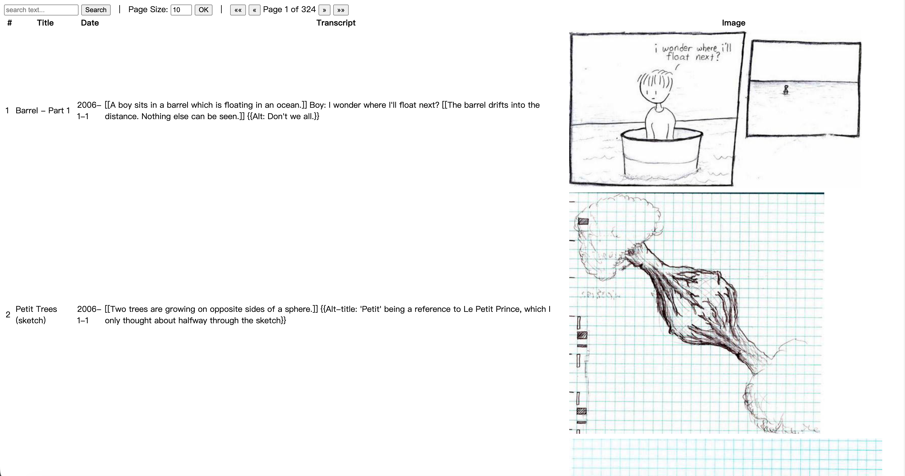

# 为 xkcd 创建一个漫画索引

该练习基于Excercise 4.12 

> The popular web comic xkcd has a JSON interface. For example, a request to https://xkcd.com/571/info.0.json produces a detailed description of comic 51, one of many favorites. Download each URL (once!) and build an offline index. Write a tool xkcd that, using this index, prints the URL and transcript of each comic that matches a search term provided on the command line.

## 运行效果



## 源代码

https://github.com/hxw05/gopl-practice-xkcd

## 用到的package

此处列出的package截止书的Ch4都已经提到过。

- http
  - 用于向xkcd发GET
  - 用于启动HTTP server
- json
  - 用于将xkcd的返回JSON反序列化为struct
- html/template
  - 用于渲染前端页面

## 目标

构造一个[xkcd](https://xkcd.com)漫画索引，以表格的形式展示漫画的原信息以及漫画内容（图片）。

## 实现步骤

### 1. 分页

为了分页，我们需要知道分页的上限。xkcd的JSON API比较简单，似乎并没有专门的文档，经过一番探索可以发现其主要提供两个接口
- `https://xkcd.com/n/info.0.json`用于获取编号为n的漫画。xkcd上的漫画的编号与时间顺序同步，所以编号为1的漫画可以认为是最早的那个漫画，经过测试当`n=0`时服务器返回404
- `https://xkcd.com/info.0.json`用于获取最新的那个漫画。

我们可以在程序启动的时候用第二个接口来获取漫画编号的最大值，记作`xkcdMax`。得到这个最大值以后，就可以计算各个分页参数了。当客户端发来请求时，会给定`pageSize`和`page`。给定客户端指定的`1 <= pageSize <= 50`、`1 <= page <= maxPage`，可以算得：
- 在该`pageSize`下的最大页数`maxPage`，等于$\lceil\mathrm{xkcdMax}/\mathrm{pageSize}\rceil$，在程序中用`xkcdMax/pageSize`整数除法加上一个`if xkcdMax%pageSize != 0 { maxPage++ }`来实现不涉及到浮点数运算的向上取整。
- 要获取的漫画编号范围（闭区间，最小值为1，最大值为`xkcdMax`）
  - 需要获取的漫画编号起点`start=pageSize*(page-1)+1`
  - 需要获取的漫画编号终点`end=min(start+pageSize-1, xkcdMax)`

需要注意`maxPage`是在用户发来请求以后，根据`pageSize`算得的，因此只能在handler内部动态计算，不能提前计算。

### 2. 获取xkcd

定义结构体用于承载从API获取的JSON数据，并用于模板中

```go
// xkcd represents the structure of the JSON response from the xkcd API, or an "xkcd"
type xkcd struct {
	Month      string
	Num        int
	Link       string
	Year       string
	News       string
	SafeTitle  string `json:"safe_title"`
	Transcript string
	Alt        string
	Img        string
	Title      string
	Day        string
}
```

这里用到了unmarshal时不区分字段大小写的性质，没有为每一个字段都加上json tag。实际填入到页面中的结构体由`pageData`定义。

```go
type pageData struct {
	Xkcds    []*xkcd
	Page     int
	PageSize int
	MaxPage  int
}
```

编写函数`fetchXkcd(i int) *xkcd`获取编号为i的那个漫画的json，底层是一个简单的`http.Get`+使用`json.Decoder`进行流式unmarshal+错误处理，代码略。编写函数`fetchXkcdRange(start, end int) []*xkcd`，调用`fetchXkcd`，使用for循环获取区间内的所有xkcd json，代码略。在handler内调用`fetchXkcdRange`完成数据的动态获取。

### 3. 编写模板

为了让代码更清晰，单独创建一个`template.html`用于存储模板HTML内容以及必要的JS逻辑。使用模板语法获取`pageData`上的各个字段，使用`range` action实现对`.Xkcds`的循环输出等。具体代码略。

### 4. 编译模板与页面返回

在程序启动的时候，调用`template.Must(template.ParseFiles("template.html"))`编译模板。此处遇到一个坑：如果按照书本上的写成`template.New("name")`后跟上`ParseFiles`，会导致无法编译，因为其名称冲突了，`ParseFiles`本就会为模板添加一个名称。

> ParseFiles creates a new Template and parses the template definitions from the named files. The returned template's name will have **the (base) name and (parsed) contents of the first file** ...

在构造好`pageData`之后，向构造好的template变量`tmpl`的`Execute`方法直接传入handler的`w *http.ResponseWriter`完成输出，通过`fmt.Fprintf`和`w.WriteHeader`在出现错误的时候向前端输出错误和状态码。

```go
w.Header().Set("Content-Type", "text/html")
err = tmpl.Execute(w, pageData{
    Xkcds:    comics,
    Page:     page,
    PageSize: pageSize,
    MaxPage:  maxPage,
})
if err != nil {
    log.Printf("error executing template: %v", err)
    fmt.Fprintf(w, "internal error: %v", err)
    w.WriteHeader(http.StatusInternalServerError)
}
```


## 总结

这个程序综合运用了http、html/template和json包提供的功能，实现了一个前后端不分离架构下的数据展示网页，从第三方（xkcd）获得数据。上一次接触这种不分离的架构大概是我在初中的时候写PHP。

单从这样一个简单的页面就能感受到这种模式比起现在广泛使用的前后端分离以及现代的前端框架等的复杂性以及缺点所在，但总之还是有点莫名的怀念...？

这个程序可以在下列方面进一步优化和功能扩展：
- 搜索功能。该方面需要经过一定的设计，考虑搜索关键词的具体含义以及作用。
- 页面翻译。可以调用本地大模型完成对内容的翻译。
- 内容解析。struct `xkcd`的`Transcription`字段使用了某种记号文本，通过对这个记号文本的解析可以让文本的呈现更加直观。
- 请求并行。handler返回的时间很大程度上受到串行for循环执行http.Get的制约，其速度可以说很慢（即使当page小如10）。这种请求并行在Go中很容易实现，但是并不属于Ch4及以前的内容。当然在JavaScript中实现似乎也只需要一个`Promise.all`。