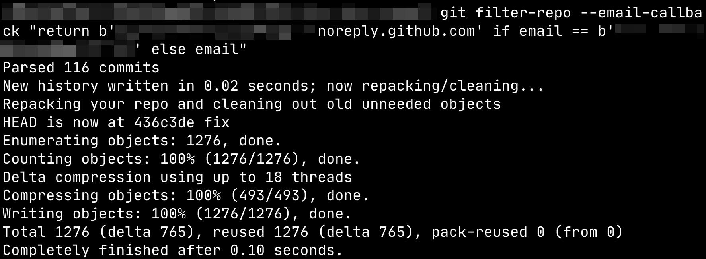

# 一键替换项目中的所有电子邮箱地址

虽然一开始可能并不觉得在commit中包含自己的私人邮箱地址有什么不妥，但或许我们终究会有反悔的那一天。新的提交可以通过调整git config来实现，而过去的那些提交呢？幸运的是，确实有相应的指令来实现这一点，并且不会改变过往提交的时间、提交信息，步骤如下：
1. 在操作系统中安装git-filter-repo包，macOS上直接用Homebrew即可：`brew install git-filter-repo`
2. clone一份我们需要调整的repo，这个操作是必须进行的，否则指令会拒绝处理，它要求是一份“干净的clone”。
```sh
git clone git@github.com:YourName/YourRepo.git
```
3. 分别checkout到每一个要调整的分支，执行下面的指令，将NEW_EMAIL替换为新的地址，OLD_EMAIL替换为旧的地址。新的地址可以是你想要调整到的那个地址，也可以是GitHub为你提供的一个保密地址（noreply email），可以在这个页面 https://github.com/settings/emails 看到这个保密地址
```sh
git filter-repo --email-callback "return b'NEW_EMAIL' if email == b'OLD_EMAIL' else email"
```
 *执行效果示例*
4. 覆盖远端分支，注意这里加了`--force`。建议执行之前先git log看看效果。这里的`--all`指的是全部分支，如果只考虑一个分支，可以改成特定分支名。
```sh
git push origin --all --force
```

如果使用的是GitHub并且做这个操作是为了隐藏公开邮箱地址（而非单纯的修改），建议在https://github.com/settings/emails打开“Block command line pushes that expose my email”来防止将来的意外提交。
