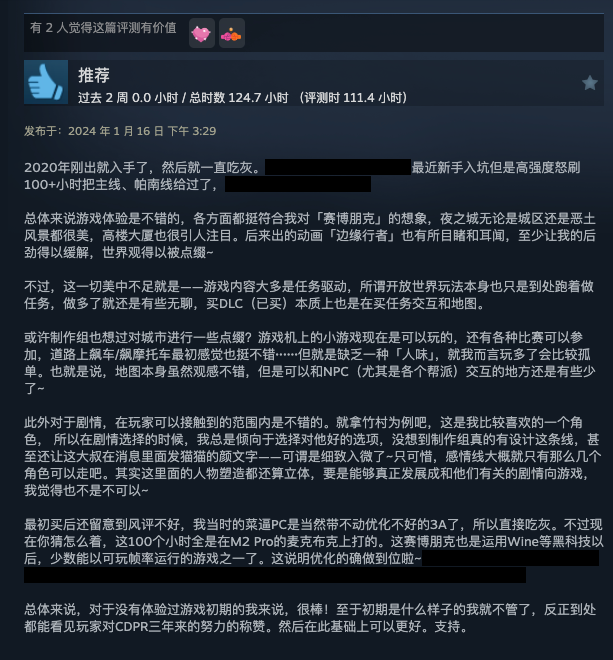

# 赛博朋克 2077

:::danger 本来想放点游戏截图在这里的
不知道是否是Wine里的Steam的问题，截图并没有被上传...所以当我现在想找的时候就找不到了。应该是在我清理硬盘的同时灰飞烟灭了。当时真的截了很多图。截图数量应该仅次于我玩Portal 2的时候。
:::

这是我第一部花“高价”（相对，应该是打折后 100 多块钱）买的游戏，也是我第一部爱上的带有 FPS 元素的游戏。接触到这款游戏没有什么特殊的理由，也不是因为对银翼杀手或者其它与Cyberpunk世界观相关的作品的情怀（根本不了解...），单纯喜欢这样的风格和沉浸探索的玩法。

我至今仍然很难想象是如何忍受着平均30~40fps的帧率在一台M2 Pro的MacBook上开着1080p打通关主线的（当时还没有原生macOS版，是在Wine里面的Steam上运行的）。但主线的剧情仍然令我难忘。具体的内容就不回顾了，懂的都懂。

因为太喜欢主线的剧情（帕南！）所以打完主线，后续的DLC也是一秒购入，虽然之后不知为何就没什么玩游戏的兴趣了，以至于现在狗镇虽然进去了但啥也没干。不知不觉，这都好几年了，连macOS版都出了...

 *刚刚打完主线在Steam上发表的好评，看得出我当时是真的入迷了😱*