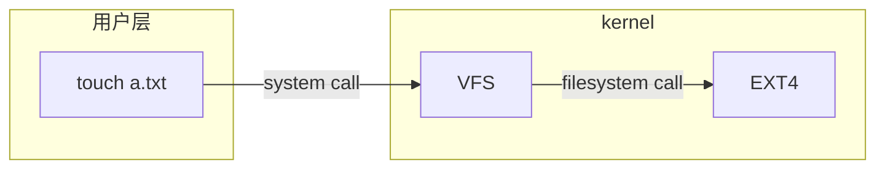
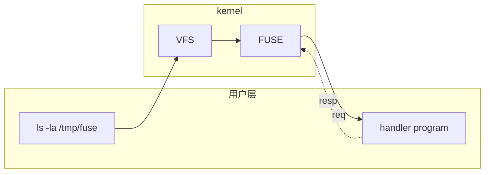

# 10. 百花齐放

这一节课主要是对一些杂项话题的简单介绍，这些话题之间没有明确的关联，但是每一个都涉及到了我们日常对电脑的使用过程以及开发工作。

## Keyboard remapping

> As a programmer, your keyboard is your main input method.

对键盘最简单的一类定制操作就是设置一些快捷键。在这里主要强调的是remapping，但概念与快捷键是相通的。

一个首先想到的可以被remap的按键是键盘上的Caps Lock（大写锁定）键，这是一个不太常用的键，因为其功能完全可以被Shift+字母代替，以及在中文语境下不怎么会遇到需要大写锁定的场景。在MacBook的键盘上，这个键除了大小写锁定以外还有一个切换中英文输入法（一般只对系统自带的输入法有用）的作用，我想这个设计或许是因为苹果工程师也早就意识到了这一点。

Caps Lock可以被映射为Esc或者Ctrl，因为这个键所在的位置与Shift、Tab之类都很近，属于键盘上的黄金位置。

除了简单的重映射外，我们还可以做一些复杂的定制，例如让Shift连按五下对应按下一次Caps Lock来弥补罕见的Caps Lock按键需求，或是让Caps Lock如果是短按则起到Esc的作用，长按（作为组合键）时则起到Ctrl的作用。

另外，我们可以考虑设计一些组合键来帮助我们完成一些经常会用到的功能，例如打开命令行窗口、打开浏览器窗口或是在输入框中输入一段我们经常用到的文本。

这里对macOS推荐的定制软件有[karabiner-elements](https://karabiner-elements.pqrs.org/)、skhd和BetterTouchTool。我发现我很久以前（~2024年）就安装了第一个软件，这主要是因为用外部键盘访问macOS的第一个需求就是将键盘上的三个修饰键（Ctrl、Alt、Meta或Windows）映射到正确的macOS修饰键顺序（Control、Option、Command）。不过后来发现一些键盘自带了Mac模式，这样就可以直接从键盘层面改变修饰键的含义，而不需要用到软件。另外在摆弄输入法的过程中，为了贴合长期使用个搜狗带来的习惯，我也用到了该软件提供的一些定制功能来实现系统输入法/鼠须管的Shift切换中英文功能。

## Daemons

为了持续对外提供服务，操作系统中会有一些常驻运行的进程，称之为守护进程（daemon）。它们的位置好比客户端与服务端之间的服务端，受操作系统管理。守护进程的程序名称通常是其对应的客户端程序名称后加上一个*d*，例如ssh用于连接到sshd服务、crond用于具体的定时执行，而crontab则用于管理定时任务项目等。

在Linux中存在一个系统守护进程（system daemon, systemd），用于管理其它的守护进程，通过systemctl程序来执行。nginx等常驻运行的服务程序在Linux上就是通过`systemctl start/stop/status/restart/reload/...`等指令进行管理的。

应用程序可以定义自己的守护进程从而受系统守护进程的管理，这是一个作为服务运行的程序在Linux中运行的标准实现。

:::tip Eureka
在之前我唯一了解的在Linux服务器上运行常驻服务的方法是使用screen（类似于tmux）挂session，从而避免ssh会话结束之后程序被hup。这是一种虽然可行但并非真正正确的管理方式，因为它完全没有与操作系统对接、没有可靠的恢复机制也无法充分利用操作系统暴露的信息等。
:::

将一个`.service`文件放在指定的路径下，写入对于此程序运行相关的描述，就将其“安装”到了系统中，使其成为了一个守护进程。下面的这个配置文件中的各项的名称本身已经包含了足够的信息来解释其含义。

```ini
# /etc/systemd/system/myapp.service
[Unit]
Description=My Custom App
After=network.target

[Service]
User=foo
Group=foo
WorkingDirectory=/home/foo/projects/mydaemon
ExecStart=/usr/bin/local/python3.7 app.py
Restart=on-failure

[Install]
WantedBy=multi-user.target
```

## 用户空间文件系统 FUSE (FileSystem in User Space)

> Your operating system supports using different filesystem backends because there is a common language of what operations a filesystem supports. For instance, when you run touch to create a file, touch performs a system call to the kernel to create the file and the kernel performs the appropriate filesystem call to create the given file.

一般文件系统的处理均在内核中执行。用户态的指令会执行系统调用，将请求交给kernel中的虚拟文件系统（VFS）处理；虚拟文件系统再进行具体的文件系统调用。我们无法对kernel中的流程做修改，也就无法实现一些额外的功能，例如当删除一个文件时给我发送邮件，或者更加实际地，将云盘挂在到本地等等这样的显然处于用户状态下的代码。


*EXT4文件系统下的大致调用链路*

FUSE是一个与EXT4等文件系统并列的一个“接口文件系统”，它会将对文件系统的访问请求转交给处于用户空间的程序进行处理，该程序处理后返回相应的结果。由于对请求的处理最先发生在用户层，就可以引入额外的代码来拓展一个平凡的文件系统访问的操作。

例如我们可以对外展现（ls的返回结果）一个虚拟的目录结构，该目录结构并不位于本地计算机上，而是位于远端。我们对这些目录的内容做的操作，例如touch、rm等，也都由处理程序递交给远端进行，这就实现了一个看上去位于本地，也可以像与本地一样进行操作，而实际内容存储在远端，过程中需要使用网络进行通信的虚拟文件系统。与这一想法类似的实现是[sshfs](https://github.com/libfuse/sshfs)。


*FUSE下的大致调用链路*

## Backups
> Any data that you haven’t backed up is data that could be gone at any moment, forever.

> The same goes if you have an external drive where you are making a copy, but if you are storing everything in your home, and your home burns down ...

单纯地将文件进行拷贝，或是将文件存储在不同的硬盘上但都处于同一个位置，都不能算作是真正的备份，因为它们无法避免数据因为一些外部因素而消失。常见的外部因素如
- 硬盘出现问题（hard disk failure）。俗称的掉盘正是在此类别中。任何时候都无法确保硬盘不会出现问题。不同类型的存储介质有着不同的寿命，其出现问题的概率也有差别，例如固态硬盘的故障率就低于机械硬盘，而后者的寿命则高于前者。一些传统的存储介质也有类似的概念存在。
- 自然因素或人为因素所导致的问题，例如火灾、地震、洪涝等，这些自然因素都会损害硬盘。另外也可能出现偷窃、抢劫等情况，也会导致数据的丢失。

这些定义显得有些激进并且直接涉及到了异地容灾的要求，但这是确保备份*大概率*（而非绝对）可靠的必要前提。如果数据足够珍贵独特，严格按照这些要求去备份能够更有效地降低损失发生的可能性；对于一般的数据，如果条件允许，也应该优先考虑这种方式。在GitHub上开一个private repo用来备份一些文本文件/小文件似乎也是一个不错的选择，这何尝不是某种意义上的异地容灾。

一些临时备份确实可以通过一些不可靠的方式，例如拷贝来进行，但这个时候备份的有效期可能在数分钟到数小时。

文件的自动同步（eg. OneDrive, iCloud, etc.）不属于备份，因为它存在对文件内容的无条件传播。当数据因为某些操作或者介质问题出现损坏时，损坏的内容也会无条件地传播到远端服务中去。

分版本的备份是一个比较好的备份方式，对于小文件、简单文件如此，对于大文件也是如此。在这种情况下，对于一些简单的文本文件，我们完全可以使用Git对其进行版本控制进而实现带有版本信息的备份。事实上，在日常使用Agent过程中我们不可避免地被置于一些项目内容可能被LLM的一些疯狂的想法而破坏的风险之下，使用Git就可以帮助我们减轻风险带来的损失——前提是要经常性地、有组织地进行提交。

:::warning
Agent工具自身的备份机制，例如Claude Code的`/rewind`，均不如Git可靠（除非它们自己是完全基于Git的，且与你手动创建的Git仓库具有严格对应的历史），这是因为它们大都具有一定的限制，例如`/rewind`要求模型必须是使用框架提供的tool，而非手动用代码进行写入。你自己所做的修改也不在`/rewind`历史的覆盖范围内。
:::

我们应当定期检查备份的完整性和有效性，因为备份也是存储在存储介质上的，也有损坏的可能性。如果长时间不检查而又盲目地相信备份是有效的，很可能会造成损失（“随便搞，反正有备份”）。

## Commandline arguments

不同的命令行工具之间也可能存在一些共同的部分，类似于一种convention。例如
- `--help` flag通常可以获取一个命令行工具的介绍及其参数列表和解释
- 会进行不可撤销操作的工具（例如cp、mv等）通常会提供一个dry run选项来测试该流程是否能够正常以及按照预期进行（通过观察dry run过程中列出的预期操作，*what would have done*）。这些工具通常还会提供一个交互模式flag（eg. `-i`）用来在进行不可撤销操作之前弹出确认，例如`mv -i`。通常建议设置`alias mv="mv -i"`来避免mv覆盖掉同名文件而不提示。
- `--version`或`-V`通常用于显示一个工具的版本号信息
- `--verbose`、`-v`、`-vv...` 用于让工具给予更加详细（啰嗦）的输出，以帮助排查一些问题和观察现象。与之相对应的会提供一个`--quiet`或`--silent`选项来禁止除了错误之外的输出
- 对于需要读写文件的工具，在其用来填入文件名的位置填入一个`-`可用来表示stdin或stdout
- 许多具有破坏性的工具默认都不是递归的，通常通过一个`--recursive`/`--recurse`/`-r` flag指定递归
- 如果希望工具忽略一些看上去像是flag但实际上应当被认为是普通argument的参数，可以在其前面加上一个`--`。eg.
  - `rm -- -r` vs. `rm -r` 前者删除目录下名为`-r`的文件，后者是一个未提供删除目标的递归删除指令
  - `ssh machine --ssh-flag -- foo --foo-flag` vs. `ssh machine --ssh-flag foo --still-ssh-flag`

## Window managers

我们最为熟知的一类窗口管理器被称为悬浮窗口管理器（floating window manager），其特点是窗口可以随意拖动，彼此覆盖，并且自由调整大小。这种非常符合直觉的窗口管理器得到了广泛的应用，但是从效率上来看，它并不是最高的，而且还有一个最大的问题便是必须需要鼠标才能操作。

在Linux中有一种流行的tiling window manager，其中的窗口排布方式类似于tmux中的pane。屏幕总是被任意打开的应用程序所占满，如果只打开了一个，那么这个窗口就是全屏的。当有多个窗口时，这些窗口会按照某种你设置的布局（layout）进行排布。通过键盘我们可以在这些不同的窗口之间切换并控制它们的布局和大小，全程无需鼠标的参与。

## Markdown

> Instead of pulling out a heavy tool like Word or LaTeX, you may want to consider using the lightweight markup language Markdown.

Markdown是作为一个轻量级的标记语言出现的，用于代替LaTeX繁重的排版指令系统以及Word的GUI。Markdown在表现上就像是加了格式的纯文本文件，简单且符合直觉，这或许就是为什么Markdown被选中作为多数conversational LLM的默认输出格式的原因。

## Hammerspoon

Hammerspoon是一个macOS上的桌面自动化框架，可以通过编写Lua脚本的方式与操作系统相关的各个部分，例如屏幕、键盘、鼠标、文件系统等进行交互。

听了介绍，我觉得Hammerspoon可以帮我代替[Loop](https://github.com/MrKai77/Loop)这个工具，实现在悬浮窗口管理器下面通过快捷键快速地窗口的位置。

## Booting on live USB

在操作系统启动之前，UEFI和BIOS负责系统的初始化，因此在正式进入操作系统之前我们可以通过按下键盘上的按键来进入到BIOS/UEFI的菜单和配置界面或是引导菜单中。

装有可直接引导启动的操作系统的USB被称为Live USB。从21世纪初到当今，Live USB对于PC而言一直具有相当重要的作用，其中不可磨灭的一点就是当PC上的操作系统出现问题时，Live USB可以直接被用于拯救其中的数据以及修复或重装操作系统。

## Virtual machines

- https://www.vagrantup.com/
- Docker

## Notebook programming environment

笔记编程环境中最为出名的就是Python的[Jupyter Notebook](https://jupyter.org/)。它使得你可以交互式的构建并运行你的代码，添加详尽的注释并分享给其他人，非常适合研究型、探索向的代码。Jupyter Notebook是一个网页，这代表着它可以在异地运行，在线访问，从而利用另一台具有较高配置电脑的性能跑代码。

:::tip Recall
我最早一次尝试Jupyter Notebook是在Google Colab平台上，因为当时看到这个平台提供了免费的算力。但当时的我还不知道Python该怎么写。
:::

[Wolfram Mathmatica](https://www.wolfram.com/mathematica/)也是一种笔记编程环境。

## 参考链接

- cron manpage - https://www.man7.org/linux/man-pages/man8/cron.8.html
- 基于 API 的 workflow：https://ifttt.com/
- Lecture Note: https://missing.csail.mit.edu/2020/potpourri/