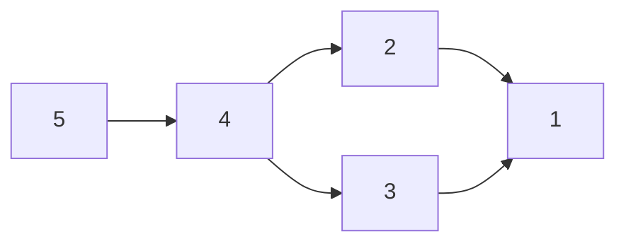

# 6. 使用 Git 的版本管理

:::tip
本文为纯英文笔记
:::

`git` has become the de facto standard of version control systems.

Git's interface is considered not so good (*ugly*), a leaky abstraction. It's more appropriate to get to know Git down-top rather than top-down, in order to address this classic scenario: every Git command is memorized and used like magic incantations, but whenever something go wrong, you would probably just delete the entire directory and re-download it for a fresh start, which is a quite straightforward fix.

## Adhoc Version Control

An adhoc approach to controlling versions of a developing project could be making a copy of the entire project folder every day and name it with the date or timestamp.

To collaborate with others, one might need to communicate with others and determine the files and folders should be focused on beforehand. When there's a need for synchronization, one might just create a zip archive of the project folder and send it through email, and the receiver replaces specific local files or folders with the ones received.

## Git Models

> Relating the interface of git and some of the bad designed commands to the underlying data model can help it make a lot more sense.

### Snapshot

```
(root)
    foo
        bar.txt
    baz.txt
```

The project root is referred to as (root) here. A snapshot is like a moment or state of the project history. A directory is normally described as a tree. In Git models, there are 2 kinds of tree nodes:
- Tree: (kinda) equivalent to directory in filesystem terms.
- Blob: (kinda) equivalent to file in filesystem terms.

### History

Git uses directed acyclic graphs (DAC 有向无环图) to model the history of the project. DAC is significant for the common non-linear history. Each node in the graph is a snapshot and refer to its parent(s).



Each node of the graph also contains metadata like author of the commit, message, etc. Node 4 is merged from 3 and 2, and there can be *merge conflict* that might need the programmer to fix manually during the automatic merge attempt performed by Git.

## Data Structure

The psuedocode of the Git models involves data structures shown below.

```typescript
type Blob = byte[]
// Hash as key
type Tree = Map<string, Tree | Blob>
type Commit = {
    parents: Tree[],
    author: string,
    snapshot: Tree
}

type Object = Blob | Tree | Commit

// Hash as key
const objects = new Map<string, Object>();

function store(o: Object) {
    let id = sha1(o);
    objects[id] = o;
}

function load(id: string) {
    return objects[id];
}
```

*Object* is the combination of either Blob, Tree or Commit, which is used to store the three in a content address store in a unified manner.

Commit does not contain the actual content of any of the Trees, instead only references (hashes) are stored.

Notice that the difference between commit and snapshot is clear according to the data structure. Basically a snapshot is the concrete tree whilst a commit is a snapshot plus its metadata and connections in the history DAG.

### References

The identifier of each object is a SHA1 hash which is a 40 character long hexadecimal string generated from its content, which is not human readable and hard to type. *References* is a mapping from some human readable alias to the underlying SHA1 hash.

```typescript
const references = new Map<string, string>();
```

In contrast of the DAG which tracks the history of the project, references are mutable. A reference can be changed to be pointed to another hash, but a hash cannot be changed (which makes no sense) since it's essentially a mapping from its corresponding content.

As an intro to commandline, all of Git commandline commands are just manipulation of either the references data or the objects data.

## Git Commands

### `git add`, `git commit`

There's no such command as "git snapshot" for you to take a snapshot of the project. The combination of `git add` and `git commit` in a normal workflow actually provides more flexibility and freedom by proposing the staging area for the committer to consider which part of the changes should be included in the next snapshot.

`git commit -a` commits all tracked files, which does not includes new files that have not been tracked.

`git add *` is useful when you want to include every changes git detected in the next snapshot/commit.

### `git cat-file`

`git log` can be used to visualize the history. There's a corresponding hash for each commit, as stated earlier. We can dig down the hash using an internal command `git cat-file` to verify our previous knowledge.

For example let's say we've got a commit hash `38d226c` (which obviously is truncated for clearity), we can use the command below to pry its content.

```sh
git cat-file -p 38d226c
```
```
tree f5221d7a267e08aa345bb4680308e5a7b1269fd2
author ***<***> 1779156406 +0800
committer ***<***> 1779156406 +0800

first commit
```

*Asterisk for privacy.*

The structure returned is known to us, and it provides the hash of the tree(snapshot) that the commit refers to, so we can keep on digging:
```sh
git cat-file -p f5221d7a267e08aa345bb4680308e5a7b1269fd2
```
```
100644 blob 5ecf8199105ae55ec3c6a687b42721a05d5a0303	***
100755 blob 42642545cc2dbfca5f65ac3277cf86b4cc1de74c	***
040000 tree 1f50a7fdc55bda89bcd33746d713647994bce7f0	***
```

Now we have the snapshot content along with the hashes correspond to the blobs and trees contained. The `cat-file` now behaves like the system `cat` or `ls`.

Notice that along the way we just use the same command `git cat-file -p` but with different hashes. That said, all the hashes effectively share the same namespace (*objects* in Data Structure).

### `git log`

Why `git log` is called a *visualization* tool for history? A simple `git log` call will always present the history in a linear form, no matter what the DAG actually looks like. So for a complex history, more advanced `git log` usage is preferred:

```sh
git log --all --graph
git log --all --graph --decorate # for decoration
git log --all --graph --decorate --oneline # for simple logs
```

### `git checkout`

There are two special references for now: `HEAD` and `master`(or main, after some kind of "convention update"). `HEAD` stands for the current state of the directory, namely what you see. `master` refers to the latest commit.

`git checkout` can be used to switch between different commits by providing either a hash or a reference, essentially moving the `HEAD` pointer. `git checkout` will mutate the directory content so it's dangerous if not used properly. A warning is shown and the checkout is aborted if there's a chance it overwrites uncomitted changes. This protection can be bypassed by specifying `-f` (force).

### `git diff`

`git diff` shows the changes of a given file. The full form is shown below which gives the differences between what the file contains in commit A and in commit B. Effectively the differences here can be seen as "what changes should be made to produce the file content in commit B from that in commit A" where changes can be either add or delete of lines.

```sh
git diff commitA commitB path/to/file
```

Omitting `commitA` or `commitB` makes the commit identifier part a single `commitHash` (no order included), which is interpreted to `commitHash` → current state comparison.

Omitting the commit identifier entirely makes the comparison between `HEAD` and the current state.

Note that `HEAD` is a pointer to the state of tracked history reflected by the current directory content, whilst "current state" is `HEAD` plus our changes that is not yet commited, so it does make sense to compare one with another.

## Branching and Merging

`git branch` shows branches.

`git branch <branch-name>` creates a new branch, `git checkout <branch-name>` switches to that branch and mutates the directory content. `git checkout -b <branch-name>` is the same as `git branch name; git checkout name`. Branch is highly combined with the idea of references.

`git branch <branch-name>` behaves like the opposite of `git merge <branch-name>` which merges two branches (specifically the current branch and the specified branch) into one single branch.

Fast Forward: if the current branch (say, `master`) precedes the specified branch (say, `dog`), merging them is just changing the pointer:
```mermaid
M[master (1)]
D[dog (2)]
C[cat (3)]
M-->D
M-->C
```
```mermaid
M[(1)]
D[master, dog (2)]
C[cat (3)]
M-->D
M-->C
```

Merge Conflict: happens when Git can't automatically merge two branches as a whole. Some parts might be merged correctly, and other parts are left for the programmer to resolve manually. The conflict section looks like a diff, with conflict markers (actual characters) inserted by Git.

```
<<<<<<<< HEAD
...
========
...
>>>>>>>> incoming
```

## Working with Remote Machines

`git remote` lists remotes.

`git remote add <name> <url>` adds a remote, where `<url>` could be either Internet URLs or local file paths, like `../remote`. It's a convention to call the remote "origin" when there's only one.

`git push <remote> <local-branch>:<remote-branch>` pushes the local branch to the remote and sets the remote branch. `<local-branch>:` can be ommited to represent the current branch.

`git push` can work without any argument if the *upstream* of the current branch is known, which can be set using `git branch --set-upstream-to=<remote>/<remote-branch>` eg. `origin/master`.

`git fetch` retrieves references and objects from a remote.

Git is a local tool. By default, Git commands do not talk with the Internet, making the command execution fast. Without any explicit synchronization, a cloned history is solely changed by the editor locally with `git commit`, etc. and `git log` reflects only local history from when it's cloned. It's not aware of any remote updates.

```mermaid
Remote --> A[Machine A]
Remote --> B[Machine B]
```

Suppose that Machine A has up-to-date history and in sync with the remote while Machine B is *behind* the remote history, the `git log` of Machine B would be outdated and different from that of Machine A. The `origin/master` on Machine B might not point to what it actually does on the remote machine. Machine B would need to perform `git fetch` to retrieve the latest history, including the correct remote references.

`git fetch` just downloads the history and does not change the current state. One would need to use `git merge` and solve any desynchronization between the local history and the incoming history. `git pull` does fetching and merging altogether.

## Other Interesting Things

`git checkout <file>` reverts the file to its latest snapshot.

`git clone --depth=1` or `git clone --shadow` clones the project without history which can be useful when cloning a large project.

`git add -p <file>` allow you to stage file interactively and decide which part of the file content should be included in the next snapshot.

`git blame` shows metadata of a file especially authors reponsible for each line.

`git bisect` binary searches the history for a given purpose.

`git stash` temporarily removes edits and restores directory to its latest snapshot. `git stash pop` brings the edits back.