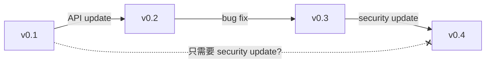
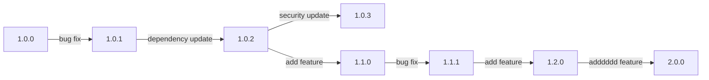

# 8. （另一种含义的）元编程

> ...it was the best collective term we could come up with for the set of things that are more about process than they are about writing code or working more efficiently.

围绕着编写代码的外周事物（surrounding）就是本节课程中所提到的元编程（metaprogramming）。值得注意的是元编程还有另外一个更加公认的含义：https://en.wikipedia.org/wiki/Metaprogramming，一个用来构建程序的程序，或是*自举*（quine），都在这种元编程的范畴内。

## 构建系统（Build systems）

涉及到代码的一些源文件要变为最终的成品，需要经历一个*构建*（build）的过程。这个过程可以简单如只需要一行指令，也可能比较复杂，例如一篇有很多张图片的LaTeX论文，我们需要引入宏包、管理宏包、构建出论文中所引用的所有图片等等，在一台只有代码而没有环境的计算机上从零开始执行这个过程是比较繁复的。

帮助解决此过程的繁复性的一类工具就是构建系统。现存的有许多构建系统，它们的内核不外乎三大元素：
- 依赖（dependencies）：描述了为了构建最终的产物，需要提前获取并构建的一系列外部或者内部产物
- 规则（rules）：描述了构建的过程和条件等
- 目标（target）：描述了最终产物的形式和要求

构建系统会从依赖开始处理，利用规则产生中间产物，最终产生目标产物。在这一过程中，构建系统还可能加入一些额外的考虑，例如复用缓存、增量构建等。

eg. npm作为前端的一个常用包管理器，其描述文件`package.json`中就包含了整个项目的依赖。在前端开发中，考虑到项目的需求，我们通常会引入一些外部的工具（例如Webpack、Vite、Babel、tsc）来参与构建，我们可以借助它们来描述rules和target。所有这些共同构成了一个project specific的构建系统。

### `make`

make是一种常用的构建系统，且一些UNIX系统上是内置的。make适合中小型系统。其核心是一个名为Makefile的文件，这是用于描述依赖、规则、目标的地方。

```makefile
paper.pdf: paper.tex plot-data.png
	pdflatex paper.tex

plot-%.png: %.dat plot.py
	./plot.py -i $*.dat -o $@
```

上面展示的每一个项目被称为一个指令（directive），它的一般形式是

```makefile
<target>: <dependencies>
    # <recipe>
```

一个指令描述了生成一个target所需要的依赖，以及生成该target的具体程序调用过程（recipe）。第一个指令被视为是默认指令，它在命令行不带任何参数执行`make`的时候被执行。

:::tip
`$*`在Makefile中作为参数时表示`%`表示的内容。`$@`表示target的名称（LHS的内容）。
:::

在`<target>`和`<dependencies>`中，我们可以使用`%`这样一个占位符（称之为模式 pattern）用于表示任意的字符。上面的例子中，当我们执行`make plot-data.png`时，它的dependencies就被自动解析为`data.dat plot.py`。dependencies可用于防止依赖文件不足的指令的执行，例如在paper.tex不存在时，我们执行`make`就会产生下面的输出。

```
make: *** No rule to make target 'paper.tex', needed by 'paper.pdf'.  Stop.
```

除此之外，dependencies还会被用于确定产物是否是最新的。如果依赖没有发生改变，那么重复执行同一个构建指令不会从头开始生成产物，而是什么也不做，类似于一种缓存机制。

正是因为这种原因，当我们需要定义一个功能性的指令时，可能需要将其声明为一个假的（phony）目标，从而绕过上面的检查。

```makefile{1}
.PHONY: clean
clean:
    rm *.o temp
```

如果没有最上面那一行`.PHONY`，clean会被视为一个没有依赖的target，如果当前目录下存在一个名为clean的文件，则clean指令的recipe不会被执行。最上面的那一行实质上做的是将clean这一个target定义为`.PHONY`这个[special target](https://www.gnu.org/software/make/manual/html_node/Special-Targets.html)的依赖，而作为`.PHONY`的依赖的recipe永远不会被跳过。

## 依赖管理（Dependency management）

从宏观上来看，程序的依赖很可能自身是一个现存的项目，例如`matplotlib`。当今一般有专门的*仓库*（repository）用于存放这些依赖供开发活动来获取，例如apt的仓库、RubyGems、PyPI、crates.io、pkg.go.dev等。

仓库中的项目都有其版本号。一个版本就好似一个快照，但没有git那么细粒度。版本最大的一个作用是为了区分程序中的修改，使得依赖不同版本的同一个依赖的项目可以正常的工作。版本号有许多种形式，并且不一定是由纯数字构成，也不一定遵循数学上的递增顺序，一些例子包括：

- Windows: 2000 Me XP Vista 7 8 10 11
- Windows 10：1804 1903 25H1 
- Minecraft: 1.16 1.20.1 26.1
- Java: 17.0.1 18.0.1 21.0.1
- iOS: 26.1 26.2 26.3

可以看到其中的一些版本号甚至是跳跃的乃至带有产品宣传色彩的。这些版本号的形式并不会产生很大的影响，因为它们都是最终的产品，而不是作为某个依赖而存在。当然，即使如此，一个有意义的、保持基本递增关系的版本号仍然重要。



仅考虑递增关系的版本号最大的一个问题无法区分版本的轻重缓急。对于那些功能上的增加和修改，递增关系版本号确实可以做到基本的区分。然而对于安全性更新这种不影响功能，但影响程序安全性的重要更新，如果也将其放在递增的关系中，很容易让一些依赖于旧版本的程序无法适应，因为安全性更新和功能性更新混合在一起了，强行更新会导致类似于“饺子醋”或“牵一发而动全身”情况的出现。

对于我们开发过程中常见的那些包（package）来说，现存的一个广泛的标准是语义化版本号（semantic versioning, semver），它包含了一些对于依赖管理十分有用的规则，并且解决了上面说的这种问题。semver将一个版本号分为三个部分，表示为`major.minor.patch`。根据对程序的修改的性质不同，每次增加的部分也不同。
- major：API未保留向后兼容性（backwards-compatibility），属于破坏性修改（breaking change）
- minor：API保留了向后兼容性
- patch：没有对API的调整



在严格的semver控制下，如果我们的项目依赖1.3.7版本，那么它也应该可以直接切换到1.3.8、1.6.1或者1.3.0；但它很可能不能直接切换到1.2.7或者2.1.0。前者是因为，1.3.7相比于1.2.7增加了minor版本，保留了向后兼容性，但1.3.7中可能包含1.2.7中不存在的API（注意添加新的API仍然属于向后兼容的操作）。后者是因为major版本发生了改变，API可能完全不同。Python 2和Python 3的区别就很像major版本改变的区别；Python 3.7的代码不一定能在Python 3.6中运行（反过来可以）也是类似的道理。当然由于Python代码存在一定的复杂性，这种“反过来可以”的逻辑不一定总是成立，因为一些代码可能引入了额外的外部条件、平台依赖等。

锁文件（lock files）是用来记录“我们到底依赖的是哪一个版本？”信息的文件。我们不一定总是要使用最新的版本。保持在某一个够用的版本，能够让产物得以完全复现，减少不需要的重构建，并且避免最新版本自身原因所带来的问题等。一个更为极端的方法称为vendoring，就是将一整个依赖的项目完整复制到当前的项目中。

在最初使用npm管理依赖的时候，我们可能会有这样一个疑问：到底应不应该提交`package-lock.json`？还是像忽略`node_modules`那样忽略它？答案是应该提交。
- https://stackoverflow.com/questions/44206782/do-i-commit-the-package-lock-json-file-created-by-npm-5
- https://stackoverflow.com/questions/39990017/should-i-commit-the-yarn-lock-file-and-what-is-it-for

对锁文件是“我们到底依赖的是哪一个版本？”信息的这一描述还不够全面。对于`package-lock.json`或`yarn.lock`来说，它们描述的是用于构建`node_modules`目录所需要的元数据。换句话说，`package.json`不足以唯一确定`node_modules`的内容。不同的操作系统、不同的平台，甚至不同的依赖顺序，都可能产生不一样的`node_modules`内容，即使从我们的视角来看`package.json`中记录的内容没有发生实质性的改变。

以一种更为精确的方式描述`node_modules`的树到底长什么样（这就包含了具体的版本、依赖关系、哈希值等），从而避免平台差异造成问题，并允许`npm ci`一类的指令检验这种错误的存在而消除在持续集成的过程中潜在的问题，是锁文件的一个重要意义和作用。锁文件避免了works on my machine一类的问题（这类问题往往令人费解）的发生，也是某些情况下删除`node_modules`并重新安装就能解决问题的一个很大的原因。

## 持续集成系统（Continuous integration systems）

在实际开发和协作的过程中，存在一些重复的操作需要我们来完成。一个很直观且朴素的需求是，当我们在静态博客程序上编写文章的时候，我们希望push之后文章能够自动构建成页面，而不需要我们自己来run build。更高级的需求可能是，当某人在我们的仓库上面提交了PR后，我们希望能够自动对其提交的内容进行一些检查，例如风格检查等。这些需求都可以通过持续集成来解决。

> Continuous integration, or CI, is an umbrella（总称的） term for “stuff that runs whenever your code changes”, and there are many companies out there that provide various types of CI, often for free for open-source projects.

一些CI平台：Travis CI、Azure Pipelines、GitHub Actions。一些PaaS也会在自己的服务中添加类似于CI的设计，例如Vercel对仓库更新的检测。

> They all work in roughly the same way: you add a file to your repository that describes what should happen when various things happen to that repository. By far the most common one is a rule like “when someone pushes code, run the test suite”. 

此过程通过小型虚拟机实现，平台在虚拟机上运行给定的任务，完毕之后将结果存放在某个地方（例如部署到GitHub Pages）等。此过程如果出现问题，通常会提供消息提示（或者手动设置），例如GitHub Actions会在build failed的时候发送邮件信息。README中还有一种常见的badge用来快速查看构建是否成功（build passing/failed）。

### 关于测试的一些术语

- Test suite（测试套件）：用于代指所有测试相关内容的统称
- Unit test（单元测试）：单独测试程序中的一小部分的测试
- Integrated test（集成测试）：测试程序中的一部分的测试，用于验证模块之间是否能正常协同
- Regression test（回归测试）：例如，设计一个先前会导致bug的流程，在当前的模块中作为测试，验证其是否正常
- Mocking：将某个模块、函数、类型、接口等替换为一个假的占位符，用于去掉无关内容。例如通常我们会选择去mock一些接口，以及网络和硬盘这样的资源。一些涉及到数据库的小型测试，为了方便，我们会用内存sqlite来mock一个真实的DBMS。