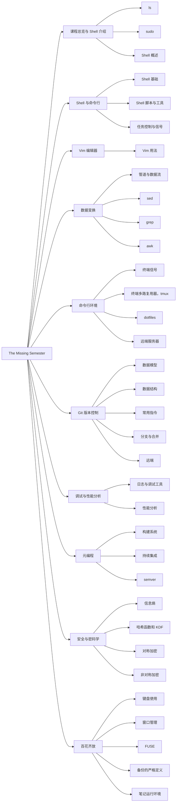

# missing_2020

几乎同一时期，我在[CSDIY](https://csdiy.wiki/)和哔哩哔哩了解到了 *The Missing Semester of Your CS Education*（简称 Missing Semester，“遗失的学期”）这门课程。这是麻省理工大学的一门公开课，自从当年（2019，2020年）就广受好评，其课堂教学录屏以及Lecture Note均在互联网上开放供所有人查看。我很庆幸能够在其开课的五年后见识到这门课程。2026年年初，这门课程再一次开课。

这门课程所涵盖的内容十分丰富，涵盖Shell中的工具与脚本的使用、Git的原理与使用、调试和性能测试的进行、构建系统（building systems）、持续集成、简单的密码学概念等内容。正如其课程名所暗示的那样，这门课程不是对某个主题或学问的系统性探讨，而更像是对于计算机专业基础知识的补遗。

:::details 本笔记中包含的内容树状图（可能不准确）

:::

在看这门课程之前，得益于日常的开发实践，我能够对其中的一些内容有一个基本的粗浅了解，这些了解往往来自于开发过程中根据实际需求所做的google search以及其中一些程序自身的手册或命令行提示。例如git的一些常用指令的使用（`--rebase`是命令行中的文字提示教我的，`--set-upstream-to=`也是）、GitHub的使用（多年间逐渐熟悉）、构建系统（前端要用）、持续集成（写博客要用）、非对称加密（SSH免密码登录要用）等。

我认为这些仅仅根据具体需求所做的*了解*距离真正的*知道*还很远。这门课程为我提供了一个很好的补漏平台：instructors从自身的专业角度对相关内容进行了介绍和拓展，让我的这些既有认识更加系统化且有了锚点，同时还引入了许多紧密相关的内容以及剖析了一些平时甚至完全不会注意到的原理（例如Git的底层逻辑，以及SSH的公钥登录是如何实现认证的）等。我很喜欢这种提供了许多rabbit hole的内容，给人一种持久的无限的探索欲望。

本课程笔记主要是对YouTube上的课程视频以及Lecture Note的个人整理，可能会省略掉一些个人觉得没必要的部分（省略地不多），并添加一些我个人在看到相关部分的联想、过去的经验和额外的理解，因此不一定准确。Lecture 1-4的笔记主要基于视频理解，没有多少Lecture Note的整理，因此会略显简略；Lecture 5、Lecture 6的笔记在当时为了方便，是用英文编写的。如果你希望有一个标准的参考，请考虑查看Lecture Note（[2020年版](https://missing.csail.mit.edu/2020)，[2026年版](https://missing.csail.mit.edu/2026/)）。

下面是学完本课程之后的某个下午脑海里蹦出来的一些感想，just feel free to skip.

## \*nix is a type of solitude

值得注意的是贯穿此门课程自始至终都是Unix-like系统，其课程内容只字未提Windows-specific的内容；占据大篇幅的内容更是仅针对Shell，而非Powershell（虽然从宏观上来看概念很像，但一旦详细看，就是完全无关了）。指出这一点，是因为我一直有个疑问：Unix-like系统是因为什么原因，只要涉及到geek、编程等话题人们就会第一时间想到它们？

就我个人来说，我很享受使用这类系统的过程——我的主力电脑的操作系统是macOS，我觉得除了一些兼容性问题（例如游戏、某些专业软件），我找不出什么它（对于我来说）不如Windows的地方，我甚至还很庆幸我选择了macOS，使得能够有一个近似于Linux的命令行界面；在云服务上，我通常会选择Debian-like，原因没有什么特别的，就是最开始接触了Ubuntu，后来就对这类系统用得越来越熟（一种犹如小鸡破壳、先入为主的好感）。以及我对于一些概念的最初了解以及一些程序（nginx、apache、apt、...）的最初认识，就是在这类系统上面形成的。

因此我发现我与周围人语言交流的匮乏，在一定程度上也是由操作系统不匹配导致的。这是一个略显荒谬和意识流的结论，但从某种程度上来说，确实如此。注意：仅限周围人。可能他们在先前并不知道在Windows之外存在另一些系统；可能他们不知道GUI是什么，以及使用命令行有哪些理由（“我为什么要在这个黑框框里操作？”）；可能某些情况下命令行的样子会给他们一种电脑失控的感觉；可能他们衡量一个操作系统的好坏总是从一个端用户出发，通过是否可以打瓦、帧率有多高等因素来评判；......所以，我似乎找到了又一种[孤独的类型](https://book.douban.com/subject/4124727/)——操作系统孤独。

## Evaporation: thoughts on knowledge consumption

知识就像一片大海，中文社交媒体就像浮在大海上的一片片云彩，时而了无踪迹留下一片蓝天，时而是像薄薄的棉片的[卷云](https://zh.wikipedia.org/wiki/%E5%8D%B7%E4%BA%91)，时而又构成比宫崎骏的天空之城还要广大的[积云](https://zh.wikipedia.org/wiki/%E7%A7%AF%E4%BA%91)。一些知识人们起初是抗拒的，但当它被社会赋予了一定的价值，经过话语、流量的加热之后，便浮出水面，蒸发到天空，形成云彩。

AI的流行，便是一次巨大的蒸发活动，将沉寂了数十年的人工智能领域提升至天空中，让即使从来没有读过论文的人群也能（出奇地）耐着性子去认识arXiv、瞻仰那篇[Attention is All You Need](https://arxiv.org/abs/1706.03762)的神话传说以及创造着这些神话的一直以来默默无闻的科研工作者；用于简化HTML在简单的文本排版需求面前的繁杂性的Markdown，由于被选为大部分conversation LLM的输出格式（很遗憾，$\LaTeX$你输了，只配作附属[^1]）而被认识，尤其在*知识库管理*[^2][^3][^4]这一需求虽然模糊但并不小众的产品市场上被接受，甚至被一些人用HTML重新取代[^5][^6][^7][^8]；1973年首次出现在man界面中的*grep*（一款命令行程序），如今被人们拿出来与向量数据库一起探讨究竟哪一种更加适合拿来做retrieval[^9]；Claude Code等命令行的出现，使得略显冷门的TUI不再冷门，而是小众科技范的象征（虽然这是一个轮回性的现象）；Anthropics公司提出的MCP和Skills的概念分别让前后端分离或客户端—服务端架构、文件夹的树形结构和引用的概念深入人心；AI还为一些学科提供了良好的表现平台：来自软件工程、密码学、计算机编程语言等学科的经典的理论和方法只要能够投入到AI的使用中，便会让人们觉得耳目一新、又有新发现；还有很多......以上种种，无一不是在当今信息爆炸时代的奇迹。

某种程度上来看，这些信息在蒸发过程中或许丢失了一些营养和精巧，又多了一些浮躁与符号。

[^1]:  点击查看大图。图中展示了某抖音用户发明的LaTeX的另一种用法，我认为这种用法在降本增效和解决需求方面都很有市场（或许）。
[^2]: https://obsidian.md/
[^3]: https://anytype.io/
[^4]: https://appflowy.com/
[^5]: https://36kr.com/p/3802038144884738，Wayback Machine 存档：https://web.archive.org/web/20260524102232/https://36kr.com/p/3802038144884738
[^6]: HTML会代替Markdown吗？为什么？ - 知乎 https://www.zhihu.com/question/2036741717039305145
[^7]:  点击查看大图。图中展示了html markdown这一关键词在微信公众号的搜索结果。
[^8]: 来自微信公众号“AINLP”（微信号nlpjob）的文章《别再用 Markdown 了，HTML 才是 AI 时代真正的输出格式》https://mp.weixin.qq.com/s/NOzpeTx4LXB0lB44HCDk7Q 
[^9]:  点击查看大图。图中展示了grep rag这一关键词在小红书上的搜索结果。