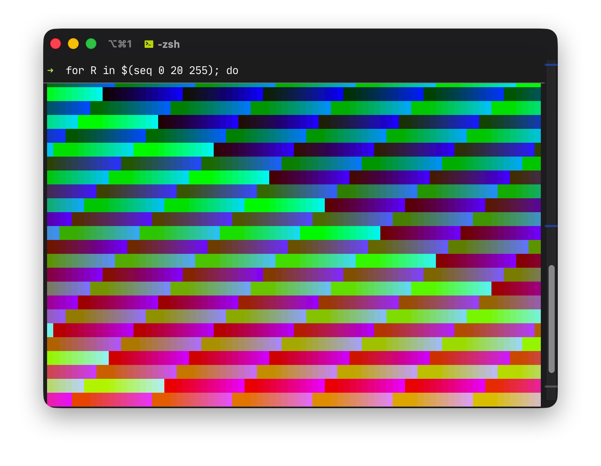

# 7. Debugging and Profiling

## Debugging

### Printf vs. Logging

“The most effective debugging tool is still careful thought, coupled with judiciously placed print statements” — **Brian Kernighan**, *Unix for Beginners*.

最显而易见且简单的方式是在程序中添加print语句，但比起print语句，更有效果的应该是常驻在程序内部的logs。比起print语句，log相关功能具备更加良好的输出支持
- 不仅可以输出到print语句输出的stdout，还可以输出到文件乃至网络设备
- log通常具有对颜色代码的专门支持，使得log中的数据便于区分和阅读
- 我们在编写log输出的时候往往会考虑包含一些上下文信息，这些信息相比于我们后期手写的print更能帮助我们定位问题

:::tip Rabbit Holes
- https://en.wikipedia.org/wiki/ANSI_escape_code
- https://github.com/termstandard/colors#truecolor-support-in-output-devices
:::

终端中带颜色的输出是通过ANSI控制字符来实现的。如果一个终端支持真彩色（true color），那么可以使用下面的格式来用RGB表示文本的颜色：
```sh
"\e[38;2;${R};${G};${B}mTEXT\e[0m"
```

 *使用Lecture Note中给出的代码生成的渐变色块*

需要注意的是macOS内置的终端就是不支持真彩色的一个例子，这种时候需要fallback到16位颜色。

### Third party logs

在UNIX系统下，程序通常会将自己的日志输出放在`/var/logs/`这个路径下面，例如：
- nginx的日志输出在`/var/logs/nginx`
- 大多数Linux采用的systemd的日志输出在`/var/logs/journal`并可使用`journalctl`来查看
  - 使用systemd启动一个服务失败时所提示的使用`journalctl -xe`正是用于查看日志
- macOS上面也存在`/var/logs/system.log`，并可使用`logs`指令查看日志
- 大多数UNIX系统都支持`dmesg`指令用于查看内核日志（kernel log）

logger是一个自带的shell程序，用于在系统日志（system log）中输出。
```sh
$ logger "Hello Logs"; log show --last 5s | grep Hello
```
```
2026-05-21 10:40:38.431008+0800 0x297000   Default     0x0          21069  0    logger: Hello Logs
```

日志的输出往往比较冗长，所以我们通常需要为`logs`或者`journalctl`这样的指令传入参数来做过滤。在这里推荐了一个终端中的日志查看工具[lnav](https://lnav.org/)。

### Static analysis

存在一类称为静态分析器的软件，可以在不运行代码的情况下对代码的内容进行分析，从而找出一些潜在的错误。看到这里，我觉得这个概念和接触到的编译型语言中的静态分析很像，例如Go中有对一些明显无法运行的代码的静态检查，这种情况下代码甚至无法通过编译；Rust则更为激进，所有权的检查也在编译期进行，更为复杂；TypeScript在某种程度上也是用于静态检查JavaScript程序的。

对于Python而言，有`pyflakes`、`mypy`等可用。对于Shell语言，有`shellcheck`可用。静态分析器列表可见https://github.com/mre/awesome-static-analysis。

IDE和一些编辑器可以借助这些软件的输出，在代码中给出相应的高亮提醒，这就是coding linting。除了检查代码中潜在的错误外，linting还可以包含对于代码风格的相关要求，这些概念在前端开发领域非常常见。

一些程序可以自动地修复这些linting问题或者整理代码的缩进结构，这就是code formatter。几乎每个语言都有适合自己的formatter，例如Python的`black`、Go的`gofmt`、Rust的`rustfmt`以及JavaScript/HTML/CSS的`prettier`（Prettier可以用于很多种语言，但不支持Go）。

## Profiling（性能分析）

Donald Knuth说过“过早的优化是万恶之源”（[premature optimization is the root of all evil](https://wiki.c2.com/?PrematureOptimization)），这表示在没有实际的运行数据之前，单单为了算法课程上教过的big O notation而去做所谓的代码效率的优化和牺牲可读性是不可取的。从逻辑上思考也是如此，随着高级程序设计语言的发展，现代程序的复杂性不能够靠猜，而应该去实践和测试。

> Even if your code functionally behaves as you would expect, that might not be good enough if it takes all your CPU or memory in the process. [...] you should learn about profilers and monitoring tools. They will help you understand which parts of your program are taking most of the time and/or resources so you can focus on optimizing those parts.

和print调试类似，有的时候我们可能会想到直接记录某个操作的开始时间和结束时间，并将它们相减来获得运行的时间。这个时间差是这次运行的真实时间（wall clock time），也就是现实所经过的时间。但是在这个时间内，程序不一定100%时间都获得了CPU，导致这个时间并不能真正反映一个操作的真实耗时。

通常，将时间分为Real、User、Sys三种。
- Real：真实经过的时间，包含在这个过程中由操作系统调度所导致的其它程序占用的时间以及程序自身阻塞的时间等。
- User：用户代码在CPU上运行的总时间
- Sys：内核代码在CPU上运行的总时间

这里所说的用户代码和内核代码可以对应到操作系统中程序运行时的用户态和系统态，其中系统态往往是由用户代码执行系统调用所转变的。使用`time`指令可以测定一个指令的三种时间，在macOS上的输出略微有所不同。
```
curl https://missing.csail.mit.edu &> /dev/null  0.01s user 0.01s system 3% cpu 0.602 total
```

其中user、system、total分别对应上面的User、Sys和Real，`3% cpu`是(0.01+0.01)/0.602的结果，表示这个过程中只有3%的时间在占用CPU，而其余的时间在干其他事情。对于curl指令来说，其余的时间就是在等待Web I/O。

### Profilers（性能分析器）

#### CPU

性能分析器通常指的是CPU性能分析器。这些分析器由跟踪器（tracing）和采样器（sampling）两部分构成。在Python中可以借助cPython这个内置的module来进行分析，但这个工具返回的是函数的调用次数，并不直观。如果需要更加直观的时间性能分析，考虑使用https://github.com/pyutils/line_profiler。

:::tip 注意
被分析的函数必须加上`@profile`包装器。
:::

```
Line #  Hits         Time  Per Hit   % Time  Line Contents
==============================================================
 5                                           @profile
 6                                           def get_urls():
 7         1     613909.0 613909.0     96.5      response = requests.get('https://missing.csail.mit.edu')
 8         1      21559.0  21559.0      3.4      s = BeautifulSoup(response.content, 'lxml')
 9         1          2.0      2.0      0.0      urls = []
10        25        685.0     27.4      0.1      for url in s.find_all('a'):
11        24         33.0      1.4      0.0          urls.append(url['href'])
```

### Memory

除了对CPU时间的分析以外，性能分析器还可以对内存占用情况进行分析。对于Python，可以使用memory_profiler这个module来进行内存分析。被分析的函数同样需要加上`@profile`包装器。

```python
@profile
def my_func():
    a = [1] * (10 ** 6)
    b = [2] * (2 * 10 ** 7)
    del b
    return a

if __name__ == '__main__':
    my_func()
```
```
$ python -m memory_profiler example.py
Line #    Mem usage  Increment   Line Contents
==============================================
     3                           @profile
     4      5.97 MB    0.00 MB   def my_func():
     5     13.61 MB    7.64 MB       a = [1] * (10 ** 6)
     6    166.20 MB  152.59 MB       b = [2] * (2 * 10 ** 7)
     7     13.61 MB -152.59 MB       del b
     8     13.61 MB    0.00 MB       return a
```

### Visualization

对于一些复杂的程序，输出的信息可能非常繁杂不易读懂，这个时候可视化可以帮助我们直观地理解结果，常用的图像形式为火焰图（[flame graph](https://www.brendangregg.com/flamegraphs.html)），其中横轴是时间，纵轴是函数调用的层级，这很像Chrome Devtool里的Network Tab瀑布流。

<div style='overflow-x: auto'>
<iframe style='outline: none; border: none' src="https://www.brendangregg.com/FlameGraphs/cpu-bash-flamegraph.svg" width="1200px" height="626px" title="cpu-bash-flamegraph"></iframe>
</div>

另一种可视化是显示程序中的调用结构。在Python中还可以使用`pycallgraph`工具来生成程序中的调用结构图示。

### Resource monitoring

程序的运行过程中我们可以进行资源的监控。

- 通用资源监控：`htop` 是首选，用于查看操作系统层面的资源占用情况。类似物有 https://nicolargo.github.io/glances、https://github.com/scottchiefbaker/dool
- I/O监控：`iotop` — 似乎在macOS下面无法正常运行，必须将系统完整性保护关闭才可以
- 硬盘占用：`df`和`du` — 其中`du`有一个交互式版本`ncdu`
- 内存占用：`free` — 作用和`htop`重合
- 开启的文件：`lsof` — 这里的文件不一定指文件系统上的文件，例如`lsof`可以用来查看占用某个端口的进程（`lsof -i`）。
- 网络连接：`ss`和`ip` — 用于代替`netstat`和`ifconfig`。网络占用情况可以使用`nethog`和`iftop`

### Specialized tools

有的时候我们只需要做一些黑盒测试就可以决定在同类的软件中选择哪一种使用。例如之前课程中推荐用`fd`代替`find`，是因为前者运行得更快。可以使用https://github.com/sharkdp/hyperfine 来快速地对指令进行速度测试。

```sh
hyperfine --warmup 3 'fd -e jpg' 'find . -iname "*.jpg"'
```
```
Benchmark #1: fd -e jpg
  Time (mean ± σ):      51.4 ms ±   2.9 ms    [User: 121.0 ms, System: 160.5 ms]
  Range (min … max):    44.2 ms …  60.1 ms    56 runs

Benchmark #2: find . -iname "*.jpg"
  Time (mean ± σ):      1.126 s ±  0.101 s    [User: 141.1 ms, System: 956.1 ms]
  Range (min … max):    0.975 s …  1.287 s    10 runs

Summary
  'fd -e jpg' ran
   21.89 ± 2.33 times faster than 'find . -iname "*.jpg"'
```