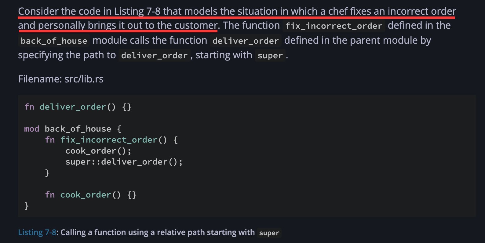

# 写在最后：一些 Rust Book 阅读感受

> 这一部分的内容包含了我的一些未经专门整理的观点和想法，它们集中写于 2025 年 8 月到 9 月期间。我不会掩饰我的真实想法，但随着时间的推移和认知的改变，想法是会发生变化的，在此声明：以下内容中涉及到的观点只是单纯的记录，并不代表我此时此刻的想法。

在阅读 Rust Book 的时候，我首先察觉到的是其地位和意图——一个完整的、官方认定的、从零开始的 Rust 教程，摆放在你接触这一语言时所能看到的明显位置，使人有一个非常明确的开始点。其它语言，尤其是比较成熟的老语言，就几乎没有这样的存在。我相信这本书在 Rust 的推广过程中起到了相当大的作用。

目前为止，我的学习都是基于这本 Rust Book（和 Kaiser Y 的中文翻译），全程阅读下来并没有花很长时间，却的确可以对 Rust 本身的语法、特性有一个初步的认识。

我先前已经接触了比较多的软编程语言，即不太接触底层硬件的语言。虽然软，因为都是高级语言，它们与 Rust 之间大概率有内容是相通的。我从 Rust Book 中给出的整体信息观察到，它似乎预设读者并没有其它语言的编程经验，在一些基础的概念上做了一些解释，例如在第 4 章的 [What is Ownership?](https://doc.rust-lang.org/book/ch04-01-what-is-ownership.html) 中对 Heap 和 Stack 的解释，这对读者理解所有权的意义很有帮助。但这里的一些更基础的概念的解释对于有些人而言可能显得啰嗦，因此喜欢精读的朋友可能仍然需要考虑在这本精心撰写的书上施加一些跳过。

我个人并不是很喜欢在语言学习的一开始就去做题目，尤其是这些题目建立在一些虚拟的需求上时，这让我觉得一定要陷入某种思维定式才能做下去。我更希望学到后期直接开始做真实项目练手。Rust Book 也考虑到了这一点（which 让我感觉很惊喜），虽然它在第 2 章就开始忍不住介绍如何做一个猜数的游戏，但作者也在 Introduction 中提到
> If you’re a particularly meticulous learner who prefers to learn every detail before moving on to the next, you might want to skip Chapter 2 and go straight to Chapter 3, returning to Chapter 2 when you’d like to work on a project applying the details you’ve learned.

*这种“喜欢看完完整内容再去实操”的习惯原来可以被描述为 “meticulous learner”。*

唯一让我觉得有些灾难的章节，是第 7 章，介绍 Rust 的包管理工具和相关概念的一章。由于 Rust 中的 crate、包（package）、项目（project）等概念的命名方式与其它语言中的惯例大相径庭，又没有规范化的中文翻译（其实也难以规范化），这一章的内容本就有些难懂。

在跟着中文翻译进行阅读时，这一章一开始就让我蒙圈了，后续内容更是难以跟进。尤其是作者在 [7.2 Defining Modules to Control Scope and Privacy](https://doc.rust-lang.org/book/ch07-02-defining-modules-to-control-scope-and-privacy.html) 中的一开始插入的一个 Cheat Sheet。由于是 Cheat Sheet，其中的文字描述是简化的口语形式，很令初学者费解，也让翻译很难办（可以去看看这一节的[中文翻译](https://kaisery.github.io/trpl-zh-cn/ch07-02-defining-modules-to-control-scope-and-privacy.html)。我原以为是翻译的问题，但...翻译也是尽力了）。

读完后我发现，如果你真的是第一次阅读 Rust Book，最好的做法是直接把这个 Cheat Sheet 跳过，因为它本质上就是一个 Reference，which 并不适合初学者看。但我依然不能理解为什么作者突然在这里要插入一个 Reference。

同样在 7.2 中，作者引入了一个餐馆的前厅和后厨的示例来说明 scope and privacy，乍一看似乎没什么问题，但如果将目光转向 7.3 就会发现，后面的例子全是围绕着一个抽象的餐厅来进行，其中的一些需求的来源无从得知。对我来说，要是抛开这里的情景，直接读代码的结构，反而更好理解。

```rust
mod back_of_house {
    pub struct Breakfast {
        pub toast: String,
        seasonal_fruit: String,
    }

    impl Breakfast {
        pub fn summer(toast: &str) -> Breakfast {
            Breakfast {
                toast: String::from(toast),
                seasonal_fruit: String::from("peaches"),
            }
        }
    }
}
```



在 [6.3 Concise Control Flow with if let and let else](https://doc.rust-lang.org/book/ch06-03-if-let.html) 中，作者举的例子多是基于美国本土的一些常识，例如美元和州。这为一些不了解相关知识的读者增添了不必要的麻烦。作者可能本身并没有考虑到这些。

美元的例子由于只涉及数字，比较好理解。

而到 [describe_state_quarter 这一个函数的例子](https://doc.rust-lang.org/book/ch06-03-if-let.html#staying-on-the-happy-path-with-letelse)上时，不了解的读者很难不蒙圈。我在读的时候即使马上看懂了函数的名称，也很好奇：对某个州的 quarter 的描述，应该是什么样的？后来我发现，这个函数名称里的 describe 更适合翻译为“吐槽”而非“描述”。

```rust
fn describe_state_quarter(coin: Coin) -> Option<String> {
    if let Coin::Quarter(state) = coin {
        if state.existed_in(1900) {
            Some(format!("{state:?} is pretty old, for America!"))
        } else {
            Some(format!("{state:?} is relatively new."))
        }
    } else {
        None
    }
}
```
*我们要编写的其实是一个按情况返回一个字符串的函数？*

坦白讲，脱离语境去理解这段代码的意思并不困难，然而这个例子恰好出现在一个“Staying on the Happy Path”的议题之上。使用这样的例子，能否让读者理解所谓 happy path 在哪里，就有些难说了。当然，如果抛开这里例子原本的含义，是可以轻松理解后面是如何改写代码来达到 happy path 的（也就是将 if 铺平，做排除而非检查），这似乎更说明了这一例子本身的干扰性质。

总之，这些问题对于一些默认会自动排除例子的语境，直接看代码结构的读者，可能并不存在。但对于一些较为细致、倾向于将代码完全读懂的读者，这些例子似乎都设下了一些障碍——除非你已经有了相关常识，并且可以跟着作者举例子的脑洞走。

我之所以会产生上面的想法，是因为我总是默认以一个较为严肃的视角去阅读这样的文档，但它似乎又不够严肃（但有的地方却又足够严肃），有些地方显得有些弯弯绕绕，不够直接——所以上面写的并不太算是我对这些章节的批评，而是在一些假设之上的感触。

其实，如果多看几遍 Rust Book，就会发现这本书的行文风格某种程度上是非常 illustrative 或者说 example-driven 的。

在 [17.1 Futures and the Async Syntax](https://doc.rust-lang.org/book/ch17-01-futures-and-syntax.html) 中，作者直接引入了一个名为 trpl（The Rust Programming Language 的缩写）的远端 crate，并在后面大量使用来自 trpl 的内容。作者解释了 trpl 是一个什么样的 crate，并说明了底层使用了 tokio。但这对我来说并不是很 beginner friendly 的举例方式[^4]。按照我过往的理解，Future 等相关特性应该是语言自行提供的（就像 Java 那样），但似乎 Rust 中并不是这样，或者可能很底层/麻烦——即使是对 Rust 语言本身的介绍和教学，作者也不免需要引入一个来自于外部的库来说明。

作者将引入 trpl 的目的定为“To keep the focus of this chapter on learning async rather than juggling parts of the ecosystem”，但我不理解 learning async 里面为什么不包含这里的“juggling parts of the ecosystem”。此外，作者还表明 trpl 是对一些“original API”的封装——所以 original API 其实算是一些 advanced 内容？

> In some cases, trpl also renames or wraps **the original APIs** to keep you focused on the details relevant to this chapter. If you want to understand what the crate does, we encourage you to check out its source code. You’ll be able to see what crate each re-export comes from, and we’ve left extensive comments explaining what the crate does.

如果确实想要了解 trpl 究竟干了什么，则可以直接去阅读它的源码，作者也留下了一些额外的解释。这句话加上以后，这里 trpl 的出现就显得合理得多了。现在我觉得 trpl 的出现大概是作者对篇幅的一些考虑吧。然而在 [17.2 Applying Concurrency with Async](https://doc.rust-lang.org/book/ch17-02-concurrency-with-async.html) 中，作者类比了 JoinHandle 上的 join 方法，并开始介绍可完成类似功能的 `trpl::join`，然后另开了一个小节来讲如何使用 `trpl::channel` 提供的信道；17.3 中介绍的一个“让出执行权”的方式“yielding”也是使用来自 trpl 的 `trpl::yield_now` 来实现的。这又让我疑惑。trpl 在这里原来不单是一个用来举例的工具，还是教学的对象？

在 [17.3 Working with Any Number of Futures](https://doc.rust-lang.org/book/ch17-03-more-futures.html) 中，如标题所述，作者花了大篇幅解决这样一个问题：如何使用 `trpl::join_all` 来等待一个具有不同 Output 关联类型的 Future 组。

```rust
let futures = vec![tx1_fut, rx_fut, tx_fut];
trpl::join_all(futures).await;
```

作者先后用了三次报错，逐级从最基本的无标注 Vec 类型拓展到了 `Vec<Pin<Box<dyn Future<Output = ()>>>>` 类型，涉及到大量显式或隐式的“关于 X 的详细解释，我们之后再说”，却没有省略对这些尚未介绍内容的“简单介绍”，以至于我在读 17.3 的时候，一直看不懂这一部分究竟想表达什么样的知识点——既然知识点都在后面，为什么这里要提？为什么要深入一个来自 trpl 封装的函数（这个疑问跟之前的观点有些重合），这和 library documentation 有什么区别？以及为什么要跟着编译器的提示从头改到尾（这读者自己也可以做），而不是解释其中读者无从而知的部分？...
- (Listing 17-15) Unfortunately, this code doesn’t compile. Instead, we get this error: `error[E0308]: mismatched types` ...
- (Listing 17-16) Unfortunately, this code still doesn’t compile. In fact, we get the same basic error we got before for both the second and third Box::new calls, as well as new errors referring to the Unpin trait.
- (Listing 17-17) Now when we run the compiler, we get only the errors mentioning Unpin. Although there are three of them, their contents are very similar. `error[E0277]: dyn Future<Output = ()> cannot be unpinned`...

---

Rust Book 中其实也存在一部分较为直截了当的定义，但大部分概念都是用例子[^5]，乃至报错来引出。如果你更倾向于一些 formal 的叙述，则可能会对这本官方的 Rust Book 失望。当然，这并不*太*算是 Rust Book 的缺点。

[^4]: 具体来说，在封装细节被隐去以后，trpl 本身变成了一种“万能的工具库”。在读者真正有精力去阅读 trpl 源码之前，它是一个黑箱的存在。至于它暴露了哪些方法，读者无从得知；并且对这些方法的理解，也需要读者具有一定的经验，例如针对 Html 的 parse 操作是什么含义？更基础地，get 函数是干什么用的？这些问题由于封装的存在，都留给了读者。由此看来，将 trpl 引入到例子里是一种完美的节约篇幅的方法。
[^5]: 拓展开来，例子之多以至于需要分类。比如，用于说明语言本身特性的例子就非常初级，容易理解；用于说明 module system 的例子包含了作者的一些想象力，如果你跟不上就可能干扰代码的理解；而用于说明 async/await 的例子则直接用到了外部的库。